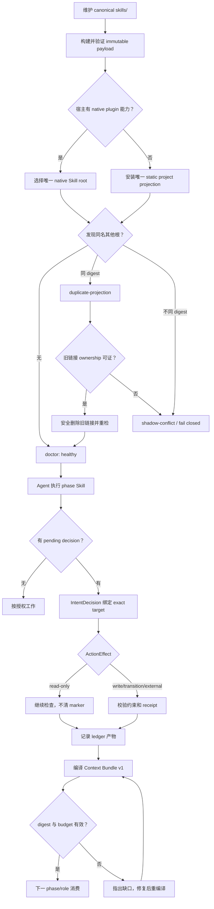

# Comet/Trellis 工作流优化用户旅程

change: comet-trellis-workflow-analysis  
design-doc: docs/superpowers/specs/2026-07-25-comet-trellis-workflow-analysis-design.md

## 产品边界

这是开发者工具和插件分发体验，不是传统页面产品。“页面/屏幕”映射为用户实际可见的
CLI、hook 提示、doctor 输出和 Change 文档状态：

- `pipeline setup/update --codex`：安装与升级面；
- `pipeline doctor skills`：Skill 根与冲突诊断面；
- pending interaction/review 提示：自然语言决策面；
- `pipeline status/document status/handoff --bundle`：阶段上下文与交接面；
- Spec/Build/Verify 的 guard 错误：失败与恢复面。

MVP 只实现当前实现能完整验证的四条链：worktree 证据、自然确认和只读门、唯一 Skill
根、Context Bundle v1。Artifact Graph 持久化、task checkpoint、完整风险档位放入后续。

## 角色

### 角色 A：插件维护者

- 目标：只维护一棵 `skills/`，发布时证明 payload、registry、adapter 没有重复内容。
- 痛点：同一 Skill 同时从插件 cache 和项目 `.agents/skills` 出现；旧链接又不能粗暴删除。
- 场景：本仓开发、打包、适配器测试、release 验证。
- MVP 优先级：P0。重复安装会直接污染所有后续证据和调用。

### 角色 B：插件安装者/项目用户

- 目标：安装或升级一次后，宿主只看到一套正确 Skill；出错时知道冲突在哪里。
- 痛点：看到同名 Skill 多次、不知道哪个生效；担心安装器覆盖自有 Skill。
- 场景：原生 Codex 插件、没有原生能力的静态宿主、从旧 adapter 迁移。
- MVP 优先级：P0。

### 角色 C：执行 Agent

- 目标：理解用户自然语言授权，pending 时继续安全研究，并从确定性输入恢复下一阶段。
- 痛点：必须要求用户回复固定口令；interaction marker 连只读检查也拦；handoff 未绑定 ledger。
- 场景：长会话、跨 worktree、Spec→Build 上下文恢复。
- MVP 优先级：P0/P1。

## 角色旅程

### A. 插件维护者旅程

| 步骤 | 触点 | 用户意图 | 系统行为 | 可验证结果 |
| --- | --- | --- | --- | --- |
| 1 | 仓库 `skills/` | 编辑唯一 Skill 内容 | registry 只引用 canonical ID | 每个 ID 对应一个 `SKILL.md` |
| 2 | package verify | 构建不可变 payload | 复制一棵 Skill tree 并计算摘要 | payload 无第二棵同名内容 |
| 3 | adapter tests | 验证 native/static | 两种发现路径互斥 | 测试证明不会同时投影 |
| 4 | doctor tests | 验证历史/用户冲突 | 分类 duplicate/shadow | 输出根、摘要与安全修复 |
| 5 | release check | 重复 setup/update | 幂等选择同一根 | 可发现根数量不增长 |

错误恢复：

- 同 ID、同摘要多根：标记 `duplicate-projection`，只选择 native 根；只清理 ownership 可证的旧软链。
- 同 ID、不同摘要：标记 `shadow-conflict`，阻止证据/执行；保留用户文件。
- 无 native 能力：明确选择 static-only 项目投影，不假装已有原生安装。

### B. 插件安装者/项目用户旅程

| 步骤 | 触点 | 正常状态 | 替代状态 | 恢复 |
| --- | --- | --- | --- | --- |
| 1 | `setup --codex` | 检出并验证 native root | payload 不完整 | 保留旧 active release |
| 2 | adapter | 发现 native，跳过项目链接 | 无 native | 创建唯一 static projection |
| 3 | migration | 删除自有旧软链 | 用户目录/foreign link | 保留并报冲突 |
| 4 | doctor | selected root/摘要健康 | duplicate/shadow | 给出精确路径与动作 |
| 5 | 新会话 | 只发现一套 Skill | 历史 cache 存在 | 历史版本不进 active set |

可见状态：

- `detecting`：定位宿主能力和 selected release；
- `native-selected`：原生不可变根唯一生效；
- `static-selected`：项目投影唯一生效；
- `duplicate-projection`：同内容多根，需要收敛；
- `shadow-conflict`：不同内容同 ID，拒绝继续；
- `migration-skipped-foreign`：目标不属于 pipeline-lite，未删除；
- `healthy`：mandatory Skills 均从一个根解析。

### C. 执行 Agent 旅程

| 步骤 | 触点 | 用户/系统输入 | 系统行为 | 输出 |
| --- | --- | --- | --- | --- |
| 1 | pending prompt | `可以`/`按推荐` | 绑定唯一 pending target | exact decision/receipt |
| 2 | mixed prompt | `继续，但先别改代码` | 批准并保留约束 | 只读可继续，写仍阻断 |
| 3 | gate | `rg`/`git diff`/status | 识别 read-only | marker 不清除，检查通过 |
| 4 | evidence | 显式 sibling worktree cwd | 校验 Git common-dir | 当前 worktree Skill receipt |
| 5 | handoff | target=build | 按 policy 读 ledger | Context Bundle v1 |
| 6 | consumer | bundle/source digest | 重算并验证 | 一致则执行，漂移则重编译 |

错误恢复：

- 多个 pending target：只问一次最小澄清，不猜。
- shell 链含重定向/未知命令：整条 fail closed，提示被分类的片段。
- document digest 漂移：指出 kind/path，要求 re-record/re-read/recompile。
- bundle 超预算：报告所需/可用字节，不生成看似有效的截断 bundle。

## 用户故事与验收

1. 作为插件维护者，我只编辑 `skills/<id>/SKILL.md` 一处；构建检查能证明没有第二份维护副本。
2. 作为原生 Codex 用户，我重复安装和升级后仍只有一个 Selected Skill Root。
3. 作为静态宿主用户，在没有 native plugin 时仍能通过唯一项目投影发现 Skills。
4. 作为有自定义 Skill 的用户，迁移永远不会删除真实目录或 foreign symlink。
5. 作为执行 Agent，我能把 `可以` 解释为当前唯一推荐项，而不是要求固定口令。
6. 作为执行 Agent，我在 pending marker 下仍能执行严格只读检查，但不能用 shell 组合伪装写入。
7. 作为跨 worktree Agent，我只有在显式声明目标 worktree 且 Git identity 相同时才能产生 Skill 证据。
8. 作为下一阶段 consumer，我获得有顺序、原因、ledger digest、预算和 aggregate digest 的 bundle。

验收必须由自动化测试覆盖上述故事；doctor、hook 和 bundle 的失败分支与成功分支同等重要。

## 端到端流程

