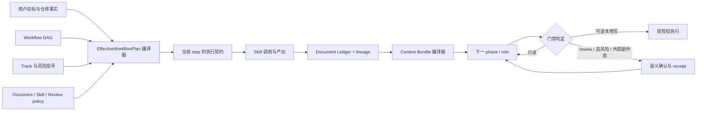

# Comet、Trellis 与 pipeline-lite 的文档驱动工作流设计

状态：Explore 设计决策  
Change：`comet-trellis-workflow-analysis`  
研究基线：

- Comet Classic `rpamis/comet@84038b0d6b7c185b233f0f36b294ae74dd9121d0`
  （`0.4.0-beta.9`）
- Trellis `mindfold-ai/Trellis@12e279a8af00456b1d0d4e3d0f7f59e7b702202e`
  （`v0.6.9`）
- pipeline-lite 当前隔离 worktree HEAD
  `547632980e09074fde86dca08850723180e69def`

## 用户结果

用户需要的不是再加一套平行流程，而是让每一步都能稳定回答：

1. 这一步为什么触发这个 Skill？
2. 它消费了哪些上游文档及确切版本？
3. 它产出了什么，由谁拥有，是否经过验证？
4. 下一步只需要读什么，为什么要读，读取的是否仍是同一内容？
5. 普通工作能否保持轻量，风险升高时能否自动进入强治理？
6. 自然语言已经表达同意后，系统能否理解，而不是要求固定口令？
7. 同一个插件 Skill 是否只有一份 canonical 内容和一个生效安装根，而不是被原生插件、
   项目 `.agents/skills` 和历史 cache 重复暴露？

本设计选择“双层模式”：默认轻量，风险命中时自动升级到强治理；两层共享同一状态、
文档和交接模型，不建设第二个工作流引擎。

## 研究结论

### Comet 的真实嵌入方式

只有 Comet Classic 直接组合 OpenSpec 与 Superpowers；Native 是另一套自包含路径。
Classic 的职责边界清晰：

- OpenSpec 管 **WHAT**：proposal、spec delta、tasks 与 archive；
- Superpowers 管 **HOW**：deep design、writing plan、TDD、review、verification；
- Comet 管 **CONTROL**：何时调用、由谁调用、能否推进、失败后回哪里。

它最有价值的机制是确定性 handoff：按固定顺序枚举 OpenSpec 源文件，记录每个路径与
SHA，再计算聚合摘要。Build 期间另有任务级 checkpoint，Skill 内容也可按摘要快照，
避免长任务恢复和插件升级导致上下文漂移。

它的不足同样明确：部分 Skill 强制仍主要依赖 prompt；多数确认没有绑定确切 transition
event；轻量 Verify 会跳过 spec/design drift；handoff 与实际消费者之间的关系没有
pipeline-lite ledger 那样强。

### Trellis 的真实嵌入方式

Trellis 没有直接依赖 OpenSpec 或 Superpowers。它吸收二者思想后重写为原生的：

- `prd.md`、`design.md`、`implement.md`；
- `implement.jsonl`、`check.jsonl` 角色上下文清单；
- Brainstorm / Before Dev / Check / Update Spec Skills；
- Plan → Execute → Finish；
- session-scoped active task 与完整 task capsule archive。

它最值得借鉴的是把“下一角色读什么”编译成显式产品：

```text
role.jsonl 中的规范与研究
→ prd.md
→ design.md
→ implement.md
```

每个清单项带路径和 `reason`，consumer 有路径校验和上下文预算。它的不足是没有内容摘要
绑定、没有 exact-event review receipt、状态图较粗，很多顺序仍靠 prose 和 Hook 维持。

### pipeline-lite 的现状

pipeline-lite 已有三者中最强的治理内核：

- 七阶段 canonical DAG 和 first-class 回退边；
- phase-owned document producer；
- Skill 调用证据、document SHA、当前 visit read receipt；
- exact-phase-and-event review receipt；
- OpenSpec delta apply/archive；
- 确定性 handoff 压缩器。

当前缺口不是“没有文档”，而是文档关系和下一步输入没有成为一等模型：

- artifact state 与 document ledger 分开写，关系不原子；
- ledger 没有 `source → handoff → consumer` 边；
- handoff 需要人工调用，未进入 phase transition；
- 没有 phase/role Context Bundle 与预算；
- 没有任务级 checkpoint 和 Skill snapshot；
- active Change 的 canonical pointer 仍偏 repo 粒度；
- 确认分类依赖短语枚举，交互门把只读工具也一起阻塞；
- managed runtime 与 canonical schema 缺少能力协商。
- Codex 原生插件已经暴露 `skills/` 时，兼容 adapter 仍可能把同一批 Skill 逐个软链到项目
  `.agents/skills/`；宿主因此看到重复注册，证据与调用也可能选择不同根。

## 逐阶段对照

| pipeline-lite 阶段 | OpenSpec / WHAT | Superpowers / HOW | 当前交接 | 推荐交接产品 |
| --- | --- | --- | --- | --- |
| Open | proposal/design/tasks 建立 Change | propose/initial shaping | ledger 登记文件 | `OpenBundle`：目标、范围、非目标、验收、来源摘要 |
| Explore | 研究修订 proposal/design/tasks | brainstorming、research、grill | 全文读取 + 独立研究稿 | `ExploreBundle`：已决策、证据索引、未决 gap、风险档位 |
| Spec | delta spec 与 tasks 冻结需求 | writing-plans | ledger + review receipt | `SpecBundle`：需求 SHA、设计 SHA、计划 DAG、测试映射 |
| Build | 按 tasks 实现，不改写 WHAT | TDD、subagent execution、review | 手工恢复文档 | `BuildBundle` + task checkpoint + Skill snapshot |
| Verify | 对冻结 build/spec 做判定 | verification-before-completion | report + exact event receipt | `VerifyBundle`：基线、证据、失败分类、回退目标 |
| Ship | apply 主 spec、整理交付 | finishing workflow | 状态字段和文件 | `ShipBundle`：可交付内容、兼容、回滚、未交付项 |
| Archive | Change 与历史证据封存 | archive/learn record | OpenSpec archive | 完整 capsule + 可检索 manifest + lineage |

## 方案比较

### 方案 A：只扩充现有 phase Skill 文案

优点是改动小。缺点是下一步输入、预算、风险升级和确认语义仍不可验证，长期必然继续漂移。
不选择。

### 方案 B：照搬 Comet Classic

优点是 OpenSpec → Superpowers 的叙事成熟，并已有 hash handoff/checkpoint。缺点是会削弱
pipeline-lite 已有的 ledger、current-visit receipt 和 exact-event review。也会引入第二套
宏观阶段语义。不选择。

### 方案 C：治理内核 + 编译式上下文层

保留现有 DAG、ledger、receipt 与 OpenSpec 生命周期；吸收 Comet 的内容寻址 handoff、
checkpoint、Skill snapshot，吸收 Trellis 的角色化清单、固定读取顺序、上下文预算和
session pointer。默认轻量，命中风险规则后自动升级同一个 plan 的治理能力。选择。

## 选定架构



### 1. 单一 EffectiveWorkflowPlan

工作流图、文档策略、Skill 策略、review 策略、风险档位和上下文预算必须编译成一个不可变
计划。CLI、kernel、hooks、server 和 dashboard 只消费计划能力，不再分别从
`workflow === default`、phase 名、Skill 名单或 marker 类型重建规则。

建议的概念模型：

```ts
type GovernanceTier = 'light' | 'strong'

interface EffectiveWorkflowPlan {
  identity: { workflow: string; schemaVersion: string; compilerVersion: string }
  graph: CompiledStepGraph
  governance: {
    tier: GovernanceTier
    upgradeReasons: RiskSignal[]
    downgradePolicy: 'audited-override-only'
  }
  documents: CompiledDocumentPolicy
  skills: CompiledSkillPolicy
  review: CompiledReviewPolicy
  context: CompiledContextPolicy
}
```

### 2. 双层治理不是两套引擎

`light` 和 `strong` 共用同一 DAG、document kind、lineage、bundle schema 与 receipt
格式，区别只是策略要求：

| 能力 | light | strong |
| --- | --- | --- |
| 最小文档 | goal/tasks 或 workflow 声明集 | proposal/design/spec/tasks + phase 产物 |
| Skill | 当前步骤最小集合 | 完整 mandatory DAG + 内容快照 |
| Handoff | 路径、reason、摘要 | 路径、digest、lineage、摘要、预算、未决 gap |
| Review | 仅 workflow 声明的真实门 | explore/spec/verify exact-event review |
| Verify | 目标相关测试 | spec coverage、drift、独立证据与回退 |
| 恢复 | step bundle | bundle + task checkpoint + evidence index |

自动升级信号至少包括：

- 跨模块、共享契约、schema 或持久化状态变化；
- 权限、安全、隐私、生产、费用或真实用户/数据影响；
- 外部发布、发送、部署、删除或难以回退的操作；
- 长任务、多 agent、上下文可能跨窗口；
- requirement drift、verify fail 或运行时/schema 不兼容；
- 用户明确要求审计、正式规格或完整验证。

高风险命中后默认不可静默降级。用户可显式 override，但必须填写理由，receipt 绑定
Change、当前 visit、原风险信号、被放宽的能力和时间。安全/生产等硬禁止项不可 override。

### 3. Document Ledger 升级为 Artifact Graph

保留现有 `kind/path/sha256/producer`，新增有类型的关系，而不是创建第二本台账：

```ts
interface ArtifactNode {
  id: string
  kind: string
  path: string
  digest: string
  producer: { skill: string; snapshotDigest?: string }
  ownerStep: string
  visit: string
}

interface ArtifactEdge {
  from: string
  to: string
  relation: 'derived-from' | 'summarizes' | 'implements' | 'verifies' | 'supersedes'
}
```

任何 artifact field 的写入与 ledger node/edge 更新必须在同一个 command/application
transaction 内完成。路径存在不等于产物有效；producer receipt、内容 digest、owner step
和关系必须同时通过。

### 4. Context Bundle 是下一步的正式输入

每次 transition 前由系统根据 EffectiveWorkflowPlan 和 Artifact Graph 编译 bundle：

```json
{
  "schemaVersion": "context-bundle/v1",
  "change": "comet-trellis-workflow-analysis",
  "from": "explore",
  "to": "spec",
  "tier": "strong",
  "inputs": [
    {
      "kind": "proposal",
      "path": "openspec/changes/.../proposal.md",
      "digest": "sha256:...",
      "reason": "定义目标、范围与验收",
      "mode": "full"
    }
  ],
  "decisions": [],
  "openGaps": [],
  "riskSignals": [],
  "budget": { "maxBytes": 120000, "usedBytes": 0 },
  "aggregateDigest": "sha256:..."
}
```

规则：

1. 输入顺序由 policy 固定，不能依赖目录扫描顺序。
2. `reason` 是编译策略的一部分，不让上一 Agent 临时编造。
3. `full / summary / reference` 由文档类型、消费者角色和预算共同决定。
4. bundle 记录每个源 digest 和聚合 digest；消费前重算，漂移就 fail closed。
5. `openGaps` 非空时，只有 policy 声明可延后或用户作出决定才能 transition。
6. read receipt 绑定 bundle digest 和被实际物化的输入集合。
7. 超预算时先做确定性裁剪；不能满足 mandatory 输入时阻断并报告缺口，不静默截断。

### 5. Build 的任务级 checkpoint

Build 每完成一个最小任务单元，记录：

- task ID 与计划节点；
- RED/GREEN/REFACTOR 或对应验证阶段；
- 变更文件与 commit/worktree 基线；
- 已消费 bundle、Skill snapshot 和 document digest；
- review 轮次、未解决反馈；
- 下一安全恢复点。

checkpoint 是 machine-readable canonical state 的派生投影，不允许用自由文本冒充完成证据。
恢复时优先读取 checkpoint 指向的 bundle 与未完成节点，而不是重新扫描全部历史。

### 6. Skill snapshot

强治理模式在 phase 首次调用 mandatory Skill 时记录：

- canonical Skill ID；
- 受信任安装根；
- `SKILL.md` 内容 digest；
- 解析后的依赖 DAG；
- 调用 transcript/host receipt。

同一 visit 后续验证使用 snapshot digest。插件在任务中途升级不会使旧调用“变成另一份 Skill”。
新 visit 可显式选择新版本，但必须使依赖产物和验证证据失效或重新登记。

### 7. 智能确认与动作分类

当前短语枚举和 blanket gate 被替换为两个独立模型：

#### IntentDecision

```ts
interface IntentDecision {
  intent: 'approve' | 'reject' | 'modify' | 'authorize-continuous' | 'revoke' | 'unclear'
  target: { change: string; phase: string; questionId: string; event?: string }
  selectedOption?: string
  constraints: string[]
  confidence: number
  evidence: 'structured-ui' | 'deterministic-rule' | 'semantic-classifier'
}
```

分类顺序为：

1. 结构化 UI 答案；
2. 明确拒绝、撤回、范围限制等 deterministic rules；
3. 与当前 pending question/options 绑定的语义分类；
4. 低置信度进入一次澄清。

“继续，按照你的推荐”“可以”“按推荐方案”都应在存在唯一当前问题且没有冲突约束时，
映射到推荐选项。它们不是全局授权，也不能批准另一 Change 或另一 event。

混合表达如“继续，但先别改代码”产生 `approve + constraints=["no-code-write"]`：
只解锁允许的动作，不把整道门清空。任何 receipt 必须保存原文摘要、目标、决策、约束、
分类来源和置信度，便于审计与回放。

#### ActionEffect

```ts
type ActionEffect =
  | 'read-only'
  | 'reversible-local-write'
  | 'canonical-state-transition'
  | 'external-side-effect'
  | 'destructive-or-costly'
  | 'human-question'
```

- `read-only`、`human-question` 在 pending interaction 下继续执行；
- 本地写是否放行由当前约束和 tier 决定；
- state transition 必须有 exact receipt；
- 外部副作用、破坏性或费用动作保持显式确认；
- classifier 不认识某工具时按其声明能力 fail closed，但不得把已知只读工具降为未知写。

这使“是否理解用户”与“某个工具是否有权执行”解耦，避免一个 shell pattern 同时承担
语言理解和权限控制。

### 8. Session 绑定

将当前 host-session sidecar 的验证结果提升为可恢复的 session-scoped binding：

- exact session → Change；
- 0 个候选不猜；
- 多个候选不猜；
- repo 级 `.pipeline-active` 只保留兼容投影；
- subagent 必须继承或显式传递 parent binding；
- worktree identity 是 binding 的组成部分，禁止跨 worktree 误路由。

### 9. Runtime 能力协商

canonical state 增加显式 `schemaVersion` / required capabilities。运行时启动时比较：

- 能否解码 state schema；
- 是否支持 workflow plan/profile；
- 是否支持 bundle/ledger edge/receipt 版本；
- 当前 selected release identity。

不兼容时输出可执行升级路径，不用相同 plugin semver 掩盖 bundle schema 漂移。旧 runtime
必须 fail loud，且不能部分写入新状态。

### 10. 单一 Skill 所有权与安装根

仓库中的 `skills/<id>/` 是 pipeline-lite Skill 内容的唯一 canonical source。构建发布时只把
这棵树作为不可变插件 payload 的一部分；manifest、workflow、registry 和文档只引用 canonical
Skill ID，不复制 `SKILL.md` 内容。

运行时对每个插件版本只允许一个 **Selected Skill Root**：

```text
repository skills/                 # 开发期 canonical source
        │ build/package
        ▼
immutable plugin payload/skills/   # 安装期唯一生效根
        │ select(version + digest)
        ▼
host discovery / evidence / AFK snapshot
```

安装策略：

1. `pipeline setup --codex` 只安装原生 `pipeline-lite` 插件，不再额外向
   `~/.agents/skills` 或项目 `.agents/skills` 投递同名 Skill。
2. 项目兼容 adapter 只用于没有原生插件能力的静态宿主；开始前检测目标宿主是否已有
   pipeline-lite 原生插件。存在时跳过 Skill 投递并给出唯一根。
3. 静态模式确需项目发现时，项目软链是唯一安装投影，不能与原生插件同时启用；切换到原生
   模式时通过显式迁移命令移除**由 pipeline-lite ownership manifest 证明拥有**的链接。
4. 不扫描并信任所有历史 cache。选择器必须绑定 exact marketplace/plugin/version/digest；
   历史版本只是可回滚 artifact，不是同时可调用的 Skill root。
5. 同一 canonical ID 在多个可发现根出现：
   - digest 相同：报告 `duplicate-projection`，只选 canonical root，安装/doctor 要求收敛；
   - digest 不同：报告 `shadow-conflict` 并 fail closed；
   - 用户自有同名 Skill：绝不覆盖或删除，要求用户改名或显式选择来源。
6. AFK/容器需要冻结执行内容时使用 CAS Skill snapshot；snapshot 是 run artifact，不注册为
   宿主可发现 Skill，因此不构成第二份安装。

发布校验必须证明：

- registry 中每个 `content_skill` 唯一映射到一个 `skills/<id>/SKILL.md`；
- payload 中不存在另一棵同名 Skill 内容；
- adapter native/static 两种安装路径互斥；
- doctor 输出 selected root、digest、重复投影和冲突来源；
- setup/update 重跑不会增加第二个可发现根。

## 文档所有权与生命周期

| 文档类别 | owner | 更新方式 | 下一步消费 | 归档 |
| --- | --- | --- | --- | --- |
| OpenSpec proposal/design/spec/tasks | 对应 phase Skill | 内容变更即新 digest，旧 edge 保留历史 | Context Bundle mandatory inputs | apply/archive |
| Superpower design/plan/report | brainstorming/writing-plans/verify Skill | producer snapshot + ledger node | 按 role 选择 full/summary/reference | Change capsule |
| ADR | 决策所在 phase | accepted/superseded 显式关系 | Spec/Build/Verify | 长期 ADR + capsule |
| Research | researcher | 固定上游版本与来源 | Explore/Spec reference | capsule |
| Context Bundle | 系统编译器 | transition 前重建 | exact target phase/role | transition history |
| Checkpoint | Build executor | 每个任务安全点 | 恢复/Verify | capsule |
| Verification report | Verify | 绑定 build/spec/bundle digest | Ship/Archive | capsule |

## 失败行为

- 源文件 digest 漂移：bundle 失效，要求重新编译并重读。
- producer Skill snapshot 不可信：document record 拒绝。
- 风险信号升级：在下一次有副作用动作前切 strong，不中断只读分析。
- 用户拒绝或修改范围：只撤销冲突授权，保留可继续的只读和已明确范围。
- 语义分类低置信度：只询问当前最小问题，不要求口令。
- runtime 不支持 schema/capability：只读诊断可用，canonical 写入全部拒绝。
- bundle 超预算：按 policy 降为摘要/引用；mandatory full 输入无法容纳时阻断。
- worktree/session 不匹配：拒绝路由和写入，并展示确切候选。
- 同一 Skill 多根同 digest：选择 canonical root 并要求收敛；多根不同 digest：拒绝调用与留证。

## 实施切片

### P0：修复交互自锁

1. 中央化 pending question 与 `IntentDecision`。
2. 为自然确认、拒绝、混合约束、跨 Change/event 增加测试。
3. 引入 `ActionEffect`，先放行已知只读 CLI、文件读取和研究工具。
4. interactive Skill 清单移入编译后的 workflow policy。
5. 修复 transcript/worktree 证据绑定：只接受同一 Git common-dir，且实际工具调用明确声明
   目标 worktree；不把兄弟 worktree 当成任意可信目录。

这是独立、可回退的小闭环，优先解决本次真实遇到的问题。

### P1：唯一 Skill 根与安装收敛

1. 定义 canonical Skill ID、Selected Skill Root 和 payload digest。
2. 原生安装不再生成项目 `.agents/skills` 重复投影。
3. 静态 adapter 与原生插件互斥，并为 ownership-proven 旧链接提供显式迁移。
4. doctor/setup/update 增加 duplicate-projection、shadow-conflict 和幂等测试。
5. registry、Skill evidence、automation snapshot 全部消费同一个 selected-root resolver。

### P2：Context Bundle 与 lineage

1. ledger node 增加稳定 ID/owner visit，新增 typed edge。
2. artifact + ledger 通过单一 application command 原子更新。
3. 实现确定性 bundle compiler、预算和 digest guard。
4. transition 生成并登记 target bundle；phase entry 强制读取 exact bundle。

### P3：Build 恢复与 Skill snapshot

1. task checkpoint schema 与 CLI。
2. mandatory Skill snapshot 和 visit 失效规则。
3. Build/Verify 消费 checkpoint 与 frozen baseline。

### P4：双层治理与会话/runtime

1. 风险信号与 audited downgrade receipt。
2. session/worktree-scoped canonical binding。
3. runtime schema/capability negotiation 与迁移测试。

## 验收策略

1. Intent contract：`可以`、`继续，按照你的推荐`、拒绝、改范围、混合约束、歧义、
   错 Change、错 event、过期 question。
2. Gate contract：pending interaction 下读取/status/research 可继续；本地写按约束；
   transition、external、destructive 保持精确门禁。
3. Bundle contract：固定顺序、reason、digest、aggregate、budget、漂移、mandatory 缺失。
4. Ledger contract：artifact/document/edge 原子性、producer snapshot、visit 与回退失效。
5. Tier contract：低风险不产生强治理负担；风险命中自动升级；降级必须有理由 receipt；
   硬禁止项不可 override。
6. Recovery contract：session/worktree 隔离、checkpoint 恢复、0/多候选拒绝猜测。
7. Compatibility：旧 state/ledger/workflow 可读，新 schema 对旧 runtime fail loud；
   source、bundle、managed release 与安装验收一致。
8. Skill ownership：原生安装只有一个可发现根；静态安装只有一个项目投影；同 digest 重复
   可诊断，不同 digest 冲突 fail closed；用户目录不被覆盖或静默删除。

```coverage
touches: workflow-governance, document-evidence, context-handoff, review-intent, session-routing, runtime-compatibility, skill-ownership
L1_api:      filled -> #Context Bundle 是下一步的正式输入；首版接口为 handoff 的 opt-in bundle mode，旧输出保持兼容
L2_data:     filled -> #Document Ledger 升级为 Artifact Graph；本轮只新增派生 ContextBundleV1，不迁移 canonical ledger
L3_rules:    filled -> #选定架构
L4_state:    filled -> #双层治理不是两套引擎
L5_errors:   filled -> #失败行为；delta specs 固定 missing/stale/over-budget/duplicate/shadow 的 fail-closed 语义
L6_security: filled -> #智能确认与动作分类；#单一 Skill 所有权与安装根
L7_perf:     waived -> 只要求有界 bundle 预算；性能阈值在 Spec 测量后定义
L8_deps:     filled -> 不引入外部依赖；kernel 纯编译器、CLI ledger adapter、hook/adapter 边界见实施计划
L10_terms:   filled -> #领域词汇
```

## 领域词汇

- **Artifact Graph**：以现有 document ledger 为基础，增加产物节点和有类型 lineage 边。
- **Context Bundle**：系统为确切目标 phase/role 编译的、带 digest/reason/budget 的正式输入。
- **EffectiveWorkflowPlan**：工作流图和全部治理策略的不可变编译结果。
- **Governance Tier**：同一执行模型上的 `light` 或 `strong` 策略档位。
- **Risk Signal**：触发治理升级的可解释、可记录事实。
- **Audited Override**：带理由、范围和原风险信号的人工降级 receipt。
- **IntentDecision**：绑定确切 pending question 的结构化用户意图结果。
- **ActionEffect**：工具动作的副作用等级，与自然语言分类相互独立。
- **Skill Snapshot**：某次 visit 实际使用的受信任 Skill 内容与依赖 DAG 摘要。
- **Task Checkpoint**：Build 中可安全恢复的最小任务状态和证据索引。
- **Selected Skill Root**：一个插件版本在当前宿主唯一生效、由版本与 digest 绑定的 Skill 根。
- **Duplicate Projection**：同一 canonical Skill 的同内容副本或软链被多个发现根同时暴露。
- **Shadow Conflict**：同一 canonical Skill ID 在多个发现根具有不同内容摘要。
