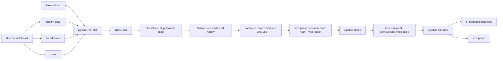

# Pipeline-lite 当前实现基线研究

> 日期：2026-07-25  
> 研究问题：pipeline-lite 当前怎样把 OpenSpec 与 Superpowers 嵌入七阶段、怎样治理产出文档、怎样把上一步产物喂给下一步，以及它在上下文、确认门和运行时上有哪些已证实的现状。  
> 范围：只描述当前实现，不给出 Comet/Trellis 对比结论和改造建议；这些应由上层综合报告在拿到另外两份外部研究后完成。

## 结论摘要

1. pipeline-lite 已不是“靠 prompt 提醒读文档”的松散流程。default workflow 把 OpenSpec、Superpowers、ADR、验证报告和 applied spec 映射成十类受治理文档，并以 `Skill/CodexSkillRead → producer → SHA-256 → phase+visit read receipt → check/transition` 形成可机器拒绝的证据链。
2. OpenSpec 和 Superpowers 的职责有清晰分工：OpenSpec 承载 proposal、initial design、delta spec、tasks 和 applied spec；Superpowers 承载 explore design、ADR、实施 plan 和 completion verification。它们不是并排附件，而是在后续 phase 的累计 read contract 中合流。
3. `tasks.md` 是跨阶段活文档和 Todo 来源。Spec 写计划，Build/Verify/Ship/Archive 按各自 phase driver 重登记新 hash；hash 改变会清旧 read receipt，迫使当前阶段重新消费。
4. “喂给下一步”目前有两层：强层是 ledger 的全文读取收据和 phase skill 中的显式 `cat/read all`；弱层是 SessionStart、breadcrumb、router 提示。另有结构化 `pipeline handoff` 压缩器，但它只能手工调用，没有接入 transition，因此不是可靠的自动 phase handoff。
5. artifact registry 只校验“声明的 field + producer 名是否位于有效 skill 集”，不校验实际 Skill 历史、不持久化 producer、不要求文件存在。它比 document ledger 弱，不能替代文档证据。
6. review receipt 的 canonical 设计较强：绑定 exact phase 和 exact outgoing event，成功 transition 后消费，`verify-pass` 与 `verify-fail` 不可互用。
7. 当前交互门存在两个已证实的可用性缺口：`继续，按照你的推荐` 会被 resume 识别，却不会被 approval 识别；新鲜 marker 会拦截除提问工具和极窄 review 命令外的所有工具，没有“只读研究工具”分类。
8. 当前托管 `pipeline` runtime 与仓库 HEAD/local dist 存在 schema 漂移：Change 已含 document/workflow fingerprint，而 active managed release 的 decoder 不接受这些字段，导致托管 CLI status 失败、本地 dist 成功。

## 1. 研究边界与版本快照

### 1.1 已提交基线

- 隔离工作树：`/Users/a1234/Documents/code-manager/projects/pipeline-worklfow-comet-trellis-analysis`
- 分支：`codex/comet-trellis-workflow-analysis`
- HEAD：`547632980e09074fde86dca08850723180e69def`
- 报告写入前，除上层任务已创建的 `openspec/changes/comet-trellis-workflow-analysis/` 外没有其他隔离工作树改动。

本文所有标为 `repo/...` 的源码引用均以该 HEAD 为基线。

### 1.2 原始工作树未提交漂移

原始工作树 `/Users/a1234/Documents/code-manager/projects/pipeline-worklfow` 与隔离工作树同一 HEAD，但存在大量未提交修改。与本研究直接相关的漂移主要是：

- `hooks/breadcrumb.sh`、`hooks/router.sh`：增加 host-session → Change 绑定，降低另一个会话改写仓库级 `.pipeline-active` 后劫持“继续”的风险。
- `packages/cli/src/commands/handoff.ts`、`packages/kernel/src/compress/*`：增加 Change 文档语言和中英文 handoff 输出。
- `packages/cli/src/commands/document.ts`、scaffold、document locale、phase skills：正在补文档语言、模板和 scaffold 安全性。
- 多个 phase `SKILL.md` 和 `skills/pipeline/SKILL.md` 有未提交文案/行为说明变化。

以下关键机制经逐文件 `cmp` 确认在两棵工作树中完全一致，因此属于 committed HEAD，不是本地实验漂移：

- `hooks/prompt-intent.sh`
- `hooks/gate.sh`
- `hooks/confirm-clear-prompt.sh`
- `hooks/interactive-skill-gate.sh`
- `templates/manifest.yaml`
- `templates/workflows/default.yaml`
- `packages/kernel/src/workflow/document-contract.ts`
- `packages/kernel/src/state/document-ledger.ts`
- `packages/kernel/src/state/document-evidence.ts`
- `packages/cli/src/commands/artifact.ts`

因此本文关于确认语句识别和只读工具被门拦截的结论，是 committed baseline 的事实。

## 2. 当前总体模型



这里有四个不同的控制平面：

1. **workflow 图**：决定 step、transition、gate、artifact。
2. **skill/profile overlay**：决定 default 每个 phase/track 必须调用哪些 skill。
3. **document contract**：决定每步必须产出、可更新和必须读取哪些文档。
4. **hook/context 平面**：负责会话启动、任务恢复、路由、交互门和 prompt 级确认。

这四层并未完全统一到一个声明文件：default 图在 `templates/workflows/default.yaml`，default skill matrix 和 breadcrumb 在 `templates/manifest.yaml`，文档矩阵在 TypeScript，逐步执行细节又在 phase `SKILL.md`。

### 证据：七阶段、回退边与 review phase

`repo/templates/manifest.yaml:23-50`

```yaml
# —— 7 相位，声明顺序即相位顺序（回退边判定 = 目标序号 < 当前序号）——
phases:
  - open
  - explore
  - spec
  - build
  - verify
  - ship
  - archive

# —— 转换图：from: [合法目标...] ——
# build 的 requirements-changed → spec 与 verify-fail → build 都是受控回退边，
# phase_status=in_progress；修订后的目标相位证据必须重新 record/read 才能再次前进。
# archive: [archive] = 终态自环（老内核 archived 事件，phase_status=done、archived=true 由 CLI 层落）。
# 每个已声明相位必须在此有条目（可为 []），缺条目 = 结构错误，loadManifest fail-loud。
transitions:
  open: [explore]
  explore: [spec]
  spec: [build]
  build: [verify, spec]
  verify: [ship, build]
  ship: [archive]
  archive: [archive]

# —— review-gate 相位：完成这些相位、准备离开时必须取得 canonical approval receipt ——
# 引擎经 isReviewPhase() 暴露判定；此列表是唯一真相源。`pipeline review request` 才写 v2
# hook marker（receipt 同时绑定离开的 exact event），进入相位本身不写 marker，因而不会锁住该相位的调研/规格/验证工作。
review_phases: [explore, spec, verify]
```

## 3. 七阶段中 OpenSpec 与 Superpowers 的实际嵌入

| Phase | 核心工作 | OpenSpec | Superpowers / 其他文档 | 如何喂给下一步 |
|---|---|---|---|---|
| Open | 建立独立 Change 和骨架 | `proposal`、`openspec-design`、`tasks`，producer=`openspec-propose` | 无强制 Superpowers 产物 | Explore 必须读取三份精确 hash |
| Explore | 调研、brainstorming、grill、ADR | 调研结论回填 proposal/design；tasks 更新后重登记 | `superpower-design`、`adr`，通常由 `brainstorming` 产出；`design_doc` artifact 指向设计文档 | Spec 累计读取 Open + Explore 文档；design_doc 全文直接读 |
| Spec | 把设计转成可执行约束和计划 | 每 capability 的 `delta-spec`；同步 tasks；必要时修订 proposal/design | `superpower-plan` 与 `plan`，producer=`writing-plans` | Build 累计读取截至 Spec 的八类文档，并全文读 plan/design_doc |
| Build | 按 tasks 实现和自测，冻结 baseline | 需求语义变化必须回退 Spec；不得在 Build 偷改 proposal/design | 无新的强制设计文档 | 每改 tasks 就重登记并补当前 visit read；Build→Verify 冻结 `build_sha` |
| Verify | 对冻结 baseline 做独立验证 | 可按明确条件把 delta 合并主 spec；不修改实现移动靶 | `verification-report`，producer=`verification-before-completion` | Ship 读取截至 Verify 的全部文档与精确报告 hash |
| Ship | 应用 delta、生成 PR/PRD/交付 | `applied-spec`，producer=`openspec-apply-change` | PM 可生成 PRD/handoff，工程轨建 PR | Archive 读取截至 Ship 全链条 |
| Archive | 归档和沉淀 | 校验 applied spec 后归档 Change | handoff/learn-record 为条件或可选产物 | 终态，不再自动喂给下一 phase |

### 证据：文档类型及 phase owner/producer

`repo/packages/kernel/src/workflow/document-contract.ts:10-27`

```ts
export const DOCUMENT_CONTRACT_PHASES = [
  'open', 'explore', 'spec', 'build', 'verify', 'ship', 'archive',
] as const

export type DocumentContractPhase = (typeof DOCUMENT_CONTRACT_PHASES)[number]

export const DOCUMENT_KINDS = [
  'proposal',
  'openspec-design',
  'tasks',
  'superpower-design',
  'adr',
  'delta-spec',
  'superpower-plan',
  'plan',
  'verification-report',
  'applied-spec',
] as const
```

`repo/packages/kernel/src/workflow/document-contract.ts:47-73`

```ts
const OUTPUTS_BY_PHASE: Readonly<Record<DocumentContractPhase, readonly DocumentOutputRequirement[]>> = {
  open: [
    { kind: 'proposal', producerCandidates: ['openspec-propose', 'opsx:propose'] },
    { kind: 'openspec-design', producerCandidates: ['openspec-propose', 'opsx:propose'] },
    { kind: 'tasks', producerCandidates: ['openspec-propose', 'opsx:propose'] },
  ],
  explore: [
    { kind: 'superpower-design', producerCandidates: ['brainstorming', 'superpowers:brainstorming'] },
    { kind: 'adr', producerCandidates: ['pipeline-explore', 'pipeline-lite:pipeline-explore', 'brainstorming', 'superpowers:brainstorming'] },
  ],
  spec: [
    { kind: 'delta-spec', producerCandidates: ['openspec-propose', 'opsx:propose'] },
    { kind: 'superpower-plan', producerCandidates: ['writing-plans', 'superpowers:writing-plans'] },
    { kind: 'plan', producerCandidates: ['writing-plans', 'superpowers:writing-plans'] },
  ],
  build: [],
  verify: [
    {
      kind: 'verification-report',
      producerCandidates: ['verification-before-completion', 'superpowers:verification-before-completion', 'pipeline-verify', 'pipeline-lite:pipeline-verify'],
    },
  ],
  ship: [
    { kind: 'applied-spec', producerCandidates: ['openspec-apply-change', 'opsx:apply'] },
  ],
  archive: [],
}
```

### 证据：累计读取矩阵

`repo/packages/kernel/src/workflow/document-contract.ts:114-132`

```ts
const READS_BY_PHASE: Readonly<Record<DocumentContractPhase, readonly DocumentKind[]>> = {
  open: [],
  explore: ['proposal', 'openspec-design', 'tasks'],
  spec: ['proposal', 'openspec-design', 'tasks', 'superpower-design', 'adr'],
  build: [
    'proposal', 'openspec-design', 'tasks', 'superpower-design', 'adr', 'delta-spec', 'superpower-plan', 'plan',
  ],
  verify: [
    'proposal', 'openspec-design', 'tasks', 'superpower-design', 'adr', 'delta-spec', 'superpower-plan', 'plan',
  ],
  ship: [
    'proposal', 'openspec-design', 'tasks', 'superpower-design', 'adr', 'delta-spec', 'superpower-plan', 'plan',
    'verification-report',
  ],
  archive: [
    'proposal', 'openspec-design', 'tasks', 'superpower-design', 'adr', 'delta-spec', 'superpower-plan', 'plan',
    'verification-report', 'applied-spec',
  ],
}
```

这个读取矩阵解释了“怎么喂给下一步”：不是只把上一阶段新增的一份文件传下去，而是把到当前为止的治理文档集合累计重读。优点是抗遗忘和抗回退；成本是随着阶段推进上下文越来越重。

## 4. Skill 是如何嵌入每一步并形成证据的

default 的 skill 并不写在 `default.yaml` 的 `skills` 字段中；该文件每步当前都是 `skills: []`。实际 default mandatory/recommended skills 来自 manifest overlay。custom workflow 才从自身 step graph 取 skill。

`repo/templates/workflows/default.yaml:13-24`

```yaml
  - id: explore
    label: 调研
    gate: review
    skills: []
    inputs: []
    outputs:
      - field: design_doc
        type: file_path
    artifacts:
      - field: design_doc
        type: file_path
        producer_policy: effective-phase-skills
```

### 证据：default skill matrix

`repo/templates/manifest.yaml:61-95`

```yaml
# —— phase × track 强制 skill 表（老 evidence 派生；缺则 full preset [HARD] 阻断）——
# 键 = 'phase.track'；`_all` = 不分 track、对每 track 兜底（老 evidence 三级回退：per-track → _all → 空）。
# 所有默认 token 均是本插件内置 skill；新用户不依赖另一宿主、npm 或第三方 marketplace。
# 消费方：guard 强制 skill 校验面 / SessionStart 注入。
mandatory_skills:
  open._all: [openspec-propose]
  explore.pm: [brainstorming, grill-with-docs]
  explore.frontend: [openspec-explore, brainstorming, grill-with-docs]
  explore.backend: [openspec-explore, brainstorming, grill-with-docs, improve-codebase-architecture]
  explore.free: [brainstorming]
  spec.pm: [openspec-propose, brainstorming, writing-plans, grill-with-docs]
  spec.frontend: [openspec-propose, writing-plans]
  spec.backend: [openspec-propose, writing-plans]
  spec.free: [openspec-propose, writing-plans]
  build.pm: [prototype, frontend-design, design-taste-frontend]
  build.frontend: [test-driven-development, frontend-design, web-design-guidelines, design-taste-frontend]
  build.backend: [writing-plans, test-driven-development]
  build.free: [writing-plans, test-driven-development]
  verify.pm: [browser-qa, web-design-guidelines, design-taste-frontend, verification-before-completion, handoff]
  verify.frontend: [verification-before-completion, e2e-testing, browser-qa, web-design-guidelines, design-taste-frontend]
  verify.backend: [verification-before-completion]
  verify.free: [verification-before-completion]
  ship.pm: [openspec-apply-change, to-spec, to-tickets]
  ship.frontend: [openspec-apply-change, openspec-archive-change, finishing-a-development-branch]
  ship.backend: [openspec-apply-change, finishing-a-development-branch]
  ship.free: [openspec-apply-change, finishing-a-development-branch]
  # archive 无强制 skill（归档不 gate skill）——不声明即空表

# —— phase × track 推荐 skill 表（老 evidence 派生；缺只 WARN、不阻断）——
recommended_skills:
  explore.pm: [pipeline-researcher]
  explore.frontend: [search-first]
  explore.backend: [search-first]
  build.pm: [prototype, frontend-design, hallmark]
  build.frontend: [react-patterns, web-design-guidelines, hallmark]
```

### 证据：真实完成只取当前 step visit 后的 Skill 历史

`repo/packages/kernel/src/workflow/skill-evidence.ts:22-30`

```ts
/** Pipeline-owned skills may be presented by Codex with the plugin namespace. */
export function canonicalWorkflowSkillId(skillId: string): string {
  return skillId.startsWith('pipeline-lite:') ? skillId.slice('pipeline-lite:'.length) : skillId
}

function skillIdFromHistory(raw: string): string | null {
  const match = /^(?:Skill|CodexSkillRead): (.+)$/.exec(raw)
  return match?.[1] === undefined ? null : canonicalWorkflowSkillId(match[1])
}
```

`repo/packages/kernel/src/workflow/skill-evidence.ts:32-67`

```ts
/**
 * Return only skill completions recorded after the most recent transition into the current step.
 * A malformed JSONL line is ignored; an unreadable history file is handled by the adapter.
 */
export function completedWorkflowSkillsSinceStepEntry(
  historyRaw: string,
  currentStepId: string,
): ReadonlySet<string> {
  const lines: WorkflowHistoryLine[] = []
  for (const line of historyRaw.split('\n')) {
    if (line.trim() === '') continue
    try {
      const decoded = decodeHistoryLine(JSON.parse(line))
      if (decoded) lines.push(decoded)
    } catch {
      // A damaged compatibility-history line cannot manufacture or erase another valid receipt.
    }
  }

  let enteredAt = -1
  for (let index = lines.length - 1; index >= 0; index--) {
    const line = lines[index]
    if (line?.kind === 'transition' && line.to === currentStepId) {
      enteredAt = index
      break
    }
  }

  const completed = new Set<string>()
  for (const line of lines.slice(enteredAt + 1)) {
    if (line.kind !== 'tool') continue
    const skillId = skillIdFromHistory(line.raw ?? '')
    if (skillId !== null) completed.add(skillId)
  }
  return completed
}
```

`repo/packages/kernel/src/workflow/skill-evidence.ts:69-77`

```ts
/** Every declared node is mandatory before the step can exit; depends_on controls invocation order. */
export function missingWorkflowStepSkills(
  skills: readonly SkillRef[],
  completed: ReadonlySet<string>,
): readonly string[] {
  return skills
    .map((skill) => canonicalWorkflowSkillId(skill.id))
    .filter((skillId, index, all) => all.indexOf(skillId) === index && !completed.has(skillId))
}
```

### 证据：Codex 的预收据不等于完成证据

`repo/packages/cli/src/codexSkillReceipt.ts:1-12`

```ts
/**
 * Codex transcript-backed skill evidence bridge.
 *
 * Some Codex App/CLI tool paths invoke PreToolUse but do not emit the paired PostToolUse callback.
 * A PreToolUse receipt is therefore only a pending pointer to a host-owned transcript.  It never
 * becomes workflow evidence by itself: document registration and custom-workflow DAG checks first
 * locate the completed matching `custom_tool_call` plus successful output in that transcript, then
 * append the normal `CodexSkillRead` history entry under the target change lock.
 *
 * This is intentionally CLI adapter infrastructure, not kernel domain logic.  The kernel continues
 * to consume the same append-only history contract from every host.
 */
```

### 证据：transition 在离开 step 前强制技能齐全

`repo/packages/kernel/src/workflow/transition-application.ts:283-297`

```ts
        if (deps.missingStepSkills !== undefined) {
          const missing = await deps.missingStepSkills({
            changeDir: command.changeDir,
            stepId: prepared.from,
            capability: effectivePlan.capabilities.skills,
          })
          if (missing.length > 0) {
            return {
              kind: 'step-skills-incomplete',
              workflowName,
              stepId: prepared.from,
              missing,
            }
          }
        }
```

这使 skill 不只是 phase prompt 中的建议；只要 effective plan 把它声明为 required slot，transition 就会以当前 step visit 的 history 拒绝漏跑。

## 5. 文档治理：从“产出文件”到“可消费证据”

### 5.1 Ledger 数据模型

每个记录保存：

- 受限的项目相对路径；
- 内容 SHA-256；
- producer skill；
- 登记时间；
- 读取该精确 hash 的 phase/visit receipts。

`repo/packages/kernel/src/state/document-ledger.ts:1-8`

```ts
/**
 * OpenSpec document evidence sidecar.
 *
 * `.pipeline.yaml` remains canonical workflow state. This sidecar is an independently rebuildable
 * evidence ledger: it records only safe project-relative documents, their content digest, intended
 * producing skill, and exact-hash phase read receipts. Callers must hold the change lock while
 * mutating it; each write is still atomically published to avoid a partially visible ledger.
 */
```

`repo/packages/kernel/src/state/document-ledger.ts:41-63`

```ts
export const DOCUMENT_LEDGER_FILE = '.pipeline-documents.json'
export interface DocumentReadReceipt {
  readonly phase: string
  readonly sha256: string
  readonly readAt: string
  readonly visitId?: string
}

export interface DocumentRecord {
  readonly kind: DocumentKind
  readonly path: string
  readonly sha256: string
  readonly producer: string
  readonly recordedAt: string
  readonly reads: readonly DocumentReadReceipt[]
}

export interface DocumentLedger {
  readonly version: 1
  readonly contract: 'openspec-v1'
  readonly createdAt: string
  readonly records: readonly DocumentRecord[]
}
```

### 5.2 Visit identity 防止旧读取收据复用

读取收据不只绑定 phase，还绑定 `[runId, transitionSequence]`。同一个 phase 回退后再次进入，会得到不同 visit identity，旧 receipt 不能复用。

`repo/packages/kernel/src/state/document-ledger.ts:131-138`

```ts
/** Stable authored-step visit identity; legacy YAML-only Changes fail closed until canonicalized. */
export async function currentDocumentStepVisitId(changeDir: string): Promise<string> {
  const metadata = (await readCurrentRunRevision(changeDir))?.state.runMetadata
  if (metadata === undefined) throw new DocumentLedgerError(
    '缺少 canonical WorkflowRun visit identity；旧 Change 必须先通过受控 state mutation 建立 run identity，再重新读取 document',
  )
  return JSON.stringify([metadata.runId, metadata.transitionSequence])
}
```

### 5.3 Producer 必须有真实当前 phase Skill evidence

`repo/packages/kernel/src/state/document-ledger.ts:247-271`

```ts
  // A normal record must be backed by a Skill invocation from the current visit to the phase.
  // `--backfill` is the sole migration exception because an upgraded Change may already have
  // crossed the document's owning phase before this ledger existed.
  let start = 0
  if (!allowEarlierPhaseEvidence) {
    for (let index = entries.length - 1; index >= 0; index -= 1) {
      const entry = entries[index]
      if (entry?.kind === 'transition' && entry.to === phase) {
        start = index + 1
        break
      }
    }
  }
  for (const entry of entries.slice(start)) {
    if (entry.kind !== 'tool') continue
    try {
      const raw = string(entry.raw)
      // Claude exposes a first-class Skill event, while Codex exposes a completed, restricted
      // bundled SKILL.md read as host-observed evidence. The hook records those two provenance
      // labels distinctly; both are valid proof that the exact packaged producer was loaded.
      const match = raw ? /^(?:Skill|CodexSkillRead): (.+)$/.exec(raw) : null
      if (match && skillsEquivalent(match[1] ?? '', producer)) return true
    } catch { /* malformed legacy tool entry cannot satisfy evidence */ }
  }
  return false
```

### 5.4 内容变更会使旧读取失效

相同 digest 重登记保留 reads；新 digest 清空 reads。后续 `read` 又会检查磁盘当前 digest 与 ledger 是否一致。

`repo/packages/kernel/src/state/document-ledger.ts:364-388`

```ts
  if (!await hasSkillEvidence(input.changeDir, input.producer, input.phase, input.allowBackfill === true)) {
    throw new DocumentLedgerError(
      `缺少 Skill 调用证据（当前 phase）: '${input.producer}'；先由宿主在本 phase 实际调用该 skill，确认完成态证据已写入 history 后再登记 '${input.kind}'`,
    )
  }
  const replacement: DocumentRecord = {
    kind: input.kind,
    path: resolved.relativePath,
    sha256: resolved.digest,
    producer: input.producer,
    recordedAt: input.recordedAt,
    reads: old?.sha256 === resolved.digest ? old.reads : [],
  }
  // Singleton kinds use one named slot. Delta specs use one slot per canonical capability.
  // Unmapped legacy records remain intact until an explicit, digest-preserving migration.
  const records = current.records.filter((record) => {
    if (record.kind !== input.kind) return true
    if (record.kind !== 'delta-spec') return false
    const recordSlot = deltaSpecSlot(record.path, input.changeDir)
    return recordSlot === undefined || recordSlot !== slot
  })
  records.push(replacement)
  const next: DocumentLedger = { ...current, records }
  await writeDocumentLedger(input.changeDir, next)
  return next
```

`repo/packages/kernel/src/state/document-ledger.ts:480-498`

```ts
  const updated: DocumentRecord[] = []
  for (const record of current.records) {
    if (!kinds.includes(record.kind)) {
      updated.push(record)
      continue
    }
    const resolved = await resolveDocument(input.repoRoot, record.path)
    if (resolved.digest !== record.sha256) {
      throw new DocumentLedgerError(`document '${record.kind}' 已变更: ${record.path}；先重新 record 后再 read`)
    }
    const reads = record.reads.filter(
      (receipt) => receipt.phase !== input.phase || receipt.visitId !== visitId,
    )
    reads.push({ phase: input.phase, sha256: resolved.digest, readAt: input.readAt, visitId })
    updated.push({ ...record, reads })
  }
  const next: DocumentLedger = { ...current, records: updated }
  await writeDocumentLedger(input.changeDir, next)
  return next
```

### 5.5 Check 与 transition 使用同一个文档证据谓词

`repo/packages/cli/src/commands/check.ts:61-88`

```ts
// ── default workflow：coverage policy 必须来自当前项目 effective registry。registry 损坏或
// state.track 已成 orphan 都 fail-loud，不回退按 track id 的旧静态矩阵。
const coverageProfile = plan.capabilities.track.coverageProfile
const result = deps.flow.guardCheck(state, { ...deps.guardCtx?.(name), coverageProfile })
let documents: DocumentEvidenceReport | undefined
try {
  documents = await governedDocumentEvidence(deps, dir, state, plan.capabilities.documents.policy)
} catch (e) {
  deps.io.err(`ERROR: ${errMsg(e)}`)
  return 1
}
deps.io.out(`[CHECK] ${name} (phase=${display(state.fields.phase)})`)
for (const warning of result.warnings ?? []) {
  deps.io.out(`  [WARN] ${warning}`)
}
if (result.pass && (documents?.pass ?? true)) {
  deps.io.out('  [PASS] 所有检查通过')
  return 0
}
for (const failure of result.failures) {
  deps.io.out(`  [FAIL] ${failure}`)
}
for (const blocker of documents?.blockers ?? []) {
  deps.io.out(`  [FAIL] document: ${blocker}`)
}
```

`repo/packages/kernel/src/workflow/transition-application.ts:311-344`

```ts
if (
  prepared.documentPolicy
  && shouldEnforceDocumentPolicyOnTransition(prepared.documentPolicy, prepared.from, prepared.to)
) {
  if (!isDocumentPolicyStep(prepared.documentPolicy, prepared.from)) {
    return {
      kind: 'document-evidence-failed',
      phase: prepared.from,
      blockers: [`受 document contract 治理的 workflow 使用了非法 step '${prepared.from}'`],
    }
  }
  let evidence: DocumentEvidenceReport
  if (prepared.documentPolicy.id === 'openspec-v1' && deps.documentEvidence) {
    if (!isDocumentContractPhase(prepared.from)) {
      return {
        kind: 'document-evidence-failed',
        phase: prepared.from,
        blockers: [`legacy document contract 使用了非法 phase '${prepared.from}'`],
      }
    }
    evidence = await deps.documentEvidence(command.root, command.changeDir, prepared.from)
  } else {
    evidence = await evaluateDocumentEvidence(
      command.root,
      command.changeDir,
      prepared.from,
      {},
      prepared.documentPolicy,
    )
  }
  if (!evidence.pass) {
    return { kind: 'document-evidence-failed', phase: prepared.from, blockers: evidence.blockers }
  }
}
```

回退边被特意豁免前向文档检查，以便证据已 stale 时仍能回到上游修订；重新前进时必须重建证据。

`repo/packages/kernel/src/workflow/document-contract.ts:401-416`

```ts
/** A rollback remains available even when forward evidence is stale or incomplete. */
export function shouldEnforceDocumentEvidenceOnTransition(from: string, to: string): boolean {
  const fromIndex = DOCUMENT_CONTRACT_PHASES.indexOf(from as DocumentContractPhase)
  const toIndex = DOCUMENT_CONTRACT_PHASES.indexOf(to as DocumentContractPhase)
  return !(fromIndex >= 0 && toIndex >= 0 && toIndex < fromIndex)
}

export function shouldEnforceDocumentPolicyOnTransition(
  policy: DocumentGovernancePolicy,
  from: string,
  to: string,
): boolean {
  const fromIndex = policy.steps.indexOf(from)
  const toIndex = policy.steps.indexOf(to)
  return !(fromIndex >= 0 && toIndex >= 0 && toIndex < fromIndex)
}
```

### 5.6 Custom workflow 的治理入口

default 或声明 `openspec_contract: required` 的 workflow 使用完整七阶段 legacy policy；声明 `document_contract: v1` 的 custom workflow 则按自己的 step、slot 和 read 声明生成短图 policy，未声明任何 contract 的 workflow 不进入 ledger 治理。

`repo/packages/kernel/src/workflow/document-contract.ts:154-187`

```ts
export function documentGovernancePolicy(
  workflowName: string,
  workflow?: {
    readonly openspecContract?: WorkflowDef['openspecContract']
    readonly documentContract?: WorkflowDef['documentContract']
    readonly steps: readonly { readonly id: string }[]
  },
): DocumentGovernancePolicy | undefined {
  if (workflowName === 'default' || workflow?.openspecContract === 'required') {
    return LEGACY_DOCUMENT_GOVERNANCE_POLICY
  }
  const contract = workflow?.documentContract
  if (!contract) return undefined
  const outputsByStep: Record<string, DocumentOutputRequirement[]> = Object.fromEntries(
    workflow.steps.map((step) => [step.id, []]),
  )
  for (const slot of contract.slots) {
    if (!isDocumentKind(slot.kind)) continue
    outputsByStep[slot.ownerStep]?.push({ kind: slot.kind, producerCandidates: slot.producers })
  }
  const readsByStep: Record<string, readonly DocumentKind[]> = Object.fromEntries(
    workflow.steps.map((step) => [step.id, []]),
  )
  for (const read of contract.reads) {
    readsByStep[read.step] = read.kinds.filter(isDocumentKind)
  }
  return {
    id: 'document-v1',
    steps: workflow.steps.map((step) => step.id),
    outputsByStep,
    mutableByStep: Object.fromEntries(workflow.steps.map((step) => [step.id, []])),
    readsByStep,
  }
}
```

## 6. tasks.md 的特殊地位

`tasks.md` 同时承担三个角色：

1. OpenSpec Change 的任务清单；
2. pipeline Todo 的唯一可编辑来源；
3. 跨阶段进度与交接状态。

这使它不能是 Open 时登记一次就不变的静态文档。Explore/Spec/Build/Verify/Ship/Archive 都被授权以自己的 phase driver 重登记 tasks。Build 每完成一个 task 后即时改 `[ ] → [x]`，再登记新 hash 和读取收据。

### 证据：Build 的 tasks 反馈循环

`repo/skills/pipeline-build/SKILL.md:269-283`

````md
#### Step 3.2: 增量勾选 + 提交

每完成一个 task（已过 Step 3.1 全绿）：
1. **宿主 VCS 可写时**：首个 commit 前，若目标项目尚无 pre-commit，建议为其配置 pre-commit（`husky` + `lint-staged`，或对应 stack 等价物如 Python 的 `pre-commit` 框架、Go 的 `pre-commit` 钩子等）**自动修格式**，避免脏格式噪音淹没后续 review。受限 agent 不能写 `.git` 时，不得因此阻塞 Build 或声称已提交。
2. 更新 `openspec/changes/<name>/tasks.md` 把 `- [ ]` 改为 `- [x]`，然后立即由本 phase 已实际调用的
   `pipeline-build` 重新登记该活文档并重建本 phase 的读取收据；不得用 `--backfill` 沿用 open/spec
   的 producer，否则当前 SHA 与证据会失真：

   ```bash
   TASKS_PATH="openspec/changes/$PIPELINE_CHANGE_NAME/tasks.md"
   pipeline document record "$PIPELINE_CHANGE_NAME" tasks "$TASKS_PATH" --producer pipeline-build
   pipeline document read "$PIPELINE_CHANGE_NAME" tasks
   ```

3. 宿主 VCS 可写且项目已有可提交 HEAD 时，可执行 `git commit -m "<task description>"`（message 体现设计意图）；否则保留真实 diff、完成 task/ledger 记录并继续验证。
````

### 证据：root skill 要求 Todo 来自真实图与 tasks.md

`repo/skills/pipeline/SKILL.md:99-107`

````md
6. Todo 一级项必须来自所绑定 workflow 的真实 step 图：
   - default：`open → explore → spec → build → verify → ship → archive`，二级任务来自
     `tasks.md`；
   - simple：`change → verify → done`，并显示 `escalated` 分支，不创建或读取 `tasks.md`；
   - 项目 custom：从其已校验的 workflow 定义投影。
   不得把原始提示词拆成脱离 phase/step 的一级 Todo。
7. 紧接着调用真实图中当前 step 声明的 skill。default 使用本文件 Step 4 表；
   simple 的 `change` 调用 `simple-task`，`verify` 调用 `verification-before-completion`。Hook 只能注入上下文，
   不能替宿主实际调用 Skill，因此此调用是入口的强制职责。
````

## 7. Artifact registry 与 Document ledger 不是同一层

default workflow 声明三个 file artifacts：

- Explore: `design_doc`
- Spec: `plan`（PM 不要求该 field，但 ledger 仍要求 PM plan 文档）
- Verify: `verification_report`

artifact registry 的作用是把当前 phase 的某个 file path 写入 canonical field，并限制 producer 名必须在 effective skill slots 中。它没有 ledger 的真实性与内容完整性保证。

### 证据：artifact 当前明确不持久化 producer，也不检查文件

`repo/packages/cli/src/commands/artifact.ts:12-20`

```ts
 * exit：成功静默 0；一切声明/producer/workflow/field/path/I-O 错误 1（不写 state）。不用 2
 * （guard/check 口径）/ 3（CAS 未命中口径）。--producer 缺失是 commander usage error → main 映射 1。
 *
 * producer 是写入授权/evidence 输入，**不**持久化：artifact 字段仍只存 path，history 记普通 set
 * （不把 producer 塞自由串）。审计「究竟哪个 skill 产出」若需要，另立结构化 record（不在本轮暗藏）。
 * 路径语义与旧 file_path 字段一致：非空即可，不要求文件已存在、不 canonicalize、不限制目录。
 *
 * P5 保留 set/set-many/cas 旧写能力（P6 才 cutover）；default 用 P4 codegen 查询层、不用 Track
 * Registry；T-R6 已在生产装配把 default resolver 接到 effective track profile，本命令保持只依赖接口。
```

`repo/packages/cli/src/commands/artifact.ts:90-109`

```ts
const slots: readonly EffectiveSkillSlot[] = resolveAvailableSkillSlots(
  deps.resolver,
  skillCapability,
  stepId,
)

// 空 effective skill 集必须拒绝（不退化成任意 producer 入口，D5）。
if (slots.length === 0) {
  return reject(deps, `step '${stepId}'/track '${track}' 的有效 skill 集为空——无合法 producer，拒绝登记`)
}
// --producer 必须精确命中某 slot 的某具体 alternative（整个 a|b token 非法）。
const matched = slots.some((s) => s.alternatives.includes(producer))
if (!matched) {
  return reject(deps, `producer '${producer}' 不在有效 skill 集内（允许: ${listAllowed(slots)}）`)
}

// 同锁内写 artifact 字段 + best-effort history（同 set：history 失败仅 WARN、不回滚主写）。
await deps.store.writeUnderLock(dir, { ...cur, fields: { ...cur.fields, [f]: path } }, { kind: 'set' })
await recordHistory(deps, dir, { ts: deps.clock(), kind: 'set', field: f, to: path })
return 0
```

所以当前正确理解是：

- artifact 是“去哪找人读产物”的状态指针；
- document ledger 是“谁真实产出、内容是否还是同一版、当前阶段是否真实消费”的证据；
- phase skill 通常要求两者都写，但二者没有自动事务合并。

## 8. 下一步怎样拿到上一步产物

### 8.1 强交接：全文读取 + hash receipt

每个受治理 phase 的 `pipeline document read <change> all` 会对契约要求的全部上游文档写 receipt。phase skill 还会对关键 artifact 做全文 `cat`，例如 Spec 读 `design_doc`，Build 读 `plan + design_doc`。

`repo/skills/pipeline-build/SKILL.md:96-108`

````md
### Step 1: 读取上下文

```bash
PLAN=$(pipeline get "$PIPELINE_CHANGE_NAME" plan)
DESIGN_DOC=$(pipeline get "$PIPELINE_CHANGE_NAME" design_doc)
# 必读 plan + design_doc。design_doc 是业务规则/不变量/状态机（layer 3/4）的家，
# build Agent 必须读到它——只凭 plan 写代码会在第 3-10 层靠猜。
[ -f "$PLAN" ]       && { echo "=== PLAN ==="; cat "$PLAN"; }
[ -f "$DESIGN_DOC" ] && { echo "=== DESIGN_DOC（业务规则/状态机/不变量）==="; cat "$DESIGN_DOC"; }

# 受治理 workflow：对截至 spec 的全部文档生成本 phase 的 hash-bound read receipt。
pipeline document read "$PIPELINE_CHANGE_NAME" all
```
````

### 8.2 会话恢复：SessionStart + breadcrumb + router

SessionStart 注入七阶段简图、workflow constitution、活跃 Change 候选、fresh markers 和 OpenSpec 路径提示，但明确不把候选自动绑定到当前会话。

`repo/hooks/session-start.sh:164-180`

```sh
# ── 简短引导（一行相位图 + 项目 GOAL.md 头两行，若有）──
append_context $'pipeline-lite: 7-phase 流水线已加载：open → explore → spec → build ⇄ verify → ship → archive。状态操作一律走 pipeline CLI（status / get / set / transition / check），编排入口 skill：pipeline。\n'
if [ -f "$CWD/GOAL.md" ]; then
  append_file "$CWD/GOAL.md" 2
fi

# ── 注入①：工作流宪法（templates/workflow.md，相对插件根；缺文件静默跳过）──
WF="$PLUGIN_ROOT/templates/workflow.md"
if [ -f "$WF" ]; then
  append_context $'\n[pipeline-lite 宪法 — '
  append_context "$WF"
  append_context $']\n'
  append_file "$WF"
  append_context $'[宪法完]\n'
fi

# ── 注入②：当前项目 pipeline 上下文（OS_ROOT/yget 已在文件头定位/定义，开关判定同源复用）──
```

`repo/hooks/session-start.sh:213-229`

```sh
if [ -n "$CTX" ]; then
  append_context $'\n[pipeline 上下文 — '
  append_context "$OS_ROOT"
  append_context $'] 活跃 change：\n'
  append_context "$CTX"
  if [ -n "$GATES" ]; then
    append_context '  待处理交互门：'
    append_context "${GATES# }"
    append_context $'（新鲜 marker，写类工具会被 gate.sh 拦，先 AskUserQuestion 解封）\n'
  fi
  append_context $'  上述均为恢复候选，未与本会话自动绑定；只有用户明确说“继续 <change>”或点名 change 才恢复。新目标会独立从 open 创建。\n'
fi
fi

# ── 注入③：openspec 使用提示（openspec 目录存在才输出）──
if [ -n "$OS_ROOT" ]; then
  append_context $'\n[openspec 提示] 本项目使用 openspec：change 唯一状态在 openspec/changes/<name>/.pipeline-run/current.json，.pipeline.yaml 仅兼容投影（两者均勿手改，走 pipeline CLI）；主 spec 在 openspec/specs/<capability>/spec.md，动某能力前先 Read 对应 spec；归档产物沉在 openspec/changes/archive/。\n'
fi
```

breadcrumb 只在显式恢复或点名 Change 时注入 `REAL_AGENT_TASK.md` 和 `.breadcrumb`，以避免把一个会话的旧任务泄漏到另一个会话。

`repo/hooks/breadcrumb.sh:2-10`

```sh
# breadcrumb.sh — UserPromptSubmit 薄 shim：明确恢复时重提该 phase 面包屑。
#
# 缓存由 CLI 在 transition 时写 openspec/changes/<name>/.breadcrumb（CONTRACT §5.4）；
# `.pipeline-active` 是仓库级恢复候选，不能把一个会话的旧任务注入另一个会话。
# 本 shim 仅在用户明确说继续/恢复或点名 change 时绑定候选；无候选时只有恰好一个
# 活跃 change 才可由明确恢复词使用。无缓存或新任务时静默 exit 0。
# 阶段×hook 开关（v5 T5 / 决议#2）：.pipeline/hooks.json 关掉当前阶段的 breadcrumb → 静默退出。
# 纯 bash 热路径：不 spawn 任何解释器/外部 JSON 解析器。
# fail-open：stdin 解析失败 → 回退 $PWD；任何异常 → 静默 exit 0。
```

### 8.3 结构化压缩：已经存在，但不是自动 handoff

`pipeline handoff` 会从 phase 相关文档中确定性提取 headings、decisions、constraints、open todos 和 key fields，并报告压缩率。它的优点是可复现、可测、结构化；决定性缺口是 transition 不会调用它，也不会把摘要持久化成下一 phase 的正式输入。

`repo/packages/cli/src/commands/handoff.ts:2-11`

```ts
 * handoff 子命令 —— 上下文压缩（BACKLOG #30 / GOAL B13·D11：对标 Comet CONTEXT-COMPRESSION）。
 *
 * `pipeline handoff <name> [--phase p] [--json]`：对指定 change 的当前相位产出文档
 * （design_doc / plan / verification_report 指向的路径 + change 目录内 proposal/design/tasks.md）
 * 做**确定性**结构化压缩，输出下游 handoff 摘要 + 压缩率。零 LLM（纯规则，可测可 oracle）。
 * stdout：压缩摘要（下游消费的产物）+ 压缩率行；--json 结构化信封。exit：非法名/状态缺失=1，否则 0。
 *
 * 触发面：handoff 只在用户显式敲 `pipeline handoff` 时跑——相位转换不自动产出 handoff
 * 摘要（transition.ts 的进相位副作用里没有 buildHandoff 调用）。注意 transition 仍会写
 * `.breadcrumb`，但那只是一行 `pipeline:<name> phase=<to>` 的相位标记，与 handoff 摘要无关。
```

`repo/packages/kernel/src/compress/types.ts:4-10`

```ts
 * 思想：phase handoff（design→build / build→verify / verify→ship）时，把上游产出的长文档
 * （design_doc / plan / verification_report）**确定性**压缩为结构化摘要传给下游——保留关键
 * 决策 / 约束 / 待办 / 结构骨架，去除叙述正文 / 代码体 / 样板。零 LLM（纯规则，可测可 oracle），
 * 压缩率可量化（原字符 → 压缩字符，字符数是确定性 token 代理，不引 tokenizer 依赖）。
 *
 * 超越判据（D11 vs Comet）：① 确定性（同输入同输出，可回归 oracle）；② 结构化产出（headings/
 * decisions/constraints/openTodos/keyFields 分桶，非纯文本 blob）；③ 压缩率逐文档 + 聚合量化。
```

因此当前实际策略不是“摘要替代原文”，而是：

- 强制正确性依赖原文 hash receipt；
- 主上下文仍可能全文读累计文档；
- handoff 摘要只是可选命令输出；
- `/clear` 后依靠 SessionStart + status + 再读文件重建。

## 9. Review receipt 与交互门

### 9.1 Canonical review receipt

Review request 先通过与 transition 同口径的 `check`，再在锁内写 pending receipt；acknowledge 把它改成 approved；transition 只接受 exact phase + event 的 approved receipt，并在成功后清空。

`repo/packages/kernel/src/state/review-gate.ts:28-44`

```ts
/**
 * A receipt is only authorization for its exact outgoing event. Keeping `event` optional lets
 * inbox/status callers inspect a phase-scoped pending receipt without weakening transition
 * enforcement, which always supplies the event it is about to execute.
 */
export function reviewGateMatches(state: PipelineState, phase: string, event?: string): boolean {
  return scalar(state, 'review_gate_phase') === phase
    && (event === undefined || reviewGateEvent(state) === event)
}

export function reviewGateApprovedFor(state: PipelineState, phase: string, event?: string): boolean {
  return reviewGateMatches(state, phase, event) && reviewGateStatus(state) === REVIEW_GATE_APPROVED
}

export function reviewGatePendingFor(state: PipelineState, phase: string, event?: string): boolean {
  return reviewGateMatches(state, phase, event) && reviewGateStatus(state) === REVIEW_GATE_PENDING
}
```

`repo/packages/kernel/src/workflow/transition-application.ts:346-360`

```ts
// Review 的判定点是“离开当前 review phase”，不是“刚进入就锁住”。所有自动 guards
// / 文档证据先通过，才允许 request/ack receipt 成为下一步的人类复核证据。CLI/agent
// 只能消费 `pipeline review acknowledge` 写入的 exact-phase-and-event receipt；dashboard
// 则把真实的、已选中 event 的显式放行点击作为同一语义的 host-bound acknowledgement。
if (
  prepared.requiresReviewApproval
  && command.humanReviewApproved !== true
  && !reviewGateApprovedFor(tx.state, prepared.from, command.event)
) {
  return { kind: 'review-approval-required', phase: prepared.from, event: command.event }
}

// Receipt 在任一成功 transition 后立即消费，避免一次旧批准在回退/重入同一 phase 后被复用。
const { record, projection } = await tx.commit({ ...prepared.nextFields, ...clearReviewGatePatch() }, {
  event: command.event, from: prepared.from, to: prepared.to,
})
```

### 9.2 Prompt intent 的分裂语义

resume 判定接受任何包含“继续”的句子；approval 判定只接受列举的强短语，或精确等于“继续”的 contextual confirm。

`repo/hooks/prompt-intent.sh:52-85`

```sh
pipeline_prompt_requests_resume() { # $1=prompt $2=候选 change 名；0=允许绑定旧 change
  local prompt="${1:-}" change="${2:-}"
  [ -n "$prompt" ] || return 1
  pipeline_prompt_rejects_resume "$prompt" && return 1

  # 点名 change 是最明确的恢复意图。
  if pipeline_prompt_names_change "$prompt" "$change"; then
    return 0
  fi

  case "$prompt" in
    *"继续"*|*"接着"*|*"恢复"*|*"上一项"*|*"上一步"*|*"按原计划"*|*"continue"*|*"Continue"*|*"resume"*|*"Resume"*) return 0 ;;
  esac
  return 1
}

# Shared approval/authority vocabulary for UserPromptSubmit consumers.  The caller still owns the
# context check: `contextual-confirm` is valid only when the exact project has a pending
# confirm/interaction/review receipt.  Keeping classification here prevents router and unlock hooks
# from accepting different Chinese/English phrases.
pipeline_prompt_approval_intent() { # $1=prompt; stdout=intent; 0=matched, 1=unrelated
  local prompt="${1:-}"
  case "$prompt" in
    *恢复逐步确认*|*恢复询问*|*停止自主执行*|*撤回自主执行*|*每步确认*)
      printf 'revoke'; return 0 ;;
    *后续不用问*|*后续无需询问*|*后续不需要确认*|*后续自行执行*|*后续自己执行*|*后续自主执行*|*自主执行完成*|*自己执行完成*)
      printf 'authorize'; return 0 ;;
    *确认继续*|*确认执行*|*确认并继续*|*继续执行*|*全部执行*|*可以继续*|*同意继续*|*请继续执行*|*批准继续*|*自行执行*|*自己执行*|*go\ ahead*|*proceed\ with\ it*|*continue\ execution*)
      printf 'confirm'; return 0 ;;
    继续|继续。|继续！|接着|接着。|continue|Continue)
      printf 'contextual-confirm'; return 0 ;;
  esac
  return 1
}
```

所以 `继续，按照你的推荐`：

- 对 `pipeline_prompt_requests_resume`：命中；
- 对 `pipeline_prompt_approval_intent`：不命中；
- `confirm-clear-prompt.sh` 会因空 intent 直接退出，marker 保留。

现有测试覆盖“确认继续，全部执行”和精确 bare “继续”，没有覆盖这个自然表达变体。

`repo/tools/test-hooks.sh:1024-1043`

```sh
# ── 10a'. UserPromptSubmit 真确认：普通询问不得解锁；明确确认必须调用 acknowledge，hook 自己不删 marker。──
printf '%s' "{\"cwd\":\"$proj\",\"prompt\":\"为什么需要确认？\"}" | bash "$CP" >/dev/null 2>&1
[ -f "$proj/.pipeline-pending-review" ] && ok "confirm-clear-prompt: 询问不误清 review marker" || bad "confirm-clear-prompt: 询问不误清 review marker" "marker 被错误清除"
FAKE_PIPELINE_BIN="$TMP/fake-pipeline-bin"; FAKE_PIPELINE_LOG="$TMP/fake-pipeline.log"
mkdir -p "$FAKE_PIPELINE_BIN"
printf '#!/usr/bin/env bash\nprintf "%%s\\n" "$*" >> "$PIPELINE_HOOK_LOG"\n' > "$FAKE_PIPELINE_BIN/pipeline"
chmod +x "$FAKE_PIPELINE_BIN/pipeline"
printf '%s' "{\"cwd\":\"$proj\",\"prompt\":\"确认继续，全部执行\"}" | PATH="$FAKE_PIPELINE_BIN:$PATH" PIPELINE_HOOK_LOG="$FAKE_PIPELINE_LOG" bash "$CP" >/dev/null 2>&1
[ -f "$proj/.pipeline-pending-review" ] && ok "confirm-clear-prompt: 明确确认不直接删除 review marker" || bad "confirm-clear-prompt: 明确确认不直接删除 review marker" "marker 被错误删除"
grep -Fq 'review acknowledge review-demo' "$FAKE_PIPELINE_LOG" 2>/dev/null \
  && ok "confirm-clear-prompt: 明确确认调用 pipeline review acknowledge" \
  || bad "confirm-clear-prompt: 明确确认调用 pipeline review acknowledge" "未记录 acknowledge 调用"
# Bare “继续” only unlocks when this exact project has a pending marker; this is the normal-chat
# regression that previously resumed the Change while leaving the interaction gate self-locked.
touch "$proj/.pipeline-pending-interaction"
printf '%s' "{\"cwd\":\"$proj\",\"prompt\":\"继续\"}" | PATH="$FAKE_PIPELINE_BIN:$PATH" PIPELINE_HOOK_LOG="$FAKE_PIPELINE_LOG" bash "$CP" >/dev/null 2>&1
[ ! -f "$proj/.pipeline-pending-interaction" ] \
  && ok "confirm-clear-prompt: bare 继续清 exact pending interaction" \
  || bad "confirm-clear-prompt: bare 继续清 exact pending interaction" "interaction marker 仍在"
printf '%s' "{\"cwd\":\"$proj\",\"prompt\":\"继续\"}" | PATH="$FAKE_PIPELINE_BIN:$PATH" PIPELINE_HOOK_LOG="$FAKE_PIPELINE_LOG" bash "$CP" >/dev/null 2>&1
```

### 9.3 Gate 没有只读工具分类

新鲜 confirm/review/interaction marker 会遍历拦截所有 tool；例外只有：

- review marker 下的 `pipeline review request/acknowledge` command；
- `AskUserQuestion`；
- `request_user_input`。

`repo/hooks/gate.sh:132-157`

```sh
for kind in confirm review interaction; do
  base=".pipeline-pending-$kind"
  m="$(resolve_marker "$base" || true)"
  [ -n "$m" ] || continue
  case "$kind" in confirm) ttl=300 ;; *) ttl=1800 ;; esac
  if fresh "$m" "$ttl"; then
    if [ "$kind" = "review" ]; then
      review_marker_relevant_to_active_change "$m" || continue
      # Acknowledgement is the only state-writing action that may pass a pending v2 gate.  The
      # command itself validates exact Change/phase/pending state under the canonical lock, so
      # allowing this narrow control surface cannot open unrelated writes.
      if pipeline_json_is_command_tool "$TOOL" && is_review_control_command "$(json_command || true)"; then
        continue
      fi
    fi
    # 交互门的目的正是让 agent 向人提问。若把 AskUserQuestion / Codex 的
    # request_user_input 也拦住，会形成“必须先问、却不能发问”的自锁；它们的
    # PostToolUse handler 在拿到真实回答后才会清 marker，故此处只是精确放行，
    # 绝不删除 marker，也不放行任何写类工具。
    case "$TOOL" in
      AskUserQuestion|request_user_input) continue ;;
    esac
    printf '【pipeline 门】检测到待处理交互标记 %s（%s 已被拦截）：请先把当前决策/产出交用户确认。支持 AskUserQuestion 的宿主可在该交互后解封；Codex 用户在下一条正常对话明确回复“确认继续”或“继续执行”后会自动解封，再重发本次操作。\n' "$base" "$TOOL" >&2
    exit 2
  fi
done
```

代码注释写的是“挡产出/写类工具”，实现却没有读写判定。因此在 marker 存在时，`rg`、只读 `pipeline status`、研究 sub-agent 消息等也会被同样挡下。测试只验证所有 marker 挡 `Write` 和两个提问工具放行，没有为只读工具定义 contract。

### 9.4 Interactive skill 清单是 hook 内硬编码

`repo/hooks/interactive-skill-gate.sh:15-25`

```sh
# 中心清单（单一真相源）：lite manifest（templates/manifest.yaml，kernel-flow 所有）尚无
#   interactive_skills 字段且本 hook 无权改它，故清单内联在此（老仓原清单：manifest.yaml
#   interactive_skills: [brainstorming, grill-with-docs, prototype, huashu-design]）。新增交互式
#   skill 只改下面一处。plugin 前缀（superpowers: 等）自动剥离比对，裸名也命中。
#
# 纯 bash 热路径（CONTRACT §5.4：PostToolUse 每次工具后触发）：零解释器 / 外部 JSON 解析器 spawn。
# fail-safe：非 Skill / 不在清单 / 解析异常 → 一律 exit 0 放行，绝不打断。
set -uo pipefail

# === 中心清单（内联单一真相源；空格分隔）===
INTERACTIVE_SKILLS="brainstorming grill-with-docs prototype huashu-design"
```

这意味着 skill matrix 的单一真相在 manifest，而“调用后要不要强制停下问人”的单一真相又在 shell hook；两者可能独立漂移。

## 10. 上下文压缩与 `/clear`

Build skill 目前明确要求按计划切分子阶段，在上下文接近约 40% 时提示 `/clear`，然后依靠 canonical state、SessionStart、status 和重新读产物恢复。

`repo/skills/pipeline-build/SKILL.md:251-257`

```md
#### Step 3.0: 按 plan 标注的「子阶段」逐个执行

plan 已把 build 切成若干**子阶段（每个 ≈ 一个干净上下文窗口）**——**逐个执行，不要一口气把所有子阶段塞进同一会话**：

1. 取 plan 里**下一个未完成子阶段**，只做该子阶段内的 task。
2. 子阶段内每个 task 走 Step 3.1 的紧反馈循环；完成后走 Step 3.2 勾选+提交。
3. **一个子阶段完成、且当前上下文接近 ~40%（聪明区上限 ~8万-10万 token）时**：**提示用户 `/clear`**，靠 `.pipeline.yaml` + SessionStart 三注入在干净会话重建上下文后再做下一子阶段——**别让整条 build 漂进"愚钝区"**（幻觉 / 丢信息 / 推理退化）。重建后无需重读对话历史，状态全在 `.pipeline.yaml`（`pipeline status <name>` 一把捞回）。
```

但 root skill 自己承认“至今全部产出 + 产物索引 + 领域词典”的完整 context reconstruction 尚未迁移。

`repo/skills/pipeline/SKILL.md:280-285`

```bash
# 每进入一个 phase，先重建上下文：状态摘要 + 关键产物路径（design_doc / plan /
# verification_report），把产物文件本体 Read 进上下文——禁止凭印象进行。
pipeline status "$CHANGE_NAME"
for f in design_doc plan verification_report; do
  p=$(pipeline get "$CHANGE_NAME" "$f"); [ -n "$p" ] && [ "$p" != "null" ] && echo "产物[$f]: $p"
done
```

`repo/skills/pipeline/SKILL.md:288-295`

```md
> ⏳ **待迁移（M2 #20 深化）**：老仓 `pipeline-context.sh` 的"至今全部产出 + 产物索引 +
> 领域词典"全量重注入尚未迁移。当前 lite 面：SessionStart（hooks/session-start.sh）已做
> 三注入（工作流宪法 templates/workflow.md + 活跃 change 上下文 + openspec 提示），phase 内
> 用上面 `pipeline status` + Read 产物文件重建。语义缺口只在"领域词典/产物全索引"。

**立即执行**：先按上面重建上下文（读产物文件本体）。default workflow 再使用表中对应的
`pipeline-<phase>` 子 skill；custom workflow 则先读取其真实 DAG，只调用其中已解锁的 phase entry
skill（若图未声明 `pipeline-<phase>`，不得擅自补调用）。**禁止跳过此步骤**。
```

因此“文档在磁盘并被 ledger 证明读过”与“模型当前上下文里携带了足够精炼、可执行的信息”是两件不同的事。当前前者较强，后者仍依靠 phase skill 顺从、全文读取和可选手工压缩。

## 11. Runtime / schema 实测

### 11.1 观察结果

在隔离工作树对 Change `comet-trellis-workflow-analysis` 实测：

```text
$ command -v pipeline
/Users/a1234/.local/bin/pipeline

$ pipeline status comet-trellis-workflow-analysis --json
ERROR: canonical state.runMetadata 含未知字段

$ node packages/cli/dist/pipeline.mjs status comet-trellis-workflow-analysis --json
{"active_changes":[{"name":"comet-trellis-workflow-analysis","track":"pm","phase":"explore","phase_status":"pending","verify_result":"pending","updated_at":"2026-07-25T15:04:11Z"}]}
```

当前 canonical `runMetadata` 键为：

```json
[
  "runId",
  "transitionSequence",
  "transitionHead",
  "documentProfile",
  "documentGovernanceFingerprint",
  "workflowPlanFingerprint"
]
```

仓库 HEAD decoder 接受后三个治理字段：

`repo/packages/kernel/src/state/run-revision-codec.ts:73-99`

```ts
function canonicalRunMetadata(value: unknown): RunMetadata | undefined {
  if (value === undefined) return undefined
  const raw = ownRecord(value)
  if (!raw) throw new RunStateCorruptError('canonical state.runMetadata 不是对象')
  const allowed = new Set([
    'runId', 'transitionSequence', 'transitionHead', 'automationPolicy', 'loopId', 'iterationId', 'documentProfile',
    'documentGovernanceFingerprint', 'workflowPlanFingerprint',
  ])
  if (Object.keys(raw).some((key) => !allowed.has(key))) {
    throw new RunStateCorruptError('canonical state.runMetadata 含未知字段')
  }
  if (typeof raw.runId !== 'string' || raw.runId.length === 0
    || !Number.isSafeInteger(raw.transitionSequence) || (raw.transitionSequence as number) < 0
    || (raw.transitionHead !== undefined && typeof raw.transitionHead !== 'string')
    || (raw.documentProfile !== undefined
      && raw.documentProfile !== 'legacy-full'
      && raw.documentProfile !== 'document-v1')
    || (raw.documentGovernanceFingerprint !== undefined
      && (typeof raw.documentGovernanceFingerprint !== 'string'
        || !/^[0-9a-f]{64}$/.test(raw.documentGovernanceFingerprint)))
    || (raw.workflowPlanFingerprint !== undefined
      && (typeof raw.workflowPlanFingerprint !== 'string'
        || !/^[0-9a-f]{64}$/.test(raw.workflowPlanFingerprint)))
    || (raw.loopId !== undefined && typeof raw.loopId !== 'string')
    || (raw.iterationId !== undefined && typeof raw.iterationId !== 'string')) {
    throw new RunStateCorruptError('canonical state.runMetadata 字段非法')
  }
```

active managed release 为：

```text
sha256-f4e55a0c013a9ec2ec8229db37731b48de87218be77319e404f37504f6803ce4
source.pluginVersion = 0.2.0
createdAt = 2026-07-25T01:52:03Z
```

它的 bundled decoder 只允许：

`managed-runtime/packages/cli/dist/pipeline.mjs:3904-3913`

```js
const allowed = /* @__PURE__ */ new Set([
  "runId",
  "transitionSequence",
  "transitionHead",
  "automationPolicy",
  "loopId",
  "iterationId"
]);
if (Object.keys(raw).some((key) => !allowed.has(key))) {
  throw new RunStateCorruptError("canonical state.runMetadata \u542B\u672A\u77E5\u5B57\u6BB5");
}
```

### 11.2 含义

- plugin semver 同为 `0.2.0`，不足以表达 canonical schema compatibility。
- managed runtime fail-loud 是合理的防损坏行为，但当前 release selection 没有保证“运行时能读取由当前仓库/本地 dist 写出的 schema”。
- 这会直接阻断 status、document、review、transition 等所有需要读取 canonical state 的正式 CLI 路径。
- 本报告没有修改托管 runtime，也没有用本地 dist 继续推进 Change；只记录事实。

## 12. 已提交基线与原工作树漂移的明确分界

| 主题 | committed HEAD | 原工作树未提交漂移 | 判断 |
|---|---|---|---|
| 七阶段图、skill matrix、document contract | 已存在 | 核心文件 byte-identical | 稳定基线 |
| `继续，按照你的推荐` 识别 | resume=yes；approval=no | prompt intent/confirm-clear byte-identical | 稳定缺口 |
| pending marker 下只读工具 | 除提问和窄 review command 外均拦 | gate byte-identical | 稳定缺口 |
| host session 恢复绑定 | breadcrumb/router 主要依赖 explicit name、`.pipeline-active`、唯一候选 | 增加 `host-session-binding.sh` 优先解析 | 正在改进但未提交 |
| handoff | 英文结构化输出，显式命令，transition 不自动调用 | 增加 document locale 与中英文渲染 | 展示层漂移，自动化缺口未改变 |
| 文档 scaffold/locale | HEAD 有基础 OpenSpec scaffold | 新增 locale、模板、安全事务代码 | 大量未提交演进 |
| phase skill 文案 | 已描述 ledger/read/review | 多个 phase skill 有改动 | 综合报告应以 HEAD 行为为基准，并单列 drift |
| runtime | local dist 能读治理字段 | managed active release 不能读 | 部署/选择状态漂移 |

## 13. 当前实现中已经可以确认的强项

这些是事实归纳，不是对 Comet/Trellis 的最终比较结论：

1. **证据链比文件存在检查强**：producer 要有宿主证据，文件要有当前 SHA，消费要有当前 visit receipt。
2. **回退是 first-class**：requirements changed 和 verify fail 有受控边，旧证据不能自然复用。
3. **OpenSpec 与 Superpowers 被统一到一条读链**：后续 phase 不能只读 plan 而忘掉 proposal/design/ADR。
4. **Review 绑定具体事件**：失败回退批准不能授权成功发布。
5. **宿主差异有适配层**：Claude Skill 事件与 Codex transcript-backed read 最终投影为同一 history contract。
6. **custom workflow 有独立 document contract 入口**：可声明 `openspec_contract: required` 或短图 `document_contract: v1`，不是只能套七阶段。
7. **压缩器是确定性的**：适合测试和审计，不依赖 LLM 自由摘要。

## 14. 当前实现中已经可以确认的机制缺口

以下仍是基线事实，不给出改造优先级：

1. **多真相源**：图、default skills、document matrix、interactive skill list、phase instructions 分散。
2. **artifact 与 document 双写不原子**：一个 path 可写入 state，但 ledger 可能仍缺 record；反之也可能 ledger 有记录而 artifact field 未更新。
3. **artifact producer 不是 provenance**：只验证名字属于允许集合，不证明 Skill 调用，也不持久化 producer。
4. **handoff 没进入 phase transition**：压缩摘要不会自动生成、持久化、登记或成为下一阶段 input。
5. **累计全文读取可能放大上下文**：ledger 证明“读过”，不保证读入后的信息密度与当前任务相关性。
6. **SessionStart 恢复上下文不完整**：源码明确承认领域词典/全部产物索引尚未迁移。
7. **prompt intent 语法枚举过窄**：自然确认表达可同时触发恢复，却不能解锁确认门。
8. **gate 粒度过粗**：目标是挡写入，实际挡全部工具；只读研究会被锁死。
9. **interactive skill 清单与 manifest 分离**：新增/改名 skill 需要跨文件人工同步。
10. **托管 runtime schema compatibility 不可见**：plugin version 相同仍可能无法读取 canonical state。
11. **skill evidence namespace canonicalization 不完全对称**：workflow skill helper只明确剥 `pipeline-lite:`；document ledger 另有 OpenSpec alias，跨插件命名的统一策略分散在不同模块。
12. **文档“读取”是命令收据，不是内容理解证明**：系统可证明文件在 read 命令时 hash 一致，但不能证明模型正确吸收了哪些决策、约束和未决问题。

## 15. 留给综合对比的开放问题

1. Comet/Trellis 是把 handoff 摘要作为 transition 的正式产物，还是也只依赖 prompt/文件读取？需要外部源码证据回答。
2. 它们是否有比“hash read receipt”更强或更轻的消费证明，例如 typed context packet、input manifest、自动依赖切片？
3. 它们如何区分安全门下的读操作、写操作、外部副作用和人类提问？是否能为当前 gate 粒度提供可迁移模型？
4. 它们怎样处理 workflow/schema 的 runtime compatibility、migration 和 release identity？是否有 schema version/capability negotiation？
5. 它们的 OpenSpec/Superpowers 文档是单一 canonical artifact graph，还是与 pipeline-lite 一样存在 state artifact + document ledger 两层？

## 16. 事实、推断与建议边界

- **事实**：本文带源码片段、路径/行号、工作树比较或命令实测的内容。
- **推断**：诸如“累计全文读取会增加上下文成本”“多真相源会产生漂移风险”，是从源码结构推出的工程含义，已明确使用“可能/风险/含义”表述。
- **建议**：本文不提出具体改造方案、优先级或目标架构。应等待 Comet/Trellis 研究结果后，在综合报告中形成差距矩阵和改进路径。
