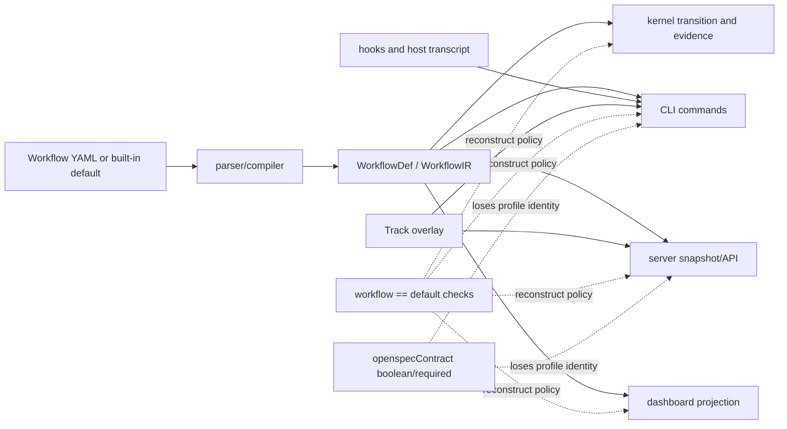

# Workflow Governance Architecture Audit

Status: Explore decision record
Change: `workflow-governance-architecture-audit`
Scope: kernel, automation, CLI, server, dashboard, hooks, packaged Skills,
schemas, generated assets, tests, documentation, and repository Agent Rules.

## Outcome and constraints

The product needs one composable execution model. A Workflow graph, its
document obligations, Track overlay, Skill DAG, gates, automation policy, and
UI projection are separate inputs. They must be validated together once and
then consumed as one immutable effective plan. No adapter may reconstruct the
rules from the name `default`, a phase label, or a boolean.

This change must preserve:

- the existing seven-phase `default` behavior and its evidence chain;
- the lightweight `simple` workflow, which stays ungoverned by default;
- the neutral `free` Track, which adds no domain policy but does not remove a
  Workflow's own policy;
- legacy custom workflows with no governance declaration;
- current state files, document ledgers, API response shapes, host setup,
  immutable releases, and fail-closed security boundaries.

The change must not add a second workflow engine, a database, an external
workflow dependency, or an adapter-only bypass.

## Evidence map

### Current execution and policy flow



The dotted paths are the architectural defect: consumers infer capabilities
instead of reading a compiled capability contract.

### Confirmed architecture findings

| ID | Severity | Evidence | Finding | Required correction |
| --- | --- | --- | --- | --- |
| A1 | Critical | `packages/kernel/src/workflow/types.ts`; default-name branches in `packages/cli/src/commands/{check,advance,artifact,document,review}.ts`, `executionCoordinatePort.ts`, `packages/kernel/src/workflow/transition-application.ts`, `packages/server/src/snapshot.ts`, and dashboard progress/skill views | Default and custom execution are two policy engines. New features must be implemented twice and have already drifted. | Compile built-in and custom Workflows into the same effective plan. Consumers query capabilities, steps, gates, skills, transitions, and evidence policy from that plan. |
| A2 | High | `packages/kernel/src/workflow/document-contract.ts:329-380`; parser/compiler/types accept only `openspec_contract: required` | OpenSpec governance is structurally coupled to exactly seven named phases. A three-step Workflow cannot ask for a smaller, enforceable document chain. | Introduce a declarative document profile independent of graph length. Keep `required` as the legacy full profile. |
| A3 | High | `packages/kernel/src/types.ts` and server startup DTOs reduce the contract to `openspecContract?: boolean` | State initialization loses which document profile was selected, so future profiles cannot be projected or migrated safely. | Persist a versioned profile identity; accept the old boolean on read and emit the canonical identity on new writes. |
| A4 | High | `packages/cli/src/commands/internalSkillGate.ts:112` explicitly bypasses `default`; custom steps use a separate current-visit DAG gate | Skill sequencing is not one invariant. Default sequencing relies on phase Skills and document producers while custom sequencing relies on a DAG gate. | Compile one step-skill policy and enforce it for every Workflow, with an explicit entrypoint exemption rather than a Workflow-name exemption. |
| A5 | High | `hooks/prompt-intent.sh` accepts bare `继续` as resume; `hooks/confirm-clear-prompt.sh` did not accept it as approval | One user phrase resumed the Change but left the interaction marker locked. Routing and approval vocabularies drift independently. | Centralize prompt intent classification. Bare `继续` may approve only an exact active pending interaction/review; otherwise it remains resume-only. |
| A6 | Critical | `hooks/skill-evidence.sh:17-41` enumerates every historical Codex cache version | A read from a stale, unselected plugin cache can satisfy Skill evidence. This violates immutable selected-release provenance. | Trust only process-provided selected roots plus the executing hook's verified root. Remove historical cache enumeration and add negative tests. |
| A7 | High | `packages/cli/src/commands/loops.ts` has a private top-level YAML scalar parser and direct state record casts | The CLI recreates persistence decoding outside the canonical repository/codec boundary. | Move the required read projection behind a kernel application port/repository and keep the command as a DTO adapter. |
| A8 | High | `packages/server/src/server.ts` is a 2,171-line HTTP controller and includes direct body assertions such as `as unknown as WorkflowDef` | HTTP validation, routing, domain conversion, and application orchestration are mixed in one adapter. | Split route modules by bounded context and introduce explicit request decoders before domain compilation. |
| A9 | Medium | `packages/server/src/afk.ts` claims server has no automation dependency and duplicates automation states/cancel marker; `packages/server/package.json` now depends on automation | Comments and literals preserve an obsolete boundary and can drift. | Export stable automation contracts and consume them through the package public API; correct ownership comments. |
| A10 | High | dashboard `model` and `shared` import `inbox`; shared components import `shell/Icon` | Frontend dependency direction is reversed: lower/shared layers depend on feature and shell layers. | Move neutral evidence/decision projection and Icon into model/shared ownership; feature/shell depend downward. |
| A11 | High | production file-size inventory contains multiple files above the hard limits in FRONTEND and BACKEND rules | Oversized controllers, services, domain modules, storage modules, components, and pages mix responsibilities and make rule review ineffective. | Decompose each hard-limit violation by responsibility. Keep generated/config/protocol exceptions explicit and machine checked. |
| A12 | High | frontend API client contains unchecked `res.json() as ...`; server route bodies contain unchecked structural casts; repository-wide production search finds non-null assertions | Boundary input and assertion discipline does not match the selected Agent Rules. | Add reusable unknown-to-DTO decoders and eliminate assertions inside every touched boundary; add a narrow architecture check to prevent recurrence. |
| A13 | Medium | rules are prose-only; root scripts/CI have no architecture rule check | Green builds do not detect dependency reversal, hard-size violations, stale cache trust, or unvalidated boundary casts. | Add a deterministic `check:architecture` with rule citations. Keep behavioral truth in production tests, not duplicated in the checker. |
| A14 | Medium | source, generated CLI/server bundles, schemas, Skills, release payloads, and dashboard types repeat the same contract | A schema change can pass a focused source test while installed users run stale generated assets. | Extend freshness/bundle/install tests so every contract projection is verified from one source. |

### Findings that are not defects

| Evidence | Classification | Reason |
| --- | --- | --- |
| `translations.ts` is large | documented exception | It is a translation resource/configuration file, explicitly exempt from the component/page limit. It still needs key/type and build tests. |
| hooks contain a minimal canonical-state fallback | compatibility exception, review required | A source-only Bash fallback can be necessary during first install or recovery. It is acceptable only when it is byte-small, read-only, and tested against the canonical helper. |
| `default` remains a built-in identity | intentional invariant | The name is a stable user contract. The defect is using the name as a capability oracle, not retaining the identity. |
| `simple` has no OpenSpec documents by default | intentional product behavior | Lightweight work must remain lightweight. An authored short Workflow may opt into a compact contract explicitly. |
| HTTP Host/token/content-type checks and filesystem CAS/atomic publication | compliant safety boundary | Existing tests exercise these controls. Refactoring must preserve them and add route-module integration coverage. |

## Agent Rule compliance matrix

The matrix uses four result types: `compliant`, `confirmed defect`,
`documented exception`, and `manual/final verification`. “Manual” does not mean
optional; it means the rule cannot be proved by a source-shape script alone.

| Rule family | Evidence reviewed | Result | Enforcement/repair |
| --- | --- | --- | --- |
| AGENTS rule selection | `AGENTS.md`; all three selected rule files were read because the change crosses frontend/backend/shared contracts | compliant | Phase evidence records the selected rules; no additional checker needed. |
| Canonical pipeline state | CLI state/review/document commands and hooks | compliant with A5/A7 exceptions | Never edit canonical run or YAML projection directly. Move A7 behind repository APIs; test exact approval receipts. |
| Todo ownership | current Change `tasks.md`; server/dashboard projections | A1 risk, no present fabricated Todo in this Change | Effective-plan steps drive projections; default still renders seven phases, custom renders declared steps. |
| Workspace/package ownership | package manifests and imports | A9 confirmed defect | Public automation contracts replace copied literals; architecture check rejects cross-package deep imports. |
| Generated-source discipline | default workflow generator, tracked CLI/server bundles, release payload | A14 confirmed gap | Existing freshness checks remain; add profile/schema/install golden coverage. |
| Secrets and HTTP boundary | server guards/tests | compliant, final verification required | Preserve Host, token, content-type, root anchoring, path normalization, and non-disclosure tests. |
| Truthful evidence | pipeline document/skill/review ledgers | A6 confirmed defect | Bind Skill evidence to selected immutable root and test stale/unselected paths fail. |
| Type discipline | production searches and boundary samples | A12 confirmed defect | Decode `unknown`; prohibit new explicit `any`, production non-null assertions, and configured unsafe casts. |
| Backend DDD contexts | kernel, automation, CLI, server boundaries | A1/A7/A8/A9 confirmed defects | Effective plan belongs to workflow domain; orchestration in application services; adapters only decode/call/map. |
| Domain purity | kernel workflow code and imports | mostly compliant | Architecture check rejects Node/protocol imports in configured domain directories. |
| DTO/domain separation | server request handling, dashboard client | A8/A12 confirmed defects | Dedicated decoders and explicit conversions; negative tests for malformed payloads. |
| Persistence/CAS/atomicity | StateStore, run revisions, ledgers, release store | compliant, regression-sensitive | Reuse existing stores; cross-process/integration tests remain mandatory. |
| Error semantics | CLI exits and HTTP status mapping | mostly compliant, final verification required | Route extraction must preserve public error shapes and retry semantics. |
| Backend file limits | measured production files by responsibility | A8/A11 confirmed defects | Split controllers >400, services >500, domain >450, storage/codecs >500. Machine check carries explicit exempt path/type list. |
| Frontend dependency direction | import scan in model/shared | A10 confirmed defect | Move shared primitives downward; architecture check rejects `shared/lib/model -> feature/shell`. |
| Frontend API ownership | all `fetch`/SSE calls reside in `src/api/client.ts` | compliant but client itself violates size/type rules | Split client by API bounded context behind the same public barrel and decode responses. |
| Frontend state ownership | feature hooks/models and API client | manual/final verification | Refactor must keep hooks thin and writes in canonical API/store paths. |
| Frontend interaction states | current component tests | manual/final verification | Changed flows require success/failure/loading/empty/disabled/keyboard coverage and real browser smoke. |
| Frontend i18n/accessibility | translation resources and component tests | manual/final verification | Preserve translation keys, labels, focus, keyboard, and contrast during component splits. |
| Frontend file limits | component/page inventory | A11 confirmed defect | Split components >400 and pages/routes >600; translations remain an explicit config exception. |
| Public contract compatibility | schemas, YAML parser, persisted state, API/dashboard types | A2/A3/A14 confirmed defects | Legacy read + canonical write; round-trip, API, generated bundle, install, and rollback tests. |
| Full delivery gates | root scripts and CI | manual/final verification | Run build, unit/integration, web, hook, adapter, skills, bundle, freshness, comments, oracle, install, Docker/browser gates. |

## File-size remediation inventory

The rule checker will classify files by responsibility rather than use one
global threshold. The current hard blockers include:

- frontend components/pages:
  `OrchestrationBoard.tsx`, `WorkbenchView.tsx`, `mandatorySkills.tsx`,
  `ProgressView.tsx`, `LoopCard.tsx`, `TaskDetail.tsx`, `SkillChain.tsx`,
  `ExecutionTimelineComposer.tsx`, and other page/component files above their
  applicable hard threshold;
- frontend boundary:
  `api/client.ts`, which must become bounded-context client modules behind a
  stable public facade;
- HTTP/controller:
  `packages/server/src/server.ts` and oversized workflow route composition;
- backend services/domain/storage:
  the measured automation admission/scheduler/lifecycle/triage modules,
  channel supervisor, kernel ownership/reconciliation/run-revision/ledger
  modules, tap certificates, CLI setup/channel/program modules, and any other
  production file above its rule-owned hard threshold.

`translations.ts`, generated `dist`, test fixtures, schemas, and protocol data
files are classified separately and are not split merely to satisfy a line
counter. Every exception is an exact path/category with a reason; there is no
floating baseline that permits new debt.

## Options considered

### Option 1 — Add a `compact` boolean beside `required`

This is small but repeats the defect. Each new profile adds another branch and
adapters still infer behavior from booleans. It cannot express which step owns
which document or read receipt. Rejected.

### Option 2 — Compile a declarative governance profile into one effective plan

The schema keeps the legacy `openspec_contract: required` alias and adds a
versioned profile form. A profile declares document slots, owner steps,
required producers, later-step read obligations, and review requirements.
Compilation resolves aliases, validates referenced steps/skills/transitions,
and produces an immutable `EffectiveWorkflowPlan`. Default is compiled from
the generated Workflow plus the full profile; custom and short Workflows use
the same path. Selected.

### Option 3 — Create a separate “mini pipeline” engine

This would make short workflows easy initially but creates a third engine,
duplicates evidence/review semantics, and makes UI/automation projection more
fragile. Rejected.

## Selected design

### 1. Effective workflow plan

```text
WorkflowDef
  graph: steps / transitions / gates / step skills
  governance: none | legacy-full | declarative-v1
TrackDef
  coverage profile / routing / automation eligibility
Repository capabilities
  bundled skill inventory / supported schema version
                         |
                         v
compileEffectiveWorkflowPlan(...)
  - graph validation
  - governance reference validation
  - track compatibility validation
  - skill availability and DAG validation
  - terminal/archive and review validation
                         |
                         v
EffectiveWorkflowPlan (deep-frozen)
  graph
  documentPolicy
  skillPolicy
  reviewPolicy
  automationPolicy
  projection
```

CLI, server, dashboard, hooks, and transition application consume this plan.
They may branch on an explicit capability such as
`plan.documentPolicy.enabled`; they may not branch on `workflow === default`
to decide policy.

### 2. Document governance profile

The new canonical form is versioned and bounded. It is not a general scripting
language. It contains only declarative references:

```yaml
governance:
  documents:
    profile: v1
    slots:
      - kind: proposal
        owner_step: shape
        producers: [openspec-propose]
      - kind: plan
        owner_step: plan
        producers: [writing-plans]
    reads:
      implement: [proposal, plan]
      verify: [proposal, plan]
```

Exact names may be adjusted in Spec to fit the parser style, but the semantics
are fixed:

- `openspec_contract: required` remains readable and compiles to the current
  full seven-phase profile;
- absence compiles to `documents: none`;
- the declarative form may reference any valid step count;
- each slot has one owner step and allowed producer set;
- a read requirement is exact-digest and step-scoped;
- unknown profiles, document kinds, steps, producers, or impossible ownership
  order fail closed;
- legacy state boolean reads as the full profile; new state stores the profile
  identity without rewriting unrelated fields.

A three-step Workflow can therefore declare proposal/plan in step 1, implement
in step 2 after exact reads, and verify in step 3 after exact reads, without
pretending those steps are the seven default phases.

### 3. Skill policy

Every step gets the same current-visit evidence algorithm. `pipeline` remains
an exact entrypoint exemption because it selects/recovers the Change; it is not
a phase completion receipt. Built-in default skills are represented in the
compiled plan rather than exempting the whole Workflow. Evidence roots are:

1. the exact host plugin root captured by the stable bootstrap;
2. the exact active managed release root;
3. the physically executing verified hook root for direct-development tests.

Historical cache discovery is removed. A Skill path is accepted only when its
real path is the expected `skills/<safe-id>/SKILL.md` beneath one of those
exact roots.

### 4. Prompt intent and review

One source-only classifier owns mutually exclusive intents:

- new objective / reject resume;
- exact Change resume;
- generic resume;
- one-turn approval;
- continuous authorization;
- authorization revocation;
- workflow selection.

The classifier returns data; router, breadcrumb, and confirm hooks choose the
allowed action. Bare `继续` has context-sensitive approval semantics only when
the exact active Change has a pending interaction/review receipt. It must
never authorize continuous execution and must never approve a different event.

### 5. Adapter and UI boundaries

- server route modules are grouped by projects/changes/workflows/automation/
  loops/runtime and share authentication plus response mapping middleware;
- request bodies enter as `unknown`, pass a decoder, and only then reach an
  application service;
- frontend API modules mirror stable API contexts and export through one
  facade, keeping components free of protocol parsing;
- evidence and decision projection move to `model`; reusable Icon moves to
  `shared`; no lower layer imports `inbox`, `workbench`, `progress`, or
  `shell`;
- Todo/progress/skill views consume the server's effective-plan projection.

### 6. Architecture enforcement

`tools/check-architecture.mjs` will enforce only objective repository-shape
rules:

- configured file-size thresholds and exact justified exceptions;
- forbidden frontend reverse imports;
- forbidden package deep imports;
- forbidden Node/protocol imports from configured kernel domain paths;
- unsafe production `any`, non-null assertions, and configured unchecked
  boundary casts;
- stale Skill-cache enumeration patterns;
- Workflow capability reconstruction patterns outside compiler/compatibility
  modules.

Each failure names the governing Agent Rule. Behavioral invariants stay in
unit/integration/oracle/browser tests. The checker is added to root scripts and
CI, so rules cannot silently become documentation-only.

## Migration and failure behavior

- Parsing old YAML/state/ledger remains lossless.
- New profile syntax is rejected by old releases rather than silently degraded.
- New releases read old `required`/boolean values as full governance.
- Writes use canonical profile identity only when the affected record/schema
  already supports it; no startup-time destructive migration is introduced.
- Compilation is all-or-nothing. Invalid references do not publish a Workflow.
- Route extraction preserves existing status codes and response envelopes.
- State/release mutations retain current locks, revision/epoch CAS, temp-file
  publication, and rollback semantics.
- Generated CLI/server bundles and immutable install payload are refreshed
  only after source verification passes.

## Assumptions and red-team decision log

Continuous authorization lets Explore resolve low-risk design questions
without interrupting the user. The following assumptions were challenged using
the repository documents and code:

| Question | Evidence and conservative answer |
| --- | --- |
| Who owns governance semantics? | Kernel workflow/document domain. Adapters cannot own it because CLI and HTTP must reject the same invalid transition. |
| What fails if governance is only a UI flag? | CLI or direct server transitions can diverge; therefore UI receives a projection but never defines capability. |
| Must every short Workflow generate OpenSpec/Superpowers/ADR? | No. Absence means none; explicit declarative governance means exactly the authored document set. `simple` remains none. |
| Can `required` change meaning? | No. It is a public compatibility alias for the current full seven-phase contract. |
| Can the checker grandfather all existing violations? | No. That would institutionalize debt. Exact config/generated exceptions are allowed; production hard-limit violations must be decomposed. |
| Can bare `继续` globally unlock writes? | No. It can approve only an exact pending receipt on the exact selected Change; otherwise it is resume intent only. |
| Can any Codex cache version prove Skill use? | No. Only the selected immutable/current executing plugin roots are authoritative. |
| Can file splitting be mechanical? | Only after identifying ownership and public seams. Tests must prove preserved behavior; empty wrapper files do not count as decomposition. |
| Does fixing comments suffice for duplicated automation policy? | No. Stable public contracts must replace literal duplication. |
| Is external research required? | No. This is an internal architecture/rule-conformance audit with sufficient first-party specifications and code evidence; external library comparison would not change the selected boundary. |

## Acceptance strategy

1. Contract tests: legacy full, declarative three-step, none/simple, invalid
   references, parse/serialize round trips, state migration compatibility.
2. Enforcement tests: identical CLI/HTTP transitions, current-visit Skill DAG,
   stale cache rejection, exact approval context.
3. Architecture checks: package/layer direction, size thresholds, boundary
   decoding, no capability reconstruction.
4. Full existing suites: build/test/web/hooks/adapters/skills/bundle/freshness/
   comments/oracle.
5. Install tests: clean `pipeline setup --codex`, current release identity,
   bundled Skills, update/rollback behavior, dashboard health on port 18765.
6. Browser acceptance: actual default/simple/free/custom governed Todo and
   phase state, desktop/mobile, light/dark, error/loading/empty/keyboard paths.

```coverage
touches: auth, workflow-governance, document-evidence, skill-provenance, review-intent, api-boundary
L1_api:      filled -> #adapter-and-ui-boundaries
L2_data:     filled -> #migration-and-failure-behavior
L3_rules:    filled -> #selected-design
L4_state:    filled -> #effective-workflow-plan
L5_errors:   filled -> #migration-and-failure-behavior
L6_security: filled -> #skill-policy
L7_perf:     waived -> compilation is bounded, pure, and cached per resolved workflow; no new remote or unbounded operation
L8_deps:     filled -> #architecture-enforcement
L10_terms:   filled -> #domain-terms
```

## Domain terms

- **Workflow graph**: authored steps, transitions, gates, inputs, outputs, and
  declared step Skills.
- **Governance profile**: versioned declarative document ownership and
  exact-read obligations, independent from graph length.
- **Effective workflow plan**: immutable compiled result consumed by every
  runtime adapter and projection.
- **Track overlay**: routing, coverage, and automation eligibility that does
  not replace Workflow-owned governance.
- **Selected Skill root**: exact immutable/current plugin root supplied by the
  trusted bootstrap or executing verified hook, never an arbitrary historical
  cache candidate.
- **Architecture check**: build-time source-shape validation with rule
  citations; it does not duplicate runtime domain behavior.
