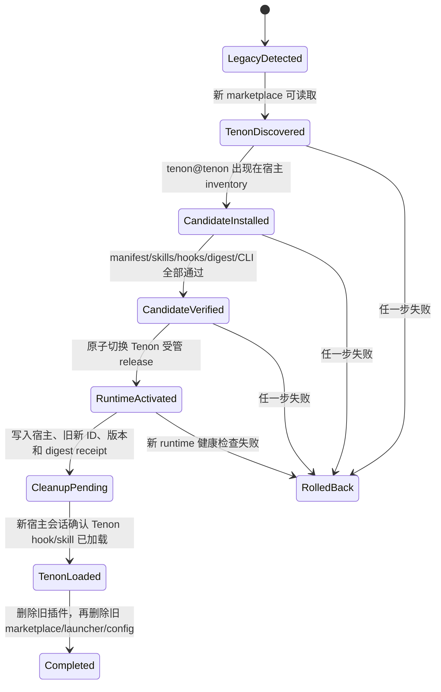

# Tenon 宿主插件身份迁移调研

> 日期：2026-07-26
> 范围：Codex CLI 0.144.1、Claude Code 2.1.215、本机只读 inventory，以及 OpenAI / Anthropic 官方资料
> 结论置信度：身份不能自动改名为高；Codex 自动更新细节为中（官方公开命令面尚未提供完整承诺）

## 执行摘要

`pipeline-lite@pipeline-lite` **不能依靠普通自动更新无缝变成**
`tenon@tenon`。两个宿主都把已安装插件绑定到精确的
`plugin-name@marketplace-name`；普通 update/auto-update 只更新这个已安装身份的版本或来源快照，
不会声明、推断或执行身份重命名。插件名与 marketplace 名同时变化时，新旧两者是两个独立身份。

因此，直接在当前 marketplace 中把两个 `name` 全部替换为 `tenon` 会把已安装用户留在旧身份：

- Claude 仍会尝试更新 `pipeline-lite@pipeline-lite`，而新目录只剩
  `tenon@tenon`；
- Codex 当前没有独立的 `plugin update` CLI，只有 marketplace 快照升级与按精确 ID
  `plugin add`；刷新 marketplace 也不会重写已安装 ID；
- 本项目已有的每日自动更新固定调用旧 launcher、旧配置目录和旧精确插件 ID，也不会自然跨越这次改名。

推荐把它设计成一次**有期限、可验证、失败可回滚的身份迁移**：

1. 发布最后一个仍叫 `pipeline-lite@pipeline-lite` 的迁移桥版本；
2. 在独立且稳定的新 marketplace 来源发布 `tenon@tenon`；
3. 旧桥只负责发现旧安装、安装并验证 Tenon、原子切换受管 runtime；
4. 新会话确认 Tenon 已实际加载后，再删除旧插件与旧 marketplace；
5. Tenon 的最终发布物不保留 `pipeline` 命令、旧 skill namespace 或旧插件别名。

建议主动迁移窗口截止 **2026-10-31**，且至少覆盖两个稳定 Tenon 版本；旧 marketplace
再保留 12 个月的冻结迁移说明和手工恢复入口，但不再承载功能发布。

## 调研问题与判断

### 1. marketplace 或 plugin ID 能否原地改名

不能把它当作受支持的原地升级。

Claude 官方命令始终使用 `plugin-name@marketplace-name` 选择插件，安装、更新、卸载都接受这个精确
selector。官方资料说明自动更新会刷新 marketplace 并更新“该 marketplace 中已经安装的插件”，
版本比较也以已解析插件版本作为 cache key；没有 rename、alias 或 `replaces` 字段。
因此，把目录中的名字改为 Tenon 后，旧安装记录不会自动变成新 selector。

Codex 0.144.1 的本机命令面同样要求 `PLUGIN@MARKETPLACE`：

```text
codex plugin add <PLUGIN[@MARKETPLACE]>
codex plugin remove <PLUGIN[@MARKETPLACE]>
codex plugin marketplace upgrade [MARKETPLACE_NAME]
```

`codex plugin list --json` 返回的主键也是组合身份：

```json
{
  "pluginId": "pipeline-lite@pipeline-lite",
  "name": "pipeline-lite",
  "marketplaceName": "pipeline-lite",
  "version": "0.2.0"
}
```

OpenAI 的 app-server 协议文档把 marketplace 的增删升级与 plugin 的安装、读取、清单分成不同方法；
plugin mention 路径也包含 `plugin://<plugin-name>@<marketplace-name>`。这与本机 inventory
共同证明两级名字是宿主可见身份，不只是展示文案。

### 2. marketplace 更新是否等于插件更新

两个宿主不相同。

| 宿主 | marketplace 刷新 | 已安装插件更新 | 本次改名影响 |
| --- | --- | --- | --- |
| Codex 0.144.1 | `codex plugin marketplace upgrade <name>`，只支持 Git marketplace | CLI 无独立 `plugin update`；本项目目前以同 ID `plugin add` 重新物化后再查 inventory | 刷新新目录不会把旧 ID 改成新 ID，必须显式 add `tenon@tenon` |
| Claude Code 2.1.215 | `claude plugin marketplace update <name>` | `claude plugin update <plugin@marketplace>`；也可按 marketplace 配置启动时自动更新 | update 仍指向旧 selector，必须显式 install `tenon@tenon` |

Anthropic 官方资料还明确说明：删除 marketplace 会卸载从该 marketplace 安装的插件。因此清理顺序
必须是“新身份安装并验收”在前，“删除旧插件 / marketplace”在后。

Codex 的公开 Help Center 只明确承诺工作区导入的 marketplace 插件可以通过 Refresh 拉取原来源的
最新版本；它没有承诺 CLI 第三方 marketplace 的启动时自动升级，也没有公开身份改名协议。产品不能把
这部分未文档化行为写成“自动迁移保证”。

### 3. 当前本机状态说明了什么

只读清单显示本机 Codex 当前有：

```text
marketplace: pipeline-lite
source_type: local
source: /Users/a1234/Documents/code-manager/projects/pipeline-worklfow
pluginId: pipeline-lite@pipeline-lite
version: 0.2.0
enabled: true
```

本机 Claude 当前没有安装本项目，也没有登记 `pipeline-lite` marketplace；因此 Claude 结论来自
官方命令面、官方文档与项目 manifest，而不是伪造一次本机安装实验。

当前四份 manifest 的身份完全一致：

```text
.agents/plugins/marketplace.json      marketplace=pipeline-lite, plugin=pipeline-lite
.codex-plugin/plugin.json             plugin=pipeline-lite, version=0.2.0
.claude-plugin/marketplace.json       marketplace=pipeline-lite, plugin=pipeline-lite
.claude-plugin/plugin.json            plugin=pipeline-lite, version=0.2.0
```

Codex 用户配置也以精确键保存：

```toml
[marketplaces.pipeline-lite]
source_type = "local"

[plugins."pipeline-lite@pipeline-lite"]
enabled = true
```

这意味着全局替换 manifest 会创建新身份，却不会迁移上述旧键。

### 4. 当前项目自动更新为什么也跨不过去

当前自动更新实现是“同身份版本更新”，并非“身份迁移器”：

```text
~/.local/bin/pipeline
  → hooks/auto-update.sh
  → <platform-config>/pipeline-lite/auto-update.conf
  → pipeline update --codex|--claude --yes --auto
  → refresh marketplace pipeline-lite
  → update/add pipeline-lite@pipeline-lite
  → inventory 查找 pipeline-lite@pipeline-lite
  → 验证并原子激活新 runtime
```

全局替换后，目标会变成 `~/.local/bin/tenon`、Tenon 配置目录和
`tenon@tenon`。旧会话仍加载旧 hook，旧 hook 仍寻找旧 launcher 和旧配置；如果先删除旧身份，
它没有入口知道新身份在哪里。

所以需要最后一个旧身份版本承担迁移。这个桥不是 Tenon 的兼容层：它属于旧产品，期限届满后冻结，
新 Tenon 包内不包含旧命令或旧 namespace。

## 官方证据

### OpenAI / Codex

- [Plugins in Codex](https://help.openai.com/en/articles/20001256-plugins-in-codex/)：
  marketplace 导入的工作区插件通过 Refresh 从原来源拉取最新版本；文档没有提供 identity rename
  或 CLI 第三方插件自动改名承诺。
- [Codex app-server protocol](https://github.com/openai/codex/blob/main/codex-rs/app-server/README.md)：
  marketplace add/remove/upgrade 与 plugin list/install/read 分离；plugin mention 使用包含
  `plugin-name@marketplace-name` 的路径。
- [Codex config schema](https://github.com/openai/codex/blob/main/codex-rs/config/src/config_toml.rs)：
  `plugins` 与 `marketplaces` 都是以字符串键保存的独立 map。
- [Codex plugin creator skill](https://github.com/openai/codex/blob/main/codex-rs/skills/src/assets/samples/plugin-creator/SKILL.md)：
  官方示例明确禁止用 `--marketplace-name` 原地重命名已有 marketplace；已有 marketplace
  的顶层名字必须匹配。

### Anthropic / Claude Code

- [Discover and install plugins](https://code.claude.com/docs/en/discover-plugins)：
  安装、更新、卸载使用 `plugin@marketplace`；marketplace 自动更新只刷新该 marketplace
  与其中已安装插件；删除 marketplace 会卸载来源插件。
- [Create and distribute a plugin marketplace](https://code.claude.com/docs/en/plugin-marketplaces)：
  plugin `name` 是公开安装标识；版本来自 plugin manifest、marketplace entry 或 Git SHA，
  同版本会跳过更新。
- [Plugins reference](https://code.claude.com/docs/en/plugins-reference)：
  版本是 cache key；旧版本目录更新/卸载后成为 orphan，并在 7 天后清理；CLI update 接受精确插件
  selector。
- [Claude Code settings](https://code.claude.com/docs/en/settings)：
  `extraKnownMarketplaces` 与 `enabledPlugins` 也按 marketplace / 精确插件身份声明，
  `autoUpdate` 是 marketplace 级配置。

## 本机只读证据与命令输出摘要

本次没有执行 install、uninstall、remove、add、update、upgrade 或 marketplace 写操作。

| 命令 | 摘要 |
| --- | --- |
| `codex --version` | `codex-cli 0.144.1` |
| `claude --version` | `2.1.215 (Claude Code)` |
| `codex plugin --help` | 只有 `add`、`list`、`marketplace`、`remove`；无 `plugin update` |
| `codex plugin add --help` | selector 必须是 `PLUGIN@MARKETPLACE` 或插件名加 `--marketplace` |
| `codex plugin marketplace upgrade --help` | 只刷新已配置 Git marketplace，可指定精确 marketplace 名 |
| `codex plugin list --available --json` | 已安装 `pipeline-lite@pipeline-lite` 0.2.0；没有可用 Tenon |
| `codex plugin marketplace list --json` | 本机 `pipeline-lite` 是 local source |
| `claude plugin --help` | 提供 install/update/uninstall/list 与 marketplace update |
| `claude plugin update --help` | 必须传一个插件 selector，不能声明 rename |
| `claude plugin marketplace update --help` | 只刷新指定 marketplace 或全部 marketplace |
| `claude plugin list --json` | 本机 Claude 没有本项目插件 |

## 推荐迁移架构

### 资产边界

```text
旧发布源（冻结、迁移专用）
└── pipeline-lite@pipeline-lite bridge
    ├── 识别已选宿主
    ├── 登记 Tenon marketplace
    ├── 安装 tenon@tenon
    ├── 验证候选 payload
    ├── 原子激活 Tenon runtime
    └── 写迁移 receipt，等待下一会话清理

新发布源（长期产品）
└── tenon@tenon
    ├── tenon CLI
    ├── Tenon skills/hooks
    ├── Tenon runtime/config/data 目录
    └── 不含 pipeline 命令、旧 skill alias 或旧插件 alias
```

新旧 marketplace 必须有独立且稳定的来源地址。只依赖 GitHub 仓库改名重定向不够：URL
即使跳转，catalog 的顶层 marketplace 名与 plugin ID 仍然改变。最稳妥的方式是保留一个只读旧源，
并把 Tenon 放到新的长期源；也可以使用独立仓库或宿主能稳定寻址的独立 catalog 路径，但不能让两个
逻辑 marketplace 抢同一个可变根。

### 迁移状态机



每个状态必须可重复执行；进程中断后从宿主 inventory 与本地 receipt 重建，不根据缓存目录或“文件看起来
存在”猜测成功。

### 宿主动作

#### Codex

1. 保持旧 `pipeline-lite@pipeline-lite` bridge 可升级；
2. `codex plugin marketplace add <tenon-source> --ref main`；
3. `codex plugin add tenon@tenon --json`；
4. `codex plugin list --json` 精确确认 name、marketplace、version 与 source root；
5. 从 inventory root 验证完整 payload，发布受管 Tenon release；
6. 新会话验证 Tenon hook 已受信任并实际加载；
7. `codex plugin remove pipeline-lite@pipeline-lite --json`；
8. `codex plugin marketplace remove pipeline-lite --json`。

不能把 Codex hook trust 绕过。新插件 ID 会形成新的 hook 身份，宿主如果要求用户重新信任，这属于安全
边界；迁移器应暂停在 `CleanupPending`，而不是伪报完成或提前删除旧入口。

#### Claude Code

1. 保持旧 `pipeline-lite@pipeline-lite` bridge 可被旧 marketplace 自动更新；
2. `claude plugin marketplace add <tenon-source>`；
3. `claude plugin install tenon@tenon --scope <原 scope>`；
4. `claude plugin list --json` 精确确认新 ID、scope、version、installPath；
5. 验证并原子激活 Tenon runtime；
6. 新会话或 `/reload-plugins` 后确认 Tenon components 已实际加载；
7. `claude plugin uninstall pipeline-lite@pipeline-lite --scope <原 scope>`；
8. inventory 确认旧插件已不存在后，才
   `claude plugin marketplace remove pipeline-lite --scope <原 scope>`。

Claude 的 user/project/local/managed scope 必须保持原样迁移，不能一律改成 user scope。managed
scope 不应由用户态迁移器擅自删除，应停在需要管理员完成的状态。

## 自动迁移与无兼容要求如何同时满足

推荐把权限分成两档：

- 已显式启用本项目 `--auto-update` 的用户：旧 bridge 可自动完成
  `LegacyDetected → RuntimeActivated`，因为这是同一宿主、同一更新授权下的候选下载与原子切换；
  但仍必须保留旧插件，直到新会话真实加载 Tenon。
- 未启用自动更新的用户：旧 bridge 只展示一次性、可复制的
  `tenon setup --codex|--claude --migrate`，不在后台修改宿主 inventory。

新 Tenon 代码库不保留兼容入口。唯一旧入口是单独冻结的 bridge，它在迁移完成后自我失效，只输出
“已迁移，请使用 tenon”，且在截止日后不再接收功能更新。

### 推荐时间表

| 阶段 | 时间 | 行为 |
| --- | --- | --- |
| Bridge 发布 | Tenon 1.0 前 | 先用旧身份发布迁移器，验证现有自动更新能收到它 |
| 双身份迁移 | 至 2026-10-31 | 旧身份只迁移；Tenon 正常发布；至少覆盖两个稳定版本 |
| 冻结支持 | 2026-11-01 起 12 个月 | 旧 marketplace 保持可读取，只给迁移说明/已签名 bridge，不发功能 |
| 终止主动支持 | 12 个月后 | 文档保留手工恢复；不保证旧宿主版本继续可迁移 |

## 验收门

正式实施前必须用一次性 HOME 和真实 Git marketplace 做黑盒测试，至少覆盖：

1. Codex / Claude 各自的 user scope 首装；
2. 旧身份已安装且自动更新开启；
3. 旧身份已安装但自动更新关闭；
4. marketplace 断网、认证失败、catalog 损坏；
5. Tenon 安装成功但 payload 校验失败；
6. runtime 已激活但 dashboard 健康检查失败；
7. 进程在每个状态之间被终止后的幂等恢复；
8. 同时启动两个 SessionStart 时只有一个迁移 owner；
9. 新旧 hooks 同时可见时只有 Tenon leader 执行；
10. 新会话真实加载 Tenon 后才清除旧身份；
11. Claude project/local/managed scope；
12. Codex 新 hook trust 未确认时停在 `CleanupPending`；
13. 旧命令、旧 namespace、旧 manifest 在最终 Tenon bundle 中为零；
14. rollback 只回到摘要匹配的 previous release，不从可变 marketplace cache 执行。

## 开放问题

1. Codex 0.144.1 对“同 ID 再次 `plugin add`”是否在所有来源类型和 App/CLI 表面都稳定地等价于
   插件更新，官方公开文档没有完整承诺，需要隔离 HOME 黑盒测试。
2. Codex 桌面端对第三方 Git marketplace 是否存在启动时自动刷新策略，目前只确认了手工
   `marketplace upgrade` 与工作区 Refresh，不能写进产品承诺。
3. Tenon 的长期 marketplace 是否使用新仓库、同仓独立 catalog，还是发布服务 URL；无论选哪种，
   旧来源必须保持稳定，不能只靠仓库 rename redirect。
4. Codex 新 Tenon hooks 的信任 UX 如何引导；宿主要求的人类信任不能由迁移器替代。
5. Claude managed scope 的管理员迁移策略和组织级 `extraKnownMarketplaces` /
   `enabledPlugins` 变更由谁发布。
6. 迁移完成 receipt 的 schema、签名/摘要字段、跨版本读取兼容期尚需在 Spec 阶段固化。
7. 是否收集匿名迁移成功率；默认建议不采集，改用 release issue、可选诊断导出与本地审计日志。

## 最终建议

不要直接把四份 manifest、更新常量和 launcher 名一次性替换后发布。先发布最后一个旧身份 bridge，
再发布全新的 `tenon@tenon`，通过宿主 inventory 驱动两阶段迁移。这样既满足最终产品“完全叫 Tenon、
不兼容旧命令”，又不会让已经安装并启用自动更新的用户被永久锁在一个宿主无法解析的旧主键上。
