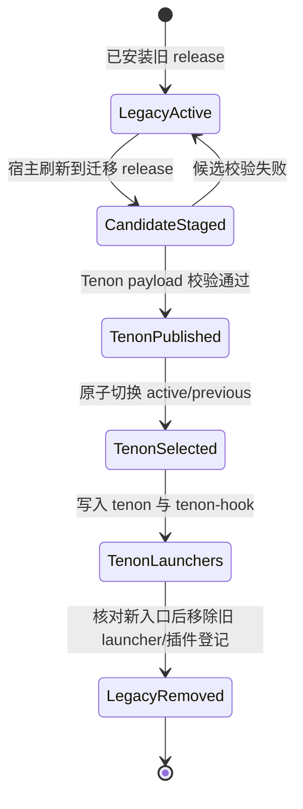

# Tenon 产品身份与执行来源统一设计

> 日期：2026-07-26
> Change：`rename-pipeline-lite-to-tenon`
> 状态：Explore 技术设计

## 用户结果

用户安装、更新、运行或打开 Dashboard 时，只看到一个产品身份 **Tenon**。CLI 的唯一入口是
`tenon`，原生插件、npm workspace、运行时目录、文档站、Dashboard 和 GitHub 仓库使用同一名称；
最终发行物不保留 `pipeline` 命令、`pipeline-lite` 插件或 `@pipeline-lite/*` 包别名。

同时，Dashboard 必须诚实区分“任务正在运行”和“由谁运行”：普通 Codex 终端会话即使获得持续授权，
仍是终端来源；只有真正进入 automation runner/queue/sandbox 的 Change 才能出现在“自动运行”页面。

## 约束与非目标

### 约束

- 当前仓库正在用已发布的 `pipeline` CLI 驱动本 Change，迁移必须保证 Verify、Ship 和 Archive 仍可执行。
- 新用户仍通过一个完整插件获得 CLI、hooks、Skills、Dashboard、自动化和 adapters。
- Codex/Claude 安装继续要求精确宿主选择；默认 Dashboard 继续使用单端口 `127.0.0.1:18765`。
- managed runtime 的内容寻址、原子 active/previous 选择、稳定 bootstrap 和失败回滚能力不得弱化。
- 现有自动更新用户需要可审计的一次性身份迁移；迁移完成后不保留旧运行入口。
- 已归档 Change、ledger、Git 历史和已接受 ADR 是历史事实，不做破坏性全文改写。

### 非目标

- 不把七阶段开发流水线这个领域概念改名；“pipeline”作为通用名词仍可出现在解释性文本中。
- 不改变 `open → explore → spec ⇄ build ⇄ verify → ship → archive` 的状态图。
- 不借品牌迁移引入第二套 Dashboard、第二个默认端口或第二个插件包。
- 不把“持续交互授权”提升为无人值守 automation 权限。

## 现状证据

### 身份分散

| 表面 | 当前事实 | 目标 |
| --- | --- | --- |
| 产品展示 | `Pipeline Lite` | `Tenon` |
| 插件/marketplace | `pipeline-lite` | `tenon` |
| npm workspace | `@pipeline-lite/*` | `@tenon/*` |
| CLI | `pipeline` | `tenon` |
| hook launcher | `pipeline-hook` | `tenon-hook` |
| server bin | `pipeline-dashboard` | `tenon-dashboard` |
| bundle | `packages/cli/dist/pipeline.mjs` | `packages/cli/dist/tenon.mjs` |
| 本机应用目录 | 平台标准目录下的 `pipeline-lite` | 同一平台标准目录下的 `tenon` |
| 环境/浏览器注入 | `PIPELINE_*` / `__PIPELINE_*` | `TENON_*` / `__TENON_*` |
| GitHub | `jefferysha/pipeline-worklfow` | `jefferysha/tenon` |
| Pages base | `/pipeline-worklfow/` | `/tenon/` |
| Dashboard/README | 旧品牌与旧命令 | Tenon 与 `tenon ...` |

证据入口包括根和 workspace `package.json`、`.codex-plugin/plugin.json`、
`.claude-plugin/*`、`packages/cli/src/commands/plugin-host.ts`、
`packages/cli/src/runtime/{paths,launchers}.ts`、`runtime/pipeline-bootstrap.mjs`、
`install.sh`、`docs-site/.vitepress/config.mts` 与 Dashboard i18n。

排除 `node_modules`、Git、归档 Change、E2E 临时目录和受控 `dist` 后，现行源码/配置中共有
379 个受影响文件；其中 `@pipeline-lite/*` 影响 263 个文件、`PIPELINE_*` 影响 151 个文件、
旧仓库标识影响 60 个文件。另有 CLI、server、Dashboard 共 4 个受控生成 bundle 必须由源码重建。

### 自动运行页面误收终端任务

实时 snapshot 中本 Change 的事实是：

- `fields.automation = "off"`；
- 存在绑定当前 Change 的新鲜 `terminalActivity`；
- `changeProgressState` 因终端心跳把展示状态投影为 `running`；
- `ProgressView` 进一步读取原始 automation 字段，正确显示“终端运行中”；
- `AfkView` 却用 `running|queued|failed` 这个折叠后的展示状态充当 `inSandbox`，因此把终端任务收入
  自动运行队列。

真实浏览器最小复现已在 18765 上报错：

```text
BUG: automation=off terminal task is rendered in 自动运行
```

根因不是缓存或后端误写，而是 **progress state 与 execution provenance 被错误折叠后又反向推断来源**。

## 方案比较

| 方案 | 做法 | 优点 | 代价/风险 | 结论 |
| --- | --- | --- | --- | --- |
| A. 全协议重命名 | 连 `.pipeline.yaml`、phase/producer/Skill id 都改为 Tenon | 字符串残留最少 | 破坏审计历史、OpenSpec ledger 和所有项目状态；品牌与协议再次绑定 | 拒绝 |
| B. 产品身份迁移，协议名稳定 | 重命名全部产品/分发/命令/运行时/展示身份；保留中性的流水线协议 token | 单一产品品牌，迁移边界可验证；历史与状态机稳定 | 需要明确残留扫描分类和一次性自举 | 采用 |
| C. 双栈兼容 | 长期同时提供 `pipeline`/`tenon` 和两套插件名 | 升级平滑 | 与“不保留兼容”冲突；持续双真相与测试成本 | 拒绝 |

## Search-first 结论

- 复用现有 managed runtime 的 content-addressed release、active/previous 选择、稳定 bootstrap、
  原子 launcher 和 update rejection；不创建第二个安装器或包管理层。
- 复用 `templates/documents` 的“单一 Registry + 确定性投影 + freshness check”模式建立产品身份真相源；
  不让 TS、shell、JSON、Dashboard 和 VitePress 各自拥有不可校验的常量。
- 复用 `packages/dashboard-app/src/model` 作为跨 Progress/AFK 的 neutral projection 层；
  不把 provenance 规则留在两个 feature view。
- 复用现有 VitePress manifest、同步器、artifact allowlist、Pages workflow 和浏览器验收；
  只迁移品牌、命令、URL/base，不替换文档技术栈。
- 复用宿主 inventory 作为插件安装根真相源；不猜测 Codex/Claude cache 路径。
- 复用现有 Codex/Claude Marketplace 作为首选一步安装通道；`install.sh` 只做 bootstrap，
  新用户不需要 clone 或 build。
- npx 只作为同一发行事务的薄入口；npm scope 与凭据未验证前不得把“可发布”描述成“已发布”。
- 仓库只删除可再生截图与未引用根图片；保留仍被实现引用的文本设计真相源、审计历史，以及少量
  经压缩和隐私检查的正式 Tenon Dashboard 文档图。

## 术语与身份边界

- **产品身份**：Tenon、`tenon`、`@tenon/*`、Tenon 插件、Tenon runtime。必须全局统一。
- **流水线协议**：phase id、event id、`.pipeline.yaml`、`.pipeline-run/`、`pipeline-*` phase Skill id、
  `pipeline` orchestration Skill id。它们描述工作流协议，不是旧品牌兼容入口。
- **执行状态**：`agent/gate/running/queued/failed` 等面向进度聚合的状态。
- **执行来源**：`terminal/automation/none`。只能由 canonical automation 字段或新鲜 terminal heartbeat
  正向投影，不得从折叠后的执行状态反推。
- **迁移桥**：只负责把受验证的旧安装原子切换到 Tenon，然后自删除；不是长期 CLI alias 或功能兼容层。

## 关键不变量

1. 一个发行版只有一个产品身份、一个 canonical Skill root、一个 CLI 和一个 hook launcher。
2. 宿主选择只决定安装所有权，不裁剪插件能力。
3. 新 release 完整验证并发布前，不改变 active runtime、launcher 或 Dashboard 所有权。
4. 迁移失败时保留旧 active release；成功后 launcher 只暴露 `tenon`/`tenon-hook`。
5. 旧产品身份只允许出现在不可变历史和有期限、单用途、可审计的迁移描述中。
6. `executionSource=automation` 当且仅当 canonical `automation` 属于
   `running|scheduled|queued|failed|conflict`；终端 heartbeat 只能产生 `terminal`。
7. 自动运行页面只消费 automation provenance，不能消费所有 `running` 展示态。
8. `127.0.0.1:18765` 仍是唯一默认 Dashboard 端点，健康检查继续绑定 release 与 state scope。

## 迁移状态机



迁移必须在现有 managed runtime 锁内执行。旧 `pipeline` 只能作为迁移 release 的启动器；目标 release
和最终文档不提供旧命令。由于插件/marketplace identity 本身改变，直接把 `main` 从旧 identity 改为
新 identity 会让 0.2.0 updater 在宿主 inventory 中找不到候选；因此必须有一个受签名/受验证的
迁移 release 或 migration-only marketplace entry。它只执行“发现 Tenon → 校验 → 原子激活 →
删除旧登记”，达到期条件后从主分支移除。

## 目标架构

### 单一身份模块

新增低层产品身份模块，提供只读常量：

- display name、plugin name、marketplace name、repository、Pages base；
- executable/bundle/launcher 名；
- runtime application directory 与环境变量前缀；
- Dashboard 浏览器注入键。

构建、验证器、安装器、Dashboard 和 docs 生成器消费该模块或其确定性 codegen 产物，不分别硬编码。
shell/JSON/VitePress 等无法直接 import TypeScript 的边界使用由同一源生成并经 freshness test 校验的
静态投影。

### API 与数据契约

对外命令统一为 `tenon setup|update|dashboard|doctor|runtime`；Marketplace bootstrap 只接收一个
host selector 与可选 auto-update 标志。Dashboard HTTP `/api` 路径保持稳定，但 health 与 runtime status
必须继续返回可比较的 `releaseId`/`stateScopeId`，不得暴露本机 state Home。

`tenon update --codex|--claude` 是完整插件的唯一更新入口；删除 `--self-update`，因为 CLI、Skills、
hooks、workflow、Dashboard 和 adapters 本来就是一个发布单元。自动更新只是在用户已显式 opt-in 后
调用同一命令的非交互形态，不拥有第二套下载、选择或回滚状态。项目 canonical state 不随插件后台更新；
update 只读项目注册表并报告需要显式 `tenon sync` 的项目。

产品身份数据由版本化 `product/identity.json` 定义，生成 TS、JSON 和 shell-safe 投影。执行来源使用
独立联合类型 `automation|terminal|none`，不得写回 canonical Change，也不得复用 UI 的 progress state。

### 更新事务与所有权边界

更新不是跨 Codex/Claude 私有 cache、Tenon runtime 和用户项目的“大事务”。它由两个明确提交边界组成：

1. Codex/Claude 的 Marketplace/plugin manager 是宿主登记和 cache 的唯一 writer，Tenon 只消费其
   inventory，不猜测或回写私有目录；
2. Tenon coordinator 对自己拥有的 staging/release store、selection、bootstrap、stable launcher 和
   Dashboard supervisor 执行原子提交与精确补偿。

Tenon managed 提交前先复制并验证候选；launcher 写入前捕获其存在性、普通文件 bytes 与 mode，
补偿时做所有权/CAS 校验后精确恢复。Dashboard 切换必须保留本次 child 句柄；readiness 失败先终止
候选 child，再恢复 previous payload 的 18765 服务并重新做 releaseId/stateScopeId 健康检查。

宿主 manager 已成功提交后，Tenon 不得声称能够“恢复宿主精确旧 cache”；宿主不提供该 API。相反，
发布门以 N−1 runtime ABI、候选完整性和 host inventory digest 约束跨边界一致性，并把两个提交结果
分别写入诊断。用户工作区始终在事务外，只通过显式 `tenon sync` 更新。

### Dashboard provenance 模型

在 neutral model 层提供唯一函数：

```text
executionProvenance(change):
  automation active/queued/failed -> automation
  else live terminalActivity      -> terminal
  else                            -> none
```

`changeProgressState` 继续负责“当前是否运行/等待/失败”；Progress canvas、Action 区和 AfkView 均消费
`executionProvenance`。AfkView 的准入条件是 provenance 为 automation，而不是 state 为 running。

### 发布与自举顺序

1. 先提交可验证的 migration-only 逻辑和 Tenon identity projections。
2. 发布迁移 release，使旧 auto-update 能获得迁移能力。
3. 发布 Tenon 插件/marketplace/repository identity，迁移 release 原子安装并切换。
4. 验证新装、旧装升级、失败回滚、Dashboard takeover 和新会话 Skill root。
5. 移除 migration-only entry；最终产品无旧 CLI/插件/包别名。

### 一步安装与发布包

首选公开命令为：

```bash
curl -fsSL https://raw.githubusercontent.com/jefferysha/tenon/main/install.sh \
  | bash -s -- --codex
```

它通过 Marketplace 安装 `tenon@tenon` 并调用包内 `tenon setup --codex`，不执行用户可见的源码 clone、
依赖安装或本地 build。Claude 只更换 host flag。

npx 目标入口为 `npx --yes @<publisher>/tenon setup --codex`。该包是同一发行 payload 的薄 bootstrap，
不能携带 monorepo 测试、设计截图、内部研究或第二套 update 状态。首次 npm 发布依赖真实 publisher
scope 与认证；本 Change 在凭据缺失时只交付可复现 pack 与发布 workflow。

### 仓库卫生

当前 67 个受跟踪图片中，`design-demos/shots/` 63 个、约 21.7 MiB，另有 3 个未被当前文档引用的
根 PNG。它们不属于 Marketplace、CLI、Dashboard 或文档站运行资产，将从当前树删除并加入精确 ignore。
正式文档站 logo 与仍被源码/设计规范引用的文本 demo 保留。重新用真实 Tenon Dashboard 生成
3–4 张稳定命名的 WebP 正式图，存入 `docs-site/public/images/`：README 展示核心图，中文文档站按
项目、进度、自动运行和工作台组织响应式图文版式。

新增 repository hygiene 门禁，检查受禁截图、正式图片 allowlist/尺寸/隐私、发布包内容和悬空链接。
不执行历史重写：旧提交中的图片、OpenSpec archive 与 ledger 保留为审计事实。

### 错误与恢复语义

- identity/freshness 漂移：构建失败，不生成或激活候选。
- Marketplace/npx 候选不完整、symlink 非法或 smoke 失败：安装非零退出，保留 active/previous。
- 旧通道迁移在任一步失败：保持旧 active，记录持久诊断，不删除旧 launcher/登记。
- 新 runtime 已激活但启动失败：只允许回滚到已持久化且重新验证的 previous release。
- npm scope/凭据缺失：Marketplace 仍可首装；文档不得宣称 npx 已发布。
- 图片丢失、超阈值、未登记或含隐私路径：文档/仓库检查失败，Pages 不部署。

### 安全与隐私

- 只信任宿主 inventory 返回且通过 manifest、digest、symlink、CLI/hook/Skill smoke 的候选。
- bootstrap 不从参数接收任意执行路径，不把 Marketplace checkout 直接作为长期 hook trust root。
- migration cleanup 只删除有所有权/hash 证据的旧资产；真实目录、用户文件和外部 symlink fail-closed。
- 正式 Dashboard 图由无隐私 fixture 生成，检查用户名、临时目录、token/secret 和真实项目内容。
- npm/GitHub 发布 workflow 不提交凭据，使用受保护环境和最小权限。

### 外部依赖与发布边界

- Codex/Claude Marketplace 负责宿主安装与 inventory，Tenon managed runtime 负责候选验证与激活。
- npm 只发布薄 bootstrap；scope 必须由真实用户/组织所有权确定，首次公开发布使用受保护凭据。
- GitHub 仓库、raw bootstrap 与 Pages 是三个独立 URL 契约；仓库改名的 Git redirect 不能代替
  Pages `/tenon/` 与 raw URL 的真实验收。
- WebP 转换使用构建环境已锁定的工具；输出尺寸、digest 和引用由 repository/docs 门禁治理。

本 Change 可以实现和测试完整迁移逻辑，但真实外部发布顺序必须以各步 GitHub/宿主结果为证，不能把
本地测试写成已经迁移所有用户。

## 验收策略

- 静态：旧品牌/旧命令扫描按“现行产品、历史证据、迁移专用”分类；现行产品必须为零。
- 单元：identity projections、provenance、AfkView 准入、Progress label。
- 集成：Codex/Claude install plan、inventory parsing、runtime activation、launcher、auto-update、
  update reject/rollback、bundle freshness。
- 首装：隔离 HOME 执行 `tenon setup --codex`，只出现一个 Tenon Skill root 和 18765 Dashboard。
- 升级：旧 runtime fixture 经 migration release 进入 Tenon，失败注入保持旧 active。
- 浏览器：终端 heartbeat 的 Change 在进度页显示“终端运行中”且不在自动运行页；真实 automation
  Change 在两页均显示自动运行来源。
- 文档：README、中文/英文站、`llms.txt`、Pages base、内部链接和命令事实门禁通过。
- 图文：README 与中文站图片在 GitHub Markdown、VitePress production base、桌面和移动宽度下均可见，
  且截图不含本机用户路径、临时任务或敏感信息。
- 仓库：当前树无受禁截图，发布包无 demo/研究/测试运行态，Git 历史未被改写。
- 安装：隔离 HOME 的 Marketplace bootstrap 无 clone/build 完成首装；npx tarball 走同一安装事务。

## Assumptions

- 用户的“不需要兼容”解释为不保留长期 alias；允许满足自动更新所必需、最终会删除的一次性迁移事务。
- 远程仓库目标名采用 `tenon`，npm scope 采用 `@tenon`，不再引入第二个产品词。
- 默认端口 18765、七阶段协议和 OpenSpec evidence contract 不因品牌迁移变化。
- 历史证据中的旧名称不计为现行品牌残留，但公开站不会发布这些内部历史文件。
- Marketplace 是首发主入口；npm publisher scope 在凭据可用前保持占位符，不猜测所有权。

## Decision Log

1. 选择方案 B：产品身份与稳定流水线协议解耦。
2. `tenon` 是唯一最终 CLI；不提供 `pipeline` alias。
3. 使用平台标准应用目录中的 `tenon`，不继续读写 `pipeline-lite` 目录；迁移事务只读旧选择并原子搬迁。
4. 允许有期限的 migration-only entry，以满足已有自动更新用户；最终发行面必须移除。
5. 进度状态和执行来源成为两个正交模型，自动运行页按来源准入。
6. GitHub 仓库和 Pages base 同步迁移到 `tenon`，避免源码仍把旧仓库名当发布真相。
7. 新用户使用 Marketplace bootstrap 一步安装，不需要手动 clone；npx 是同一 payload 的第二入口。
8. 删除当前树的可再生截图并建立卫生门禁，但保留少量当前 Dashboard 正式图且不重写 Git 历史。

```coverage
touches:
L1_api:      filled -> #API 与数据契约
L2_data:     filled -> #API 与数据契约
L3_rules:    filled -> #关键不变量
L4_state:    filled -> #迁移状态机
L5_errors:   filled -> #错误与恢复语义
L6_security: filled -> #安全与隐私
L7_perf:     filled -> #仓库卫生
L8_deps:     filled -> #外部依赖与发布边界
L9_observe:  filled -> #验收策略
L10_terms:   filled -> #术语与身份边界
```
