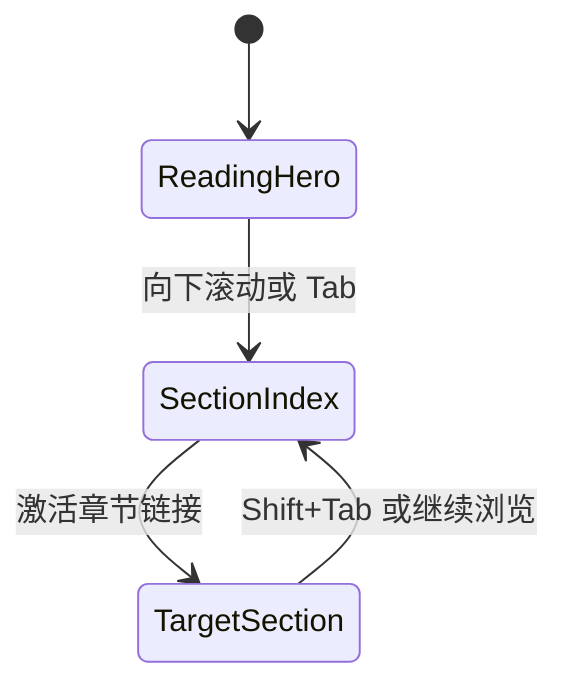

# Dashboard UI/UX 系统化优化技术设计

## 问题与用户结果

Dashboard 需要在高密度治理信息中保持清晰、稳定、可操作。用户结果不是“更花哨”，而是：

- 一眼分辨项目语境、状态层级和下一步操作；
- 电脑端常见笔记本与桌面宽度都能可靠完成高频控制；
- 键盘、屏幕阅读器、深浅主题和 reduced-motion 都获得同等完成度；
- 每组改动可独立评审、验证和回滚。

## 约束与非目标

- 沿用 React 18、Vite 5、Radix、Tailwind 4、CVA、Lucide 和 GSAP。
- 不修改服务端契约、业务规则、生产状态或真实用户数据。
- 新可见文案必须中英文同步；首切片不新增文案。
- 不复用其他 automation 的 Change、分支、worktree 或 canonical state；发现重叠时记录并保持提交可独立回滚。
- 不升级依赖、不改业务规则，也不以一次性组件重写替换现有 Dashboard。
- 产品定位只覆盖电脑端本地开发工作流；手机布局、移动触控尺寸和手机截图不是交付目标。

## 方案比较

| 方案 | 优点 | 缺点 | 结论 |
| --- | --- | --- | --- |
| A. 立即重做全局 token 与 Nav | 视觉变化最大 | 与并行 worktree 直接冲突，难审查、难回滚 | 拒绝 |
| B. 全量替换为 `components/ui/*` | 组件一致性强 | 当前消费者不完整，一次性迁移回归面过大 | 后续分批 |
| C. 先处理无冲突的高频上下文组件，再逐批扩展 | 风险低、证据清楚、可与并行变更组合 | 首批视觉覆盖有限 | 采用 |

## 设计方向

视觉语言采用“安静的操作台”：

- 中性色表面承载密集信息，accent 只表达当前选择和主动作；
- success/warning/error 仅表达状态，不承担普通主按钮语义；
- 标题、辅助说明、元信息形成稳定三级层级；
- 控件使用 Lucide 统一线性图标，图标不替代文本或 accessible name；
- 动画仅解释弹层来源、列表进入与状态变化，默认短促，reduce 下立即到终态。

## 需求变化：AppHeader 不可达

原计划选择 `shell/AppHeader.tsx` 作为低冲突切片。进入 Build 后对 `origin/main` 与 PR #5
进行生产调用链复核，仓库搜索只发现组件定义及其测试，没有 App、shell 或功能域消费者。
继续实现会形成测试可见、用户不可见的死代码优化，因此通过 `requirements-changed` 回退 Spec。

## 修订首切片：SolutionView 章节导航

### 信息架构

- `SolutionView` 已由 `App.tsx` 在 `view='overview'` 时真实渲染，且 Nav 品牌入口可达。
- 页面包含七个按 `01` 至 `07` 编号的主要章节，电脑端仍需要稳定的快速定位结构。
- 在 hero 之后提供域内页内导航，复用七个既有 eyebrow 翻译，不新增或修改共享 i18n。
- 导航链接和 section id 由同一个 solution 域配置表达，避免锚点与章节顺序漂移。

### 交互与可访问性

- 使用语义 `nav` 与原生 `<a href="#...">`，不以按钮或 JavaScript 模拟章节跳转。
- 每个链接具有可理解的既有双语名称与明确 focus-visible。
- 章节索引在 1024–1920px 桌面视口保持紧凑且不制造根级水平溢出。
- 每个目标 section 使用稳定 id 与 scroll margin，目标标题继续保持既有 h2 层级。

### 动效与 reduced motion

章节定位不引入平滑滚动或 GSAP。默认和 `prefers-reduced-motion: reduce` 都使用浏览器原生
即时锚点行为；hover/focus 只使用既有颜色反馈，并提供 `motion-reduce:transition-none`。

## Verify-fail 后的系统基线修复

第一次 Verify 证明仅交付 SolutionView 与 Button 无法满足已冻结的 Dashboard-wide MUST。返回 Build
后采用有限、可验证的系统基线，而非继续增加装饰：

- `index.css` 保持唯一 token 真相源：主动作使用 accent blue，success green 只表达成功；浅色、深色
  和 system 主题保持同一语义映射。
- App 将主题偏好明确建模为 `system | light | dark`。system 使用
  `matchMedia('(prefers-color-scheme: dark)')` 解析，并在系统主题变化时更新；离开 system 或卸载时清理 listener。
- Nav 的品牌、五个主入口与设置入口均具有双语 accessible name；
  设置浮层在打开时聚焦首控件，保持浏览器自然 Tab/Shift+Tab 顺序，Escape 关闭并把焦点返回触发器。
- Button、Input、Select、Tabs、Dialog、DropdownMenu 等共享交互原语统一可见焦点、禁用辨识
  和 reduced-motion 终态；尺寸继续服从现有桌面密度。
- App 的离线恢复、快照错误重试和 Onboarding 复制/创建操作使用相同焦点基线。
- 全局 reduced-motion 媒体查询把 CSS animation/transition 和平滑滚动直接置于终态；
  已有 GSAP 继续由各组件的 context/revert 生命周期负责清理。

## 状态与边界



- SolutionView 仍为纯展示域，不读取 API、snapshot 或运营功能域状态。
- 原生锚点即使 CSS/backdrop 不可用仍可完成定位。
- App 只负责外壳主题偏好、快照状态和功能域路由；Nav 只负责导航与设置交互；model/state/API
  边界和业务规则不变。

## 错误语义

- 章节 id 与链接在组件测试中一一校验，避免失效锚点静默交付。
- 外部文档链接的安全属性与既有错误边界不变。
- CSS 或媒体查询不可用时仍保留语义 nav 与原生链接。

## 性能与清理

- Solution 章节配置仍为静态域内数据；`SolutionSectionNav` 只维护 URL hash 派生的
  `currentSection`，注册一个 `hashchange` listener 并在卸载时移除。
- system 主题只在偏好为 system 时注册一个 media-query `change` listener，并在偏好变化或卸载时移除。
- 设置弹层的 keydown listener 只在打开期间存在，关闭或卸载时清理。
- 不新增 observer、定时动画或常驻 GSAP timeline。
- 根容器使用横向裁剪而非双轴 `overflow-hidden`，保留 sticky 的纵向滚动语义。

## 依赖与安全

- 不新增或升级依赖，继续使用现有 React、Tailwind、CVA 与 Lucide。
- 不触及 auth、token、权限、生产数据或写 API。

## Assumptions

- PR #5–#8 仍可能变化；本 Change 每轮重新检查 overlap。
- 1024–1920px 为本 Change 的桌面验收范围；不对手机端作支持承诺。
- SolutionView 是无 API 的纯展示域，浏览器验收直接覆盖生产页面而非 fixture。

## Decision Log

1. 采用“无冲突、高频组件优先”的分批策略，不复制在途 Nav/token 改动。
2. AppHeader 因无生产消费者被否决，不以“文件无冲突”替代“用户可见”证据。
3. 修订首切片选 SolutionView，原因是生产可达、无直接文件冲突，并有 8,981px 长页面定位问题。
4. 章节导航使用原生锚点与 reduced-motion 即时终态，不为简单因果引入 GSAP。
5. 第一次 Verify 的 High/Medium 结果要求在同一 Change 内补齐系统基线；因此第二批覆盖 token、
   system 主题、Nav/设置键盘语义、共享交互原语和可恢复状态。
6. 与 PR #5 的文件重叠被记录为集成风险；本分支不复用其 Change/state、不强推覆盖，所有修复保持
   独立提交并在 PR 中声明可按提交回滚。
7. 用户最终明确只支持电脑端；撤销 44px 移动触控专项投入和手机验收，保留桌面键盘与辅助技术要求。
8. 第二次 Verify 把剩余缺口限定为 App live-region/GSAP 清理、非模态设置浮层 Tab 语义、
   Onboarding H1 与复制命令名称/高度，以及主题 listener 清理测试；本轮规格不再对未触及功能域作
   Dashboard-wide 完成声明。

## 红队自检

- 如果并行 PR 未交付：本 Change 仍可独立改善 SolutionView，不依赖它们的 token 变化。
- 如果并行 PR 先合并：solution 域源码无重叠；rebase 后重测主题与外壳组合。
- 如果导航配置与 section id 漂移：测试必须因失效 href 或缺失目标失败。
- 如果 sticky/横向滚动造成布局问题：在 1024px/1200px/1440px 验证根级 overflow 与焦点可见性。

## 术语

- **语义 token**：按用途命名的颜色、表面、边框、阴影、圆角与动效变量。
- **reduced motion**：用户通过 `prefers-reduced-motion: reduce` 表达的减少非必要动效偏好。
- **首切片**：一个生产可达、可独立评审、验证、提交和回滚的 UI 改动集合。
- **并行 worktree**：未由本 automation memory 证明同源、但正在修改相同仓库的独立工作目录。

```coverage
touches:
L1_api:      waived -> 不改变 API 或协议
L2_data:     waived -> 不改变数据模型或持久化
L3_rules:    filled -> #状态与边界
L4_state:    filled -> #状态与边界
L5_errors:   filled -> #错误语义
L6_security: waived -> 不触及 auth/权限/敏感数据
L7_perf:     filled -> #性能与清理
L8_deps:     filled -> #依赖与安全
L10_terms:   filled -> #术语
```
