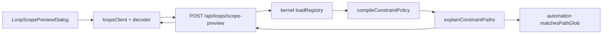

# Loop 路径策略预检设计

## 用户结果

维护者在启动无人值守 Loop 前，可以把计划变更的项目相对路径粘贴到 Workbench，看到每条路径按当前 Loop 的真实 allowlist/denylist 会被允许还是拒绝，以及命中的规则。预检只解释当前策略，不执行任务、不修改配置，也不替代运行时 gate。

## 约束与非目标

- 判定必须复用 automation 结算使用的 `matchesPathGlob` 和 kernel `ConstraintPolicy`，前端不得复制 glob 规则。
- 输入只接受有界、规范的 Git 风格项目相对路径；端点不打开用户输入路径。
- API 使用既有 loopback Host、Bearer token、`application/json` 与 registered-root 锚。
- 结果不得回传绝对路径、文件正文、secret 或运行凭据。
- 本 Change 不新增 glob 语法、不改变 Loop YAML、不调整 L1/L2/L3 晋级规则，也不把预检结果持久化成许可。

## 一手证据与差异

读取日期：2026-07-28。

- Trellis 默认分支 `main` 固定为 `621435d143d352ac1db4ab077d682716fd6d5afd`。GitHub latest Release API 返回 404，因此稳定版本回退到语义 tag `v0.6.9`，SHA `12e279a8af00456b1d0d4e3d0f7f59e7b702202e`。
- Trellis beta PR [#468](https://github.com/mindfold-ai/Trellis/pull/468) 合并提交 `5f543960683906969952f853390039c6024c48b8`，证明路径作用域规则只有在用户触碰具体路径时可见才有操作价值。
- Comet 默认分支 `master` 固定为 `2945693e4061c369be0d400ed2999a66fa87c680`；最新发布版 `0.4.0-beta.9` 固定为 `84038b0d6b7c185b233f0f36b294ae74dd9121d0`。其 baseline include/exclude policy 强调显式边界、预算和可行动的配置错误。
- Tenon 当前已有更强的执行约束：`compileConstraintPolicy`、`evaluateConstraintPolicy` 与 automation `matchesPathGlob` 在 L3 结算时 fail closed，但 Dashboard 只显示原始 chips，不能对计划路径解释结果。

上游项目只作为需求与设计证据。Trellis 当前仓库许可证为 AGPL-3.0，Comet 为 MIT；本实现不复制其源码、测试、文案或文件结构。

## 方案比较

| 方案 | 优点 | 失败模式 | 决策 |
| --- | --- | --- | --- |
| 前端直接实现 glob matcher | 少一次请求 | 与 automation 结算漂移，可能把会被 gate 拒绝的路径显示为允许 | 拒绝 |
| server 调用 CLI 子进程执行预检 | CLI 行为易复用 | 每次交互启动进程，仍需新增序列化命令，加载/失败语义复杂 | 拒绝 |
| kernel 产出逐路径解释，server 绑定真实 Loop 与 automation matcher，Workbench 只消费 DTO | 规则单源、无子进程、可定向测试、失败路径清晰 | 增加一个受保护 POST 与 DTO decoder | 采用 |

## 领域与包边界



- kernel 拥有与协议无关的逐路径解释值对象和 denylist-first 不变量。
- automation 继续拥有生产 glob 语义；server 作为应用装配层把 matcher 注入 kernel。
- server 负责不可信 DTO、root/Loop 解析、限额、稳定错误码与响应映射。
- Dashboard `api/` 负责完整解码；Workbench 组件只管理交互状态。
- 不新增反向依赖：server 已依赖 kernel 与 automation，Dashboard 功能域只依赖自己的 API 边界。

## 共享规则

逐路径解释的顺序固定：

1. 若命中任一 denylist，结果为 `path-denied`，回传首个命中 pattern。
2. 否则若未命中任何 allowlist，结果为 `path-outside-allowlist`。
3. 否则结果为 `allowed`，回传首个命中 allowlist pattern。

空 allowlist 等价于“零路径获授权”，与现有 L3 结算一致。聚合 `evaluateConstraintPolicy` 继续保持全局 denylist 优先：只要存在 denylist 命中，aggregate reason 仍是 `path-denied`，不因新增解释 API 改变现有行为。

## API 契约

`POST /api/loops/scope-preview`

请求：

```json
{
  "root": "/registered/project",
  "loop_id": "release-loop",
  "paths": ["src/app.ts", "docs/guide.md"]
}
```

边界：

- 1–100 条，去重后保持首次出现顺序；
- 单条 UTF-8 最大 1024 bytes，总计最大 32768 bytes；
- 必须是非空、NUL-free、使用 `/` 的 canonical 项目相对路径；
- 拒绝绝对路径、反斜杠、`.`、`..`、空 segment、尾 `/` 和规范化后变化的路径；
- 不允许未知 request key。

成功响应：

```json
{
  "ok": true,
  "schema_version": 1,
  "loop_id": "release-loop",
  "loop_status": "active",
  "autonomy_level": "L3",
  "enforced_for_unattended_merge": true,
  "summary": { "total": 2, "allowed": 1, "blocked": 1 },
  "items": [
    { "path": "src/app.ts", "verdict": "allowed", "reason": "allowlist", "matched_pattern": "src/**" },
    { "path": "docs/guide.md", "verdict": "blocked", "reason": "path-outside-allowlist", "matched_pattern": null }
  ]
}
```

稳定错误：

| HTTP | code | 条件 |
| --- | --- | --- |
| 400 | `LOOP_SCOPE_REQUEST_INVALID` | 请求形状、数量、字节或路径不合法 |
| 401/403 | 既有鉴权错误 | token 或 Host 不合法 |
| 404 | `LOOP_SCOPE_ROOT_NOT_FOUND` / `LOOP_SCOPE_LOOP_NOT_FOUND` | root 未登记或 Loop 不存在 |
| 409 | `LOOP_SCOPE_REGISTRY_INVALID` | loops registry 无法形成可信策略 |

预检本身无副作用；`enforced_for_unattended_merge` 只在 Loop 当前为 `active` 且 `autonomy_level=L3` 时为 true。无论该值如何，UI 都明确说明真实运行会重新判定。

## Workbench 交互状态

```text
closed
  └─ open-empty
       ├─ invalid-local (提交禁用，显示格式提示)
       └─ loading
            ├─ ready-allowed
            ├─ ready-blocked
            └─ error ── Retry ──> loading
```

- 入口位于 Loop 的“自主与安全”高级区，紧邻 allowlist/denylist。
- Dialog 使用现有焦点困笼与 Escape 返回路径；textarea 支持换行粘贴，`Ctrl/Cmd+Enter` 提交。
- 空输入保持按钮禁用；加载时禁用输入与提交；错误保留原输入并提供重试；成功逐条显示 verdict、reason 与 pattern。
- 切换语言只切换界面文案，不改变协议 token 或路径。

## 安全与性能

- 服务端只把路径当字符串匹配，不执行 `stat`、`readFile`、Git 或 shell。
- registered-root 锚在读取 Loop 前后验证；响应只含客户端已提交的相对路径和 Loop 的路径 pattern。
- 正则由已通过 Loop registry schema 的现有 pattern 编译；最多 `100 × (allowlist + denylist)` 次小型匹配，无网络、进程或持久化。
- 不缓存结果，避免策略变更后继续展示旧许可。每次提交 fresh 读取 registry；真实执行仍 fresh gate。

## Assumptions / Decision Log

- 用户已授权持续自主执行，因此采用最保守的“只读、无缓存、无许可持久化”默认，而不为低风险 UI 位置再次询问。
- 预检只针对 merge 路径政策；write 与 merge 当前共享同一声明，但 UI 不承诺它们永远相同。
- paused/L1/L2 Loop 仍可模拟策略以便配置，但会显示当前并非 L3 unattended merge 的生效许可。
- 路径 byte 语义不做 Unicode normalization，避免把两个不同 Git 路径误合并；仅验证 JSON 字符串的 canonical 分隔与相对性。

## 红队自检

- 恶意绝对路径不会触发文件读取，因为边界先拒绝且应用层没有路径 I/O。
- denylist 与 allowlist 同时命中时 denylist 获胜。
- 空 allowlist 不会变成 allow-all。
- 预检通过后修改 registry，不会绕过真实执行 gate。
- 服务端返回未知枚举、漏字段或超额 items 时，前端 decoder 失败并进入 error，不用部分可信数据渲染。
- Dialog 关闭/重开不持久化用户路径，避免本机敏感目录线索进入 localStorage。

## Verification strategy

1. kernel 定向测试：deny 优先、空 allowlist、首个 pattern、顺序与 aggregate 行为保持。
2. server 单元/真 HTTP：Host/token/content-type、闭集 DTO、路径/字节/数量、未知 root/Loop、损坏 registry、成功与无写盘证明。
3. Dashboard decoder/client/component：空、加载、允许、拒绝、服务端/网络/decoder error、retry、zh/en、Ctrl/Cmd+Enter、Tab/Shift+Tab/Escape。
4. `typecheck:web`、`test:web`、`build:web`、`build`、`npm test` 与相关 architecture/comments/bundle 门禁。
5. 真实 Tenon Dashboard 在桌面与移动视口、明暗主题完成成功/拒绝/错误恢复和键盘验收；同时核对 title、API health 与目标项目身份。

```coverage
touches: loop-automation, dashboard-api
L1_api:      filled -> #API-契约
L2_data:     filled -> #API-契约
L3_rules:    filled -> #共享规则
L4_state:    filled -> #Workbench-交互状态
L5_errors:   filled -> #API-契约
L6_security: filled -> #安全与性能
L7_perf:     filled -> #安全与性能
L8_deps:     filled -> #领域与包边界
L10_terms:   filled -> #用户结果
```
