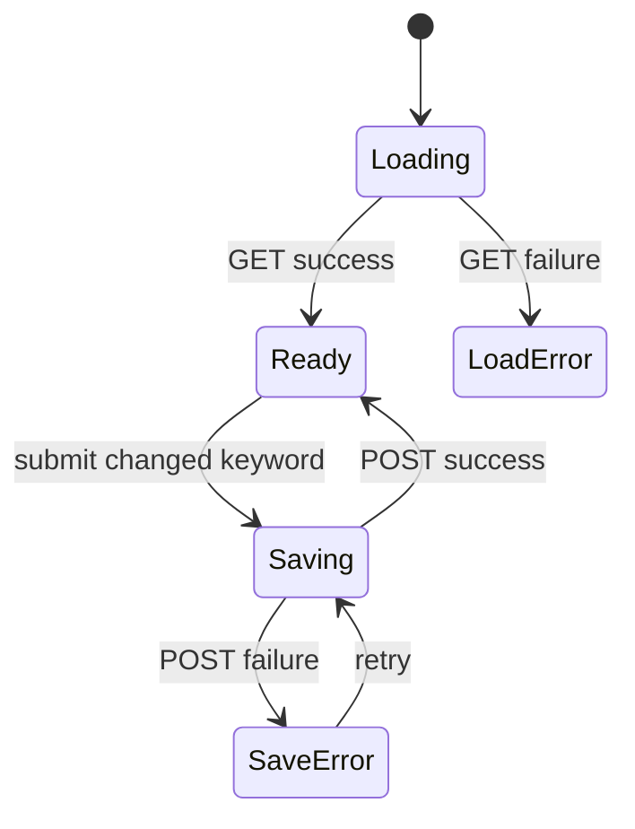

# Prompt Routing Bypass 技术设计

## 用户结果与边界

项目维护者可以在 Dashboard 的 UserPromptSubmit Hook 区配置一个单轮旁路词。提示中以独立 token 写出该词时，Tenon 本轮不输出 `router` dispatch 或 `breadcrumb`，但 review acknowledgement、confirm、PreToolUse、安全门、Skill 证据和 Change 状态完全照常运行。

非目标：

- 不提供全局“关闭 Tenon”开关。
- 不跳过 SessionStart 或 sub-agent 上下文。
- 不支持正则、空格短语、Unicode token 或按 Track/phase 配置。
- 不改动在途的 Host Target Plan、Context Bundle Budget Preview 或 Dashboard 全局视觉改版。

## 固定上游依据

- 上游参考 A `v0.6.9` / `12e279a8af00456b1d0d4e3d0f7f59e7b702202e`：默认旁路词、大小写不敏感、独立边界、空字符串禁用，仅跳过当前 turn；GitHub Latest Release API 返回 404，按规则回退语义版本 tag。详见 [上游参考 A 报告](./2026-07-28-prompt-routing-bypass-upstream-a-research.md)。
- 上游参考 B `0.4.0-beta.9` / `84038b0d6b7c185b233f0f36b294ae74dd9121d0`，当前 `master` / `2945693e4061c369be0d400ed2999a66fa87c680`：采用窄 schema、canonical 格式、原子写与失败显式化，不移植通用底层原语。详见 [上游参考 B 报告](./2026-07-28-prompt-routing-bypass-upstream-b-research.md)。

## 方案比较

| 方案 | 优点 | 缺点 | 结论 |
| --- | --- | --- | --- |
| A. 扩展 `.pipeline/hooks.json` | 复用现有 `/api/hooks`、信任锚、原子写和 Dashboard 数据流；语义同属 Hook 治理 | 所有写回必须保留 matrix 与 keyword | **采用** |
| B. 独立 `.pipeline/prompt-routing.json` | 文件职责最窄 | 新增一套路径、端点、加载与测试；两次请求 | 拒绝，超出最小切片 |
| C. 并入 `.pipeline/tracks.yaml` | 已有 revision/CAS | 旁路是全局 Hook 策略，不属于 Track；会污染路由 registry | 拒绝，所有权错误 |

## 数据与 API 契约

磁盘继续使用 version 1：

```json
{
  "version": 1,
  "prompt_skip_keyword": "no-tenon",
  "matrix": {}
}
```

- 缺文件、旧文件无字段、字段类型/字符集非法：读取为默认 `no-tenon`。
- 显式 `""`：禁用旁路。
- 非空值必须匹配 `^[A-Za-z0-9][A-Za-z0-9_-]{0,31}$`；不隐式 trim。
- `GET /api/hooks?root=...` 向后兼容增加 `prompt_skip_keyword`。
- `POST /api/hooks/prompt-routing-bypass` 接受 `{ root, prompt_skip_keyword }`；沿用 Host/token/content-type/root 校验顺序，400 表示 DTO 非法，404 表示 root 未注册，500 表示写入失败。
- Hook toggle 和 keyword 写回都先读取完整 config，再以同目录临时文件 + rename 写出 canonical JSON，互相保留字段。

## 匹配规则

共享 `hooks/prompt-intent.sh` 提供纯 Bash helper：

1. 从 canonical 单行字段读取 keyword，手改异常回退 `no-tenon`。
2. 用 Bash 3.2 兼容的 ASCII 大小写折叠，不调用 Node/Python。
3. 两侧字符若属于 `[A-Za-z0-9_-]` 则不命中；空白、标点、行首/行尾是边界。
4. 空 keyword 永不命中。

示例：

| Prompt | 结果 |
| --- | --- |
| `no-tenon explain this hook` | 旁路 |
| `(NO-TENON) explain` | 旁路 |
| `xno-tenon` / `no-tenonx` / `foo-no-tenon` | 不旁路 |
| `path/no-tenon.md` | 旁路；Dashboard 明示标点属于边界 |

`router.sh` 与 `breadcrumb.sh` 在解析可信项目根后调用 helper 并静默退出。其他 UserPromptSubmit Hook 不调用它，因此 delegated/human review receipt 不被旁路。

## Dashboard 状态

控制器放在执行时间线的 `UserPromptSubmit` 节点，与真实 Hook 同屏：

- loading：Hook config 未返回时显示加载。
- ready：输入框回显 server 值；开关控制启用/禁用；Enter 或保存按钮提交。
- disabled/empty：开关关闭且保存 `""`，明确“本轮旁路已禁用”。
- validation error：客户端提示字符规则，server 仍为权威。
- save error：保留草稿并显示重试；不得谎报已保存。
- success：用状态文本确认当前生效 keyword。

所有新增可见文本进入中英文 i18n；表单具有关联 label、键盘提交、disabled/busy 和 `role=alert/status`。

## 关键业务规则

- Bypass 是当前 turn 的输出抑制，不是状态转换或权限。
- 只有独立 ASCII token 命中；配置不能携带 shell/regex 语义。
- 安全门与 review/confirm 绝不读取此字段。
- API 成功后持久化值是唯一真相源；前端失败时保留未提交草稿。

## 状态机



Hook 运行态是确定性分支：`配置解析 → token 边界匹配 → 命中则 router/breadcrumb exit 0 → 未命中走既有逻辑`。

## Assumptions / Decision Log

- 选择 ASCII token，消除上游参考 A 的 Python/JS Unicode `\w` 不一致；这是兼容收缩，不承诺任意自然语言短语。
- 接受 `/no-tenon.md` 的标点边界命中，并在 UI 说明；要求空白边界会偏离上游且增加规则认知成本。
- 空字符串作为磁盘禁用语义，Dashboard 用开关表达，避免用户直接猜空值含义。
- 不新增通用锁/CAS；沿用当前 Hook 配置 endpoint 的原子 last-write-wins 语义。本轮测试覆盖“切开关保留 keyword / 改 keyword 保留 matrix”。

## Grill 自检

| 假设 | 所有者/证据 | 若为假 | 落点 |
| --- | --- | --- | --- |
| 用户只需单轮旁路 | 项目维护者；上游参考 A 的 issue/实现 | 会出现持久禁用诉求，可能削弱治理 | 明确非目标与 UI 文案 |
| `hooks.json` 是正确所有权 | Tenon server/Workbench 现有契约 | Track 或 workflow 会错误拥有全局策略 | ADR |
| ASCII token 足够 | 默认词与 CLI 使用场景 | 国际化 token 需求需新版本 schema | Delta spec 限制 |
| 旁路不应影响 review | Tenon 安全边界 | 审核可能被提示词静默绕过 | Hook 负向测试 |

```coverage
touches:
L1_api:      filled -> #数据与-API-契约
L2_data:     filled -> #数据与-API-契约
L3_rules:    filled -> #关键业务规则
L4_state:    filled -> #状态机
L5_errors:   filled -> #Dashboard-状态
L6_security: filled -> #关键业务规则
L7_perf:     filled -> #匹配规则
L8_deps:     waived -> 复用现有 Node-22/npm-workspace、React 与纯-Bash-3.2-能力，不新增依赖
L10_terms:   filled -> openspec/changes/prompt-routing-bypass/CONTEXT.md
```
