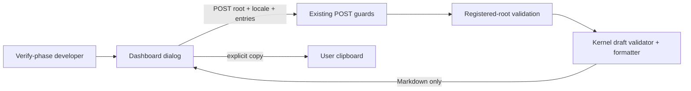

# Verification Evidence Composer Design

## Goal

Give a developer in Tenon's Verify phase a small, structured way to turn
observed checks into a reviewable Markdown fragment without claiming that the
fragment is trusted verification evidence and without mutating the governed
verification report.

## Fixed upstream evidence

Research was read on 2026-07-28 and is pinned so this design can be reviewed
against immutable source:

| Source | Pin | Evidence used |
| --- | --- | --- |
| mindfold-ai/Trellis default `main` | [`12e279a8af00456b1d0d4e3d0f7f59e7b702202e`](https://github.com/mindfold-ai/Trellis/commit/12e279a8af00456b1d0d4e3d0f7f59e7b702202e) | `add_session.py` accepts repeatable `--change`, `--test`, and `--next-step` values and omits empty sections; journal files use an append-friendly union merge rule. |
| mindfold-ai/Trellis stable version | [`v0.6.9`](https://github.com/mindfold-ai/Trellis/tree/v0.6.9), same commit as `main` | GitHub reported no Release, so the latest semantic version tag is the explicit fallback. |
| rpamis/comet default `master` | [`2945693e4061c369be0d400ed2999a66fa87c680`](https://github.com/rpamis/comet/commit/2945693e4061c369be0d400ed2999a66fa87c680) | Native acceptance evidence rejects unknown fields, requires either evidence or a skip reason, and serializes in one canonical form. |
| rpamis/comet stable release | [`0.4.0-beta.9`](https://github.com/rpamis/comet/releases/tag/0.4.0-beta.9), tag commit `84038b0d6b7c185b233f0f36b294ae74dd9121d0` | Latest published release used as the compatibility baseline. |

The feature maps those ideas rather than copying either implementation:
Trellis contributes compact structured authoring and omission of empty
sections; Comet contributes closed input, mutually exclusive skip/result
semantics, input budgets, and deterministic serialization.

## Current Tenon comparison

Tenon already has a strict trusted `VerificationResult` domain under
`packages/kernel/src/verification/`. That type binds issuer, subject revision,
verdict, and repository evidence and is consumed by workflow/runtime logic. It
must not be weakened or confused with user-authored notes.

The Dashboard Change detail currently renders document-ledger status through
`TaskDocumentsSection`, but gives no Verify-specific authoring help. The server
already centralizes POST Host/token/content-type checks before route handlers.
The smallest safe seam is therefore:

1. a distinct untrusted `VerificationEvidenceDraft` formatter in the kernel;
2. a stateless POST route behind existing server guards and registered-root
   validation;
3. a Verify-only Dashboard dialog that calls the route and lets the user copy
   the returned Markdown.

No state, ledger, report, gate, command, or filesystem write is added.

## Options

### A. Browser-only formatter

Fastest, but duplicates protocol rules in UI code, has no reusable server
contract, and can drift from other Tenon hosts. Rejected.

### B. Shared kernel formatter, protected stateless route, Dashboard dialog

Keeps normalization and serialization deterministic, lets the server enforce
the same root/security boundary as other mutations, and delivers a complete
user path without changing governed persistence. Chosen.

### C. Append directly to the verification report

More automated, but it crosses document-ledger, CAS, build-fingerprint, review
receipt, and ownership boundaries. A draft composer is not authoritative
enough to perform that write. Rejected.

## Contract

The request is `{ root, locale, entries }`, where locale is `zh-CN` or `en`.
`entries` is a non-empty array of at most 12 items:

- `kind`: `command`, `browser`, `review`, or `other`;
- `title`: trimmed, non-empty, at most 240 UTF-8 bytes;
- `status`: `passed`, `failed`, or `skipped`;
- `command`: optional, at most 2,000 UTF-8 bytes, allowed for `command` only;
- `result`: required for `passed` and `failed`, absent for `skipped`, at most
  4,000 UTF-8 bytes;
- `skipReason`: required for `skipped`, absent otherwise, at most 2,000
  UTF-8 bytes.

Unknown fields and unsafe control characters are rejected; CRLF is normalized
to LF while legitimate Chinese, emoji, tabs, and line breaks remain intact.
Empty arrays are rejected by the API, while the Dashboard presents an empty
editor state and does not submit. The response is
`{ ok: true, markdown, entryCount }`; validation errors use an
`{ ok: false, code, error, details }` envelope with stable machine codes and
field paths so the bilingual UI does not display kernel text directly.

The Markdown keeps user entry order because verification chronology is useful.
For identical normalized input and explicit locale it is byte-for-byte
deterministic and bounded to 32 KiB. Headings, inline labels, adaptive code
fences, blockquotes, and line breaks have one fixed order; content is escaped
or fenced so user input cannot create additional evidence structure.

## Dashboard interaction

`TaskDocumentsSection` receives the current phase and renders “Compose
verification evidence” only in Verify. Activating it opens the existing
accessible `Dialog`.

The dialog starts with a clear empty state and an “Add check” action. Each
draft row exposes kind, status, title, and the status-specific detail field.
Users can remove rows. “Generate Markdown” shows loading, maps server errors
inline without closing the dialog, and shows a read-only result with a copy
action on success. Copy success and failure use the existing toast mechanism.
Escape closes the dialog; the shared dialog preserves focus and traps Tab.

All visible labels, descriptions, validation feedback, empty/loading/error
text, and toast messages exist in Chinese and English.

## Data flow and boundaries



The route is stateless. It never reads a report, executes a command, writes a
file, advances a phase, or creates trusted `VerificationResult` evidence.

## Errors, security, performance, and compatibility

- Malformed JSON, wrong content type, untrusted Host/token, or unknown root
  continues through existing server behavior.
- Invalid entries fail closed before Markdown is returned. The UI retains the
  draft so correction does not lose work.
- Clipboard failure is reported separately from formatting failure.
- The 12-entry and field-size budgets keep request processing and rendered
  output bounded. Formatting is linear in total accepted input and adds no
  dependency.
- Existing API paths, state files, trusted verification types, report format,
  and gate semantics are unchanged. Removing the route and dialog fully rolls
  the feature back.

## Test strategy

- Kernel tests cover every status, omission, deterministic output, escaping,
  unknown fields, wrong field combinations, control characters, and budgets.
- Server tests use real HTTP requests to cover auth/root integration, success,
  empty input, and validation errors.
- Dashboard API tests cover decoding and compatible errors.
- Component tests cover phase visibility, empty/add/remove, status-specific
  fields, loading, server failure, generated output, copy success/failure, and
  translated labels.
- Browser acceptance runs against the real Tenon Dashboard and verifies target
  identity, empty/success/error states, focus/Tab/Escape behavior, and copy.

## Decision log

1. Keep the composer type explicitly untrusted and separate from
   `VerificationResult`.
2. Preserve entry order while making normalization/rendering deterministic.
3. Return Markdown but never persist or apply it.
4. Reuse existing POST guards and registered-root validation.
5. Add no dependency and keep every production module below repository size
   limits.

```coverage
touches:
L1_api: filled -> #contract
L2_data: waived -> stateless endpoint; no persistent data
L3_rules: filled -> #contract
L4_state: filled -> #dashboard-interaction
L5_errors: filled -> #errors-security-performance-and-compatibility
L6_security: filled -> #data-flow-and-boundaries
L7_perf: filled -> #errors-security-performance-and-compatibility
L8_deps: filled -> #errors-security-performance-and-compatibility
L10_terms: filled -> #goal
```
