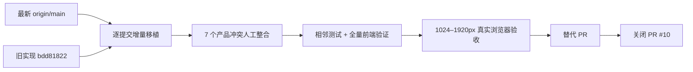
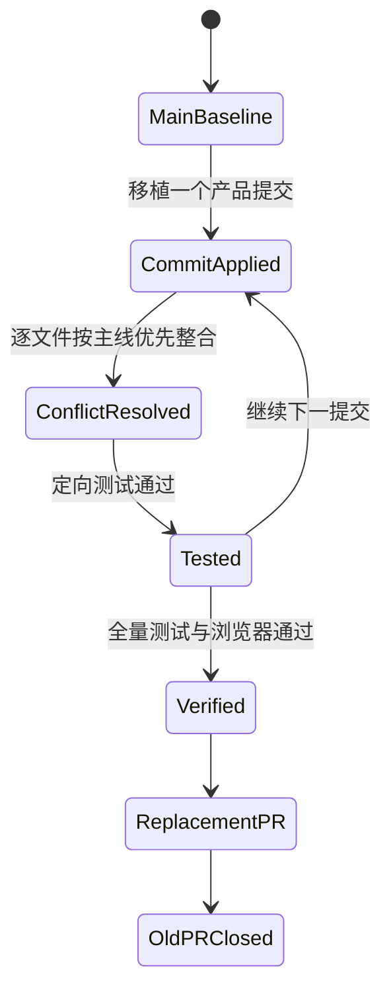

# Dashboard UI/UX 主线整合技术设计

## 问题与用户结果

PR #10 已实现一组有价值的桌面 Dashboard UI/UX 修复，但它基于旧 main，当前不可合并。用户需要的结果不是保留旧分支本身，而是：

- 在最新 main 上得到一个无冲突、可审查的替代 PR；
- 保留主线新增功能，不用旧文件覆盖新能力；
- 修复真实电脑端 Dashboard 的工作区辨识、设置键盘生命周期、长页导航、状态反馈和 reduced-motion；
- 对冲突解决后的新 SHA 重新完成测试和真实浏览器验收。

## 约束与非目标

- 产品目标只覆盖 1024–1920px 电脑端 Dashboard；手机端不设计、不修复、不截图、不验收。
- 继续使用 React 18、Vite 5、Radix、Tailwind 4、CVA、Lucide 与 GSAP。
- 不新增或升级依赖，不改变 Dashboard API、服务端数据模型或真实业务规则。
- 最新 main 是合并底座；主线新功能和当前文件结构优先。
- 旧 PR 的治理历史、归档目录、旧 Verify 报告与生成资产不作为代码移植输入。
- 替代 PR 可审查前保留 PR #10；替代 PR 创建后关闭 #10，不自动合并。

## 证据摘要

1. GitHub 报告 PR #10 `mergeable=CONFLICTING`、`mergeStateStatus=DIRTY`。
2. `git merge-tree` 把产品冲突限定为 App、Nav、Onboarding、SolutionView、i18n、全局 CSS、主规格和生成入口。
3. 1440px Projects 基线显示多个同名 worktree 无可见根路径。
4. 1024px 深色基线显示设置浮层按 Escape 后未关闭、焦点未归还。
5. 1024px Overview 有 7 个章节、4748px 高，但无 section id 与页内导航。
6. 最新 main 的完整 `npm run build` 通过，当前生产资产为 `index-D5AYWyzO.js` / `index-UO6vcbRz.css`。

详细证据见 `docs/research/2026-07-29-dashboard-ui-ux-overhaul-reconcile-audit.md`。

## 方案比较

| 方案 | 优点 | 风险 | 结论 |
| --- | --- | --- | --- |
| A. 继续 PR #10 并直接 merge/rebase | 对象最少 | 冲突解决后旧 Verify 失效，且容易整文件覆盖 main 新功能 | 拒绝 |
| B. 从最新 main 建新 Change，逐个移植旧产品提交并人工整合冲突 | 保留历史增量、主线能力和可回滚边界 | 需要逐文件判断和完整重验 | 采用 |
| C. 不看旧提交，按记忆重新实现 | 表面上差异较小 | 容易遗漏历次 Verify 修复，无法证明行为等价 | 拒绝 |

## 整合拓扑



## 文件级决策

### App 与主题/状态生命周期

- 保留 main 的路由、项目选择、Context Bundle/Verification Evidence 调用链和 skip link。
- 主题偏好使用 `system | light | dark`；system 监听 `prefers-color-scheme`，离开 system 或卸载时清理 listener。
- flash tween 与 timer 在替换、关闭和卸载时清理。
- offline、loading、error、toast 使用与严重程度匹配的 `status` / `alert` 与 live region。
- 不恢复任何会删除 main 新状态分支的旧文件内容。

### Nav 与设置浮层

- 保留 main 的一级导航结构和现有窄宽 best-effort 代码，但支持范围仍只声明电脑端。
- 每个 icon-only 或品牌入口具有稳定双语 accessible name。
- 设置浮层保持非模态：打开后聚焦首个控件，Tab/Shift+Tab 使用自然浏览器顺序，Escape 关闭并把焦点归还设置入口。
- modal Dialog 的 Escape 不得被 Nav 全局 listener 截获。

### Projects 工作区身份

- 相同 basename 的 worktree 显示足以区分的根路径信息。
- accessible name 包含完整 root；React key、GSAP selector/id 使用 root 派生的稳定唯一标识。
- loading、empty、unreadable 状态保持可读语义。

### Solution 长页导航

- 从同一域配置生成七个稳定 section id 与导航链接，避免顺序漂移。
- 使用语义 `nav` 和原生 `<a href="#...">`；不引入平滑滚动或额外 GSAP。
- hash 变化更新 `aria-current`；卸载时清理 listener。
- sticky/横向容器在 1024–1920px 不制造根级水平溢出。

### 共享原语与动效

- Button、Input、Select、Tabs、Dialog、DropdownMenu、Table、Tooltip 等增量加入 focus-visible、disabled 与 `motion-reduce` 终态。
- `shared/motion.ts` 使用 `gsap.matchMedia` 或等价生命周期，确保普通模式和 reduced-motion 都返回可清理对象。
- 动效只表达进入、退出或反馈，不增加循环、bounce 或装饰性运动。

### i18n 与生成资产

- 冲突文案只做增量合并，保留 main 全部新 key；新增可见文本保持中英文成对。
- 不 cherry-pick 旧 `dist/`；最终 `npm run build` 从整合源码重新生成 Dashboard、server、CLI 与 bootstrap 资产。

## 主规格决策

当前 main 的 `dashboard-ui-ux-system` 仍声明 390px、720px、44px 移动触控和手机截图为 MUST，这与用户再次明确的产品边界冲突。Spec 阶段将：

- 将支持范围收敛为 1024–1920px 电脑端；
- 保留语义 token、Lucide、一级页面层级、键盘/屏幕阅读器、状态反馈和 reduced-motion；
- 将 Progress/Workbench 场景改写为桌面信息密度与可发现性；
- 删除手机端验收矩阵，不要求移除已有 best-effort CSS。

## 状态与回滚



- 每个旧产品提交保持可识别的增量边界；发生回归时可回退对应整合提交。
- 生成资产只在最终源码稳定后更新，避免中间产物干扰冲突判断。
- 若某项旧改动已被 main 等价或更好实现，则记录为 no-op，不强行制造差异。

## 验证矩阵

| 维度 | 覆盖 |
| --- | --- |
| 视口 | 1024×768、1200×870、1440×900、1920×1080 |
| 主题 | light、dark、system |
| 输入 | mouse、Tab、Shift+Tab、Enter/Space、Escape |
| 状态 | success、loading、error/retry、empty、disabled、offline/reconnect |
| 动效 | 默认 motion、`prefers-reduced-motion: reduce` |
| 页面 | Projects、Progress、AFK、Workbench、Machine、Overview、Onboarding |
| 身份 | title、URL、worktree root、Change、最终 asset hash |

手机视口不在矩阵中。

## Assumptions

- main 的手机布局代码可以保留为 unsupported best-effort；本 Change 不投入维护成本。
- PR #10 没有 review 或 CI 反馈需要单独迁移。
- 旧产品提交的测试表达仍有价值，但断言必须适配 main 的新调用链。
- 关闭 PR #10 是替代 PR 创建成功后的外部动作，不提前执行。

## Decision Log

1. 用户当前“继续执行、PR 有问题可重建”覆盖旧 automation memory 的“归档后只监控”规则。
2. 用户再次明确电脑端产品边界，因此本 Change 不做手机端设计或验收。
3. 采用最新 main 为底的新 Change/分支/PR，旧 Verify 不复用。
4. 旧分支只作为增量提交和证据来源，不整文件覆盖 main。
5. 先保留 PR #10，替代 PR 创建并可审查后再关闭，避免交付窗口中断。
6. 生成资产由最终源码重建，不参与手工冲突选边。

## Grill 红队自检

| 假设 | 证据/挑战 | 保守结论 |
| --- | --- | --- |
| “冲突只是 Git 元数据” | merge-tree 明确列出 7 个产品/规格文件 | 必须新 Verify，不能直接标记已解决 |
| “main 已等价包含旧修复” | 浏览器仍复现同名项目、Escape 生命周期和长页导航缺口 | 保留这些旧增量 |
| “整体 cherry-pick 不会回退功能” | old-vs-main diff 显示 old 缺少大量 Context Bundle/Verification Evidence 文件 | 只逐提交增量，不 checkout 旧树 |
| “手机代码必须删除才算 desktop-only” | 用户要求是不考虑手机端，不是授权破坏已有 best-effort | 不设计/不验收，避免额外删除 |
| “旧 PR 可以先关” | 替代 PR 尚未存在 | Ship 成功后再关 |

## 关键业务规则

- 最新 main 是整合真相源，旧提交只能贡献未被覆盖的增量。
- 电脑端支持范围固定为 1024–1920px。
- 冲突解决后的新 SHA 必须重新验证。
- 替代 PR 可审查后才能关闭 PR #10。

## 状态机

整合按“单提交移植 → 冲突解决 → 定向测试 → 下一提交 → 全量验证 → 替代 PR → 关闭旧 PR”推进。任何定向测试失败都停留在 Build 修复，不进入 Verify。

## 错误语义

- 缺失翻译、失效锚点、未清理 listener/timer/tween、焦点未归还或根级横向溢出均由相邻测试或浏览器矩阵暴露。
- 无法启动真实目标 Dashboard 时不得用构建通过替代浏览器验收。
- CI 或权限阻塞如实记录，不自动合并。

## 性能与清理

- 不新增全局 observer 或状态库。
- hashchange、matchMedia、keydown、timer 与 GSAP context 必须在条件变化或卸载时清理。
- 不为手机端或装饰效果增加额外运行时工作。

## 依赖与安全

- 不新增依赖，不触及 auth、token、权限、生产部署、费用或真实用户数据。
- 保持 `App/shell → 功能域 → model/state → api` 依赖方向。

## 术语

- **替代 PR**：基于最新 main、重新验证并取代冲突 PR #10 的新 Pull Request。
- **主线优先整合**：冲突时保留 main 新能力，只吸收旧提交仍有价值的最小增量。
- **unsupported best-effort**：已有代码可继续工作，但不属于本 Change 的产品承诺、设计或验收范围。

```coverage
touches:
L1_api:      waived -> 不改变 API 或协议
L2_data:     waived -> 不改变数据模型或持久化
L3_rules:    filled -> #关键业务规则
L4_state:    filled -> #状态机
L5_errors:   filled -> #错误语义
L6_security: waived -> 不触及 auth、权限、敏感数据或生产状态
L7_perf:     filled -> #性能与清理
L8_deps:     filled -> #依赖与安全
L10_terms:   filled -> #术语
```

