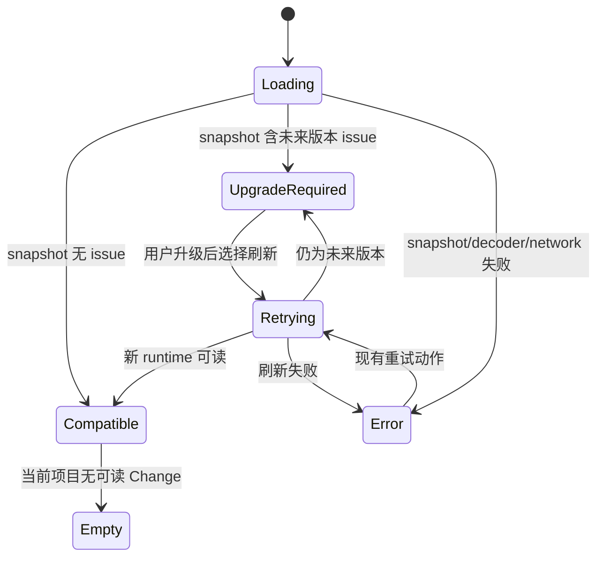

# Canonical State Version Status 设计

## 用户结果

当项目中某个 Change 来自更高版本的 Tenon 时，Dashboard 明确告诉用户“需要升级 Tenon”，展示发现版本与当前支持版本，并允许升级后刷新重试；用户不会再被误导去恢复一份并未损坏的状态。

## 范围与非目标

- 范围：canonical revision 解码错误分类、项目 snapshot 的加法兼容问题、Progress 入口的中英文状态与刷新交互、边界测试和真实浏览器验收。
- 非目标：迁移、降级、改写 unknown state、新写 API、自动执行更新、展示绝对 state 路径、重做 projection health 或通用错误中心。
- 约束：未知版本始终不可读、不可写；旧 server 省略新字段时新 Dashboard 正常工作；旧 Dashboard 可忽略新字段。

## 共享契约

kernel 导出当前支持版本常量和 typed error：

```ts
class UnsupportedRunStateVersionError extends Error {
  readonly _tag = 'UnsupportedRunStateVersionError'
  readonly foundVersion: number
  readonly supportedVersion: number
}
```

server 在 `ProjectSnapshot` 增加可选、有界数组：

```ts
interface CanonicalStateCompatibilityIssueSnapshot {
  kind: 'unsupported-canonical-version'
  change: string
  foundVersion: number
  supportedVersion: number
  action: 'upgrade-runtime'
}

interface ProjectSnapshot {
  compatibilityIssues?: CanonicalStateCompatibilityIssueSnapshot[]
  compatibilityIssuesTruncated?: true
}
```

该 issue 只来自 kernel typed error。server 不解析 canonical JSON，不把异常 message、source path 或原始 payload 投影给 Dashboard。数组按 Change 名稳定排序；每个 Change 至多一项。
数组最多返回 100 项；若仍有兼容问题，只增加字面量 `compatibilityIssuesTruncated: true`。该信号不是
普通 corruption，不得写入自由文本 `error`，也不得使已有结构化 issue 或可读 sibling 失去导航入口。

## 关键业务规则

1. JSON 无法解析、根值非对象或 `schemaVersion` 不是大于当前支持版本的安全整数时，不得建议升级；继续抛 `RunStateCorruptError`。
2. 合法的未来整数版本在 closed-schema、嵌套字段和 digest 校验之前识别，因为未来格式可能合法增加字段；识别后立即失败关闭，不读取任何未来 state 字段。
3. `foundVersion <= supportedVersion` 但不等于当前版本属于损坏/已淘汰输入，不宣称升级一定能修复。
4. 项目含兼容问题时 `ok=false`，对应 Change 不进入 `changes` 与 `change_count`；其他可读 Change 继续展示。
5. 兼容问题不进入自由文本 `error`，避免 Machine/Projects 把升级要求重复描述为损坏；真正 corruption 仍沿用现有 error。
6. compatibility issue 最多投影 100 条；第 101 条及以后只设置
   `compatibilityIssuesTruncated: true`，不得借普通 `error` 表达溢出。
7. Machine 只在 `project.error` 存在时生成不可读风险；compatibility-only 项目继续检查可读 sibling。
8. Dashboard 只在当前项目 Progress 入口展示 issue；旧响应省略字段等价于空数组。
9. “升级”只作为可复制说明 `tenon update --codex`，本功能不自动执行外部更新；唯一动作是复用现有 snapshot refresh。
10. snapshot/decoder/network 错误不直接渲染服务端任意语言 message；App 按当前 locale 与 HTTP status
    生成用户文案，并通过同一 `refresh` 通道提供通用重试。

## 状态机



`UpgradeRequired` 优先于 no-change 教学空态，防止不可读 Change 被伪装为项目为空。刷新时按钮禁用并显示加载文案；issue 消失后恢复正常 Progress 或 no-change 空态。

## Dashboard 交互

- 位置：当前项目 Progress 内容首部，使用 `role="alert"`、可见标题、原因与下一步。
- 信息：受影响 Change、发现版本、当前支持版本；多项以有序列表呈现。
- 截断：存在 `compatibilityIssuesTruncated: true` 时，说明还有受影响 Change 未列出，不猜测总数。
- 动作：一个键盘可达的“升级后刷新”按钮，调用 App 已有 `refresh`，加载时禁用并展示中英文状态。
- 空态：`compatibilityIssues` 缺失或为空时组件不渲染；若 Changes 也为零则保留现有 Onboarding。
- 错误：全局 snapshot/decoder/network 错误按当前语言显示 HTTP status，并提供键盘可达的通用重试；
  不泄露另一语言的服务端 message，也不以兼容 notice 掩盖。

## 错误、兼容与安全

- 版本识别只读取一个安全整数，不信任未来对象的其余结构。
- unknown state 绝不进入现有 `PipelineState`、projection repair 或任何写路径。
- DTO 使用稳定枚举，无绝对路径、原始错误、用户数据或任意 HTML。
- decoder 对字段闭集、枚举、非空 Change 名和安全整数做边界验证；truncation 只接受字面量 `true`
  且必须恰有 100 条 issue；畸形 issue 或截断元数据使整个 snapshot 解码失败，避免半可信展示。
- snapshot 字段为 optional，保持 server/Dashboard 滚动升级；snapshot protocol 不升级。

## 领域与包边界

- `@tenon/kernel` 拥有 wire schema 常量与错误分类。
- `@tenon/server` 只捕获 typed error 并投影 DTO。
- Dashboard API decoder 拥有不可信 HTTP 边界验证；组件只消费已解码类型。
- 不新增依赖，不让 server 或 Dashboard import codec 内部实现。

## 验证策略

- kernel：未来版本（含额外顶层字段）得到 typed error；字符串、分数、低版本和坏 JSON 仍为 corruption。
- server：混合可读/未来版本项目保留可读 Change 并投影稳定 issue；101 项时返回前 100 项及 typed truncation signal，不生成普通 error；响应不含 canonical 路径或原始错误；普通 corruption 行为不变。
- Dashboard decoder：字段缺失、合法 issue、合法/畸形 truncation、畸形 issue；组件：中英文、空、加载、刷新、多个 issue 与省略提示；App：issue 不被 no-change Onboarding 遮蔽，英文 503 有本地化通用重试。
- 门禁：定向测试、`typecheck:web`、`test:web`、`build:web`、repo build、`npm test`。
- 浏览器：在真实 Tenon Dashboard 核验 title、目标 root/Change，覆盖 1440×900 与 1024×768 的升级要求、加载/重试、空/错误和纯键盘路径。

## 方案与决策日志

- 采用 typed error + snapshot issue；拒绝前端解析错误字符串和 server 重复解析 canonical。
- 采用项目级 issue，而不是伪造一个 `ChangeSnapshot`，因为未来状态不可被当前 runtime 声称为可操作 Change。
- 采用现有 refresh，不新增 endpoint 或自动更新。
- 采用字面量 truncation metadata 而不是自由文本 overflow error，保持 bounded payload 与只读导航同时成立。
- snapshot 请求错误在 App presentation 层本地化；hook 只保留 status，不让任意服务端文案成为跨语言 UI 契约。
- 持续授权下未暂停询问低风险细节；以上选择均最小、可逆且不扩大外部权限。

## Grill 红队自检

| 质询 | 所有者与证据 | 若为假 | 文档落点 |
| --- | --- | --- | --- |
| 谁能判断版本不兼容？ | kernel codec 是 canonical reader | 停止实现，禁止 server 猜测 | 共享契约、领域与包边界 |
| 未来格式增加字段会怎样？ | 先识别明确未来整数，再做 v1 closed-schema | 若先验不可成立则仍失败为 corruption | 关键业务规则 |
| 用户会否误以为点击即可自动升级？ | 按钮文案明确“升级后刷新”，不执行命令 | 删除命令提示，仅保留 refresh | Dashboard 交互 |
| 项目为何 `ok=false` 仍可展示？ | snapshot 已允许项目级错误与部分 changes | 若选择模型排除它，需修正只读选择逻辑 | 状态机、验证策略 |
| 会否泄露本机路径？ | issue DTO 无 path，server 不转发 error message | 任何泄露均为阻断级测试失败 | 错误、兼容与安全 |
| 与 projection health 是否重复？ | projection 是 v1 YAML adapter；本功能拒绝未来 canonical | 若边界重叠则删除 UI，复用既有能力 | 范围与非目标 |

## 术语

- **canonical revision**：`.pipeline-run/current.json` 及其不可变 revision twin 所表达的权威 Change 状态。
- **supported version**：当前 kernel 能完整验证并安全读取的 canonical wire 版本。
- **upgrade required**：发现明确高于 supported version 的版本；它不是 corruption 的同义词，也不授权降级读取。
- **corruption**：无法证明为明确未来版本，或当前版本的闭集、字段、连续性、companion、digest 等验证失败。

```coverage
touches: dashboard-api, canonical-state
L1_api:      filled -> #共享契约
L2_data:     waived -> optional snapshot 投影，无 canonical schema、迁移或写盘变更
L3_rules:    filled -> #关键业务规则
L4_state:    filled -> #状态机
L5_errors:   filled -> #错误、兼容与安全
L6_security: filled -> #错误、兼容与安全
L7_perf:     waived -> 每个 Change 仅一次类型判定与至多一个有界 issue，无新增 I/O 或轮询
L8_deps:     waived -> #领域与包边界；不新增或升级依赖
L10_terms:   filled -> #术语
```
