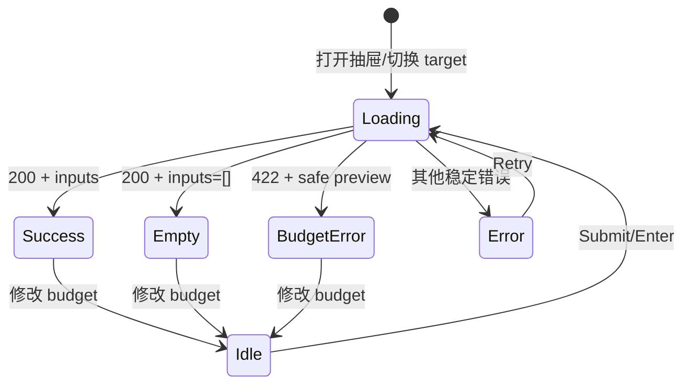

# Dashboard Context Bundle 预算层级设计

## 问题与用户结果

Context Bundle 预览已经具备完整的只读请求与失败恢复语义，但桌面用户仍需逐行解释数字。目标是在
Progress 详情抽屉中，让用户先看懂容量结论，再定位输入文档，最后采取重试或调整预算动作，同时不改变
API、ledger、安全 reader、默认预算或请求生命周期。

## 范围与非目标

- 只修改 Progress 功能域的 Context Bundle 预览展示、相邻测试与中英文文案。
- 目标桌面视口为 1024×768、1200×870、1440×900、1920×1080。
- 保留既有 `<1024px` 布局契约以避免回归，但不设计、截图或验收手机端。
- 不改变 `/api/context-bundle/preview`、decoder、hook、请求竞态、持久化或 server/kernel。
- 不新增 UI 库、图表库或依赖；不使用无明确因果价值的 GSAP。

## 基线证据

生产构建资产 `index-ClhPblSB.js` 在本地真实 Tenon Dashboard 中运行。真实 macOS 请求按主规格
fail closed，显示 `CONTEXT_BUNDLE_TRUSTED_READER_UNAVAILABLE`，未暴露绝对路径。通过浏览器对
同一真实页面只拦截只读 preview GET，注入协议合法的 success 数据后得到：

| 视口 | 抽屉 | 预览区域 | 表单 | 输入清单 | 页面横向溢出 |
| --- | --- | --- | --- | --- | --- |
| 1024×768 | 560×768 | 503×831 | 469×56 | 469×637 | 0 |
| 1200×870 | 560×870 | 503×831 | 469×56 | 469×637 | 0 |
| 1440×900 | 560×900 | 503×831 | 469×56 | 469×637 | 0 |
| 1920×1080 | 560×1080 | 503×831 | 469×56 | 469×637 | 0 |

抽屉宽度稳定且没有页面溢出，问题不是响应式破损，而是 6 份输入占 637px、预算结论只有一行数字，
导致状态、容量与文档优先级处于同一视觉层。

## 方案比较

| 方案 | 做法 | 优点 | 代价 | 结论 |
| --- | --- | --- | --- | --- |
| A. 有界容量摘要 + 紧凑输入行 | 线性容量条、used/max/remaining、文档计数；输入改为紧凑结构行 | 因果清楚，适合 560px，精确数字仍可读 | 需要派生百分比与剩余值 | 采用 |
| B. 多列遥测表格 | path、kind、mode、source、materialized 作为列 | 密度高，比较直接 | 长 path 与双语在 469px 内容宽度内拥挤 | 拒绝 |
| C. 径向仪表盘 | 环形容量图 + 卡片清单 | 视觉突出 | 面积大、精确比较弱、装饰性过强 | 拒绝 |

## 视觉与组件结构

`ContextBundlePreview` 继续拥有 hook、表单和状态分发。新增同功能域纯展示部件承载：

1. `BudgetSummary`
   - 显示本地化百分比、used/max、remaining；预算不足时显示 overage。
   - 容量条视觉宽度钳制在 0–100%，但文本保留真实百分比与精确 bytes。
   - 使用 `role="progressbar"`、`aria-valuemin/max/now` 和可读 `aria-label`。
2. `PreviewInputs`
   - 输入数量位于容量摘要 badge，清单标题保持简洁，再显示稳定顺序的文档行。
   - 每行按 path → kind/mode → reason → source/materialized bytes 排列。
   - Lucide 文件图标只作装饰，token 与文字承担语义，不靠颜色单独区分。
3. 状态容器
   - loading 使用有界 skeleton，保留 `role="status"` 与 `aria-busy`。
   - policy-empty、budget-error、platform/integrity error 分别使用 neutral、warning、danger 角色。
   - retry 仍由原表单主按钮完成，不新增第二条请求路径。

## 状态机



视图不得新增状态，也不得改变 `useContextBundlePreview` 的 abort、generation 或 Change identity
重置语义。

## 可访问性与动效

- Tab 顺序保持 target → budget → submit；Enter 与点击使用同一 form submit。
- 容量条提供完整语义，错误/空/loading 保持现有 live region 与 alert/status 角色。
- Light/Dark/System 只使用现有 semantic tokens。
- 容量变化只使用 200ms CSS transform transition，以 `origin-left scaleX()` 表达“预算结论变化”；
  不对宽度或颜色做动画，并以 `motion-reduce:transition-none` 取消。
- loading skeleton 是静态、有界的占位，不使用 pulse、循环或其他持续动画。
- 不使用 GSAP：本批次没有需要时间轴、空间因果或复杂清理的动画。

## 性能边界

- server 最多返回 64 个输入，客户端保持单次 O(n) 渲染，不做排序、测量循环或持续动画。
- 百分比、remaining 和 overage 只做常数时间纯计算，不提升到 state 或 effect。
- 容量条只改变一个有界 `transform: scaleX()`；不触发布局宽度变化，reduced-motion 下取消
  transition。

## Assumptions / Decision Log

- 已验证抽屉在四个桌面视口均为固定 560px，因此不扩大抽屉或改全局布局。
- API 保证 `maxBytes` 为正整数；UI 仍钳制视觉比例，避免预算不足时宽度越界。
- 百分比和 remaining/overage 是现有响应的纯展示投影，不成为新的领域规则或持久化状态。
- 文档顺序由 server 的确定性 policy 决定，客户端不得按体积重新排序。
- 外部库调研不适用：实现只复用现有 React、Tailwind 4、Lucide 与 i18n。

## 红队自检

- 若只用容量条、不保留精确 bytes，用户无法审计：因此两者同时展示。
- 若预算不足仍显示 remaining=0，会掩盖缺口：因此切换为 overage。
- 若按 materialized bytes 排序，会改变 policy 顺序：保持原序。
- 若 loading 保留旧结果，可能误读为当前 target：继续使用现有清空与 generation guard。
- 若给每行增加独立进度条，会制造没有清晰分母的装饰：不采用。

## 领域术语

- `usedBytes`：当前安全预览实际物化的总字节数。
- `maxBytes`：本次只读预览显式提交的预算。
- `remaining`：`max(0, maxBytes - usedBytes)`，仅用于展示。
- `overage`：`max(0, usedBytes - maxBytes)`，仅用于预算不足展示。
- `mode`：server 选择的物化模式 token，客户端不改写。
- `policy-empty`：目标阶段没有 required reads 的成功空输入，不是错误。

```coverage
touches:
L1_api:      blank
L2_data:     blank
L3_rules:    filled -> #状态机
L4_state:    filled -> #状态机
L5_errors:   filled -> #状态机
L6_security: filled -> #范围与非目标
L7_perf:     filled -> #性能边界
L8_deps:     waived -> 只复用现有 React、Tailwind 4、Lucide 与 i18n，不新增依赖
L10_terms:   filled -> #领域术语
```
