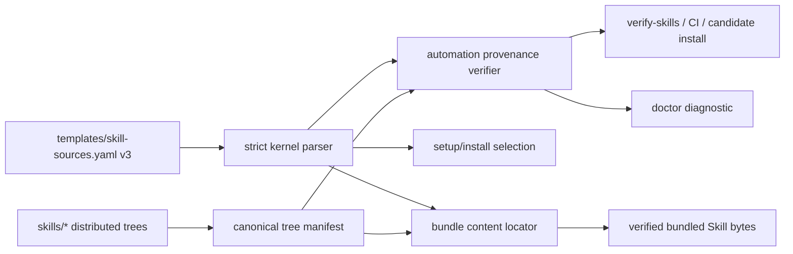

# Issue #44 Skill provenance design

## Outcome

Tenon distributes every bundled Skill from one machine-verifiable provenance registry. Install, verify, doctor and bundle assembly consume that same registry; each entry names an explicit source, immutable coordinate and canonical content hash. Drift, an unknown source, or a stale legacy registry fails closed with an actionable diagnostic.

## Scope and constraints

- The canonical source remains `templates/skill-sources.yaml`; it already drives runtime Skill selection and is shipped with the plugin.
- The existing canonical Skill tree hash from `buildCanonicalManifest()` remains the only production hash algorithm. It covers every regular file, executable bits and stable relative paths while rejecting escaping links and unsupported files.
- `skills-lock.json` is removed because repository and CI search found no production consumer. Reintroducing it is a provenance error, not a compatibility path.
- The change does not publish a version, mutate an installed plugin, change the plugin manifest contract, add a UI, or introduce an external package.
- The assigned issue worktree and Change remain the only write targets.

## Evidence inventory

| Source or consumer | Current behavior | Finding |
| --- | --- | --- |
| `templates/skill-sources.yaml` | Lists all 62 bundled Skill directories and drives install selection, doctor expectations, server display and bundle aliases | Best existing canonical source, but no immutable content hash or strict source semantics |
| `skills-lock.json` | Lists 30 historical third-party sources and computed hashes | Tracked split truth with zero repository consumers and content that no longer matches the shipped first-party bundle |
| `packages/kernel/src/skills/source-registry.ts` | Parses a narrow subset of registry fields | Ignores registry version and cannot reject unknown provenance fields or source kinds |
| `packages/cli/src/commands/setupSkills.ts` | Loads the registry to decide installed/bundled Skills | Uses the right source, but does not prove the bundled bytes |
| `packages/cli/src/skillBundleAssembly.ts` | Uses registry aliases while resolving bundled Skill content | Does not bind the selected tree to an expected registry hash |
| `packages/cli/src/commands/doctor-skills.ts` and `cmdDoctor` | Reads registry expectations and runs `verify-skills.sh` | Can surface provenance failures once the shared verifier becomes strict |
| `tools/verify-skills.sh` | Checks basic registry/file presence and is called by CI, install/update candidate verification and release verification | Central enforcement path exists, but currently shallow-greps YAML and does not verify hashes or complete set equality |
| `packages/automation/src/skills/snapshot-manifest.ts` | Computes a safe deterministic `treeSha256` | Existing canonical hash implementation should be reused, not duplicated in production |
| Release payload digest and rollback store | Verifies the whole immutable payload and previous-release digest | Protects release integrity but cannot explain per-Skill source/hash drift |

Repository enumeration shows 62 registry entries and 62 physical bundled Skill directories, with exact identifier set equality. The only additional file below a Skill tree is a legitimate helper script owned by `learn-record` and therefore included in that Skill's tree hash.

## Alternatives

### A. Extend the live bundled registry (selected)

Advance `templates/skill-sources.yaml` to a strict provenance schema and make every relevant production path validate it. This preserves the existing consumer graph and produces one tracked truth.

### B. Generate a second JSON lock from the live registry

Rejected. Even with freshness CI, two tracked files create two apparent authorities and recreate the issue's split-truth failure mode.

### C. Promote `skills-lock.json` to canonical

Rejected. It describes only 30 historical upstream Skills, contains obsolete third-party coordinates and does not model the 62 first-party bundles Tenon actually distributes.

### D. Rely only on the whole release payload digest

Rejected. A payload digest cannot prove or diagnose the provenance of an individual Skill, and it does not make source semantics machine-readable.

## Selected model

The registry advances to schema version 3 and declares `hash_algorithm: tree-sha256-v1`. Every entry keeps the compatibility fields already consumed by install and UI paths, and adds the following required provenance fields:

- `source_kind`: a closed enum; this change supports `bundled` only.
- `source_ref`: a normalized repository-relative Skill directory such as `skills/brainstorming`.
- `content_hash`: `sha256:<64 lowercase hex>` computed from `buildCanonicalManifest()`.
- `coordinate`: an immutable Tenon coordinate that embeds the Skill identity and the same digest, for example `tenon:skills/brainstorming@sha256:<digest>`.

`tool` continues to describe installation mechanics; it is not treated as provenance. `source`, `content_skill`, tier and official flags remain available to current consumers. The parser accepts only the supported schema, required fields and known source semantics. Unknown schema/source values, unsafe paths, malformed hashes and a coordinate/hash disagreement are hard errors.

## Machine contract

The kernel adds a strict registry decoder that returns schema metadata plus typed provenance entries. The existing generic `parseSkillSources()` projection remains available for explicitly legacy/custom parsing, but canonical production consumers use the strict decoder and cannot silently accept an older schema. CLI loaders distinguish read/parse failure from a legitimate empty generic registry.

The bundled CLI exposes a hidden distribution command, `internal-skill-provenance <verify|sync> --root <path> [--json]`. `verify` is read-only and exits 0 only for a complete clean root; `sync` is the sole writer and atomically refreshes registry hashes/coordinates. Exit 1 denotes invalid provenance or unsafe content, while exit 2 denotes invalid invocation. JSON findings contain stable category, optional Skill identity, safe expected/actual values and remediation code. Existing public setup, doctor and update commands retain their public options and delegate to this contract through the packaged verifier.

## Data contract

`SkillProvenanceRegistry` contains the exact schema version, `tree-sha256-v1` algorithm identifier and an ordered list of entries. Each entry extends the existing install projection with required `sourceKind`, normalized `sourceRef`, `contentHash` and `coordinate`. The strict decoder rejects duplicate tokens, duplicate physical source refs, path escapes, malformed digests, unknown fields that would change provenance meaning, and coordinate/token/hash disagreement. Set-completeness against the physical root belongs to the filesystem verifier, not the pure kernel parser.

## Component boundaries

1. Kernel owns pure schema parsing and invariant validation. Existing callers can retain a compatibility projection, while strict callers receive registry metadata and typed provenance.
2. Automation owns filesystem verification because it already owns the canonical safe tree manifest. A verifier compares the registry to the physical bundled roots and returns stable structured findings.
3. CLI owns command wiring, install/doctor reporting and bundle resolution. Bundle assembly uses an extracted provenance-aware locator so the current 481-line assembly module stays below its 500-line rule.
4. `tools/verify-skills.sh` delegates provenance validation to the bundled CLI instead of implementing a second YAML parser. CI and release/install candidate checks therefore exercise the production parser and verifier.
5. A deterministic authoring tool refreshes registry hashes through a temporary file plus atomic rename. Its output is never trusted without the independent production verifier.

## Data flow



The registry is the declared truth and the content tree is the observed state. No consumer may silently synthesize a missing hash or accept an unknown source. Bundle assembly verifies the exact observed tree before returning bytes. Candidate install/update invokes the same verifier before launcher switching; doctor reports the same failure categories.

## Domain rules

1. Registry identifiers, normalized `source_ref` paths and distributed Skill directory names have one-to-one set equality.
2. Every distributed Skill has one and only one registry entry, a verified `content_hash`, and an immutable coordinate containing that same digest.
3. The content hash is the canonical tree digest over sorted relative file paths, file bytes and executable bits; absolute paths, mtimes and ownership are excluded.
4. Only declared source kinds are valid. A source kind selects explicit validation semantics; it never falls back to a local directory heuristic.
5. `skills-lock.json` is forbidden after migration. Detection returns a migration diagnostic and a non-zero result.
6. Registry drift is never repaired during install, doctor, verification or bundle reads. Only the explicit authoring command may update declared hashes.
7. Diagnostics name the affected Skill, stable category, expected/actual value where safe, and the remediation command.

## Failure contract

The verifier emits stable categories suitable for tests and higher-level presentation:

- `unsupported-registry-version`
- `unknown-source-kind`
- `invalid-source-ref`
- `missing-distributed-skill`
- `unregistered-distributed-skill`
- `duplicate-distributed-source`
- `content-hash-mismatch`
- `coordinate-mismatch`
- `legacy-provenance-source`

Every category fails closed. Clean output remains quiet-compatible for existing scripts. Human output identifies a repair action; structured output remains available for command and test assertions. A parse or filesystem safety error is not downgraded to an empty registry.

## Lifecycle, concurrency and rollback

Authoring is explicit: edit Skill bytes or registry metadata, run the provenance sync tool, inspect the registry diff, then run verification. The writer computes all entries before atomically replacing the registry, avoiding a partially rewritten file.

Runtime verification is read-only. `buildCanonicalManifest()` retains its link and time-of-check/time-of-use protections. Candidate update/install operates in a staged immutable release root and runs provenance verification plus the existing whole-payload digest checks before launcher activation, so a concurrent or incomplete candidate cannot become active.

On candidate provenance failure, the active release and launchers remain untouched. An already stored N-1 release remains rollback-valid under its own immutable verifier and payload digest, even if that historical release predates schema v3. A new candidate carrying schema v2 or `skills-lock.json` fails with an upgrade/migration hint; the runtime does not rewrite it.

## Security boundaries

Registry paths are untrusted declarations. `source_ref` accepts only normalized `skills/<safe-id>` paths and cannot be absolute, contain `..`, or name the root itself. Filesystem hashing inherits no-follow, inode revalidation, escaping-symlink rejection, special-file rejection and non-empty `SKILL.md` checks from `buildCanonicalManifest()`. Diagnostics never print file contents, host credentials or machine-global roots. `sync` may write only the resolved canonical registry under the explicit plugin root and must verify the target remains inside that root before atomic replacement.

## Performance characteristics

Strict parsing is linear in registry size. Full provenance verification hashes each distributed file once per invocation, bounded by the shipped Skill root, and parallel consumers do not share mutable caches. Bundle lookup hashes only a selected bundled Skill after registry parsing; a per-locator promise cache may reuse successful immutable-root checks without caching failures. No network, database or long-lived process is introduced.

## File ownership and parallel risk

Implementation ownership is limited to the registry/legacy lock, kernel parser, automation verifier, CLI provenance and bundle adapters, verification/authoring tools, targeted tests, user documentation, OpenSpec evidence and controlled CLI distribution output. It intentionally excludes `templates/manifest.yaml`, unrelated architecture gates, dashboard code and plugin version metadata to reduce conflict with Wave 0 issues #42, #43, #45 and #46.

Before delivery, upstream ancestry must be checked again. Shared files are integrated only from the exact latest remote `main` when the current issue head can be safely rebased or fast-forwarded without discarding this Change.

## Acceptance and measurement mapping

| Issue requirement | Machine-verifiable evidence |
| --- | --- |
| One canonical source drives install, verify, doctor and bundle | Call-chain tests plus registry consumer assertions; legacy lock absent and forbidden |
| Every distributed Skill has source, hash and immutable coordinate | Complete-set validator over all registry entries and physical Skill roots |
| Legacy lock generated/enforced or removed/migrated | File deletion plus `legacy-provenance-source` fixture and migration documentation |
| Drift, unknown source and mismatch fail closed | Parser/verifier fixtures and non-zero CLI/script behavior with actionable categories |
| Clean, drifted, legacy and rollback tests | Focused unit/integration fixtures, release candidate rejection and prior-release preservation test |
| User docs match runtime | Contract, distribution and contributor docs name schema, sync and verification commands |
| Unconsumed provenance sources = 0 | Repository assertion allows only the canonical registry and rejects the legacy filename |
| Distributed Skills without verified hashes = 0 | Validator proves set equality and a valid hash/coordinate for every distributed directory |
| Drift detection fixture coverage = 100% | Each declared drift class has an explicit failing fixture; clean fixture passes |

## Red-team checks

- A valid-looking hash copied onto the wrong Skill must fail through coordinate/source identity binding.
- An unregistered extra directory and a registry entry pointing to an existing different directory must both fail.
- An unknown source must not be accepted merely because its local path exists.
- Re-adding a stale lock under the historical filename must fail even if the canonical registry is clean.
- Changing executable mode without changing file bytes must change the canonical digest.
- Verification failure during update must not change the active launcher or erase the previous immutable release.

## Assumptions and decision log

- Confirmed: all current registry entries are first-party bundled content, and registry/directory identifiers are in exact 62-item equality at the Explore snapshot.
- Confirmed: repository search finds no consumer of `skills-lock.json`; safe removal is preferred to another generated artifact.
- Confirmed: existing CI builds the controlled CLI bundle before invoking `tools/verify-skills.sh`, so the script can delegate to production code.
- Decision: schema v3 is a deliberate fail-closed migration rather than permissive parsing of missing hashes.
- Decision: use the existing tree digest and release staging/rollback mechanisms; do not create parallel hash or rollback state machines.
- Assumption to verify in Build: the internal CLI entry can expose provenance verification without expanding a public user-facing command contract.

## Terms

- **Canonical registry**: the only tracked declaration of every distributed Skill's identity and provenance.
- **Distributed Skill**: a physical Skill tree shipped from the repository's canonical `skills/` root.
- **Content hash**: the `sha256:` encoding of Tenon's canonical tree digest.
- **Immutable coordinate**: a Skill identity plus digest that cannot refer to changed bytes.
- **Observed state**: the physical Skill tree read and hashed by the verifier.
- **Registry drift**: any disagreement between declared provenance and observed state, including missing, extra, unknown or hash-mismatched content.

```coverage
touches: distribution, skill-provenance
L1_api:      filled -> #machine-contract
L2_data:     filled -> #data-contract
L3_rules:    filled -> #domain-rules
L4_state:    filled -> #lifecycle-concurrency-and-rollback
L5_errors:   filled -> #failure-contract
L6_security: filled -> #security-boundaries
L7_perf:     filled -> #performance-characteristics
L8_deps:     filled -> #component-boundaries
L10_terms:   filled -> #terms
```
