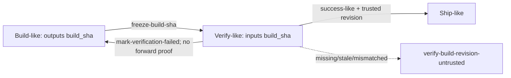

# Issue #64 revision guard remediation · 技术设计

## 问题与用户结果

Issue #42 的候选 `f508fab726c62c10d4312fdd7d29f513d774dc66` 已正确拒绝多数不可信 Build revision，但在 Review 2/2 后留下两个互补缺口：custom rollback 被显式 success guard 卡死，arbitrary custom `tenon check` 又漏掉 semantic success guard。Issue #64 的结果必须是同一条语义在 actual transition、readiness、review preflight、API/SSE、Automation 与 Dashboard 上一致：前进到 Verify/Ship 时没有可信物理绑定 revision 就失败关闭，回退到 Build 时始终可恢复并清掉旧 token。

## 冻结约束与非目标

- base 为 `d58df7a0ecbb155d54d81e782150bf68567cb617`，本 Change 从 #42 冻结候选 `f508fab726c62c10d4312fdd7d29f513d774dc66` 开始。
- #42 的 Review 2/2、attempt `528c8f06-f749-427e-84b4-7bd39c92d010` 与失败报告只读保留；#64 使用独立 Change、Review budget 与 receipt。
- 不改变 `verify-build-revision-untrusted`、closed reason、`return-to-build-and-capture-current-revision` 或 privacy-safe hash 契约。
- 不为没有 `build_sha` input/output 的 custom Workflow 注入 revision lifecycle。
- 不新增依赖，不复制 kernel 规则到 CLI/server/automation/dashboard adapter，不 merge、不发布。

## 事实映射

| 表面 | 当前事实 | #64 缺口/结论 |
| --- | --- | --- |
| actual custom transition | `engine.ts` 把 step/edge guards 与 additional lifecycle guards 合并 | rollback 的 effective actions 已含 `mark-verification-failed` 时仍保留显式 `build-head-unchanged` |
| readiness | `transition-readiness.ts` 独立组合 declared/fixed/semantic guards | 同样会把 rollback 投影为 blocked，Dashboard 因共享该投影而不可恢复 |
| CLI `check` | `check.ts` 仅调用 `evaluateWorkflowIrStepGuards(step.guards)` | arbitrary Verify-like step 没显式 guard 时假绿；review request 也可能冻结错误结论 |
| API/SSE/Dashboard | server snapshot 调用 kernel `readinessByTransition`，Dashboard strict decoder/模型只消费 typed blocker | 修 kernel 单一真相并保留 decoder contract；原则上只需回归测试，不应复制生产规则 |
| Automation | authoritative branch barrier 与 verifier subject 已独立映射同一 blocker/remediation | 现有负例保持；本次不重写 automation 语义 |

## 语义定义

1. **Verify-like step**：当前 compiled `StepIR.inputs` 含 `build_sha`。
2. **Build→Verify-like entry**：source outputs 含 `build_sha` 且 target inputs 含 `build_sha`；该 edge 获得一次 `freeze-build-sha`。
3. **rollback edge**：declared action、document-governed fixed action 与 semantic action 合并后的 effective actions 中含 `mark-verification-failed`。识别不依赖 step/event 名称。
4. **success-like edge**：Verify-like step 的任何非 rollback 出口；它必须恰好求值一次 `build-head-unchanged`。
5. rollback 只移除所有来源中等价的 `build-head-unchanged`；其他 step/edge/fixed guards 继续生效，`mark-verification-failed` 继续清 `build_sha` 并重置 review 状态。



## 方案比较

| 方案 | 做法 | 优点 | 风险 |
| --- | --- | --- | --- |
| A. edge-aware effective lifecycle（采用） | kernel 单一 helper 合并 declared、fixed、semantic guards/actions，并按 effective rollback 过滤 revision success guard；actual/readiness/check 共用 | 一次定义三处消费，能处理 step/edge/fixed/semantic 四种来源 | 需要小幅调整 engine/check 的输入形状与测试 |
| B. 三处局部过滤 | engine、readiness、check 各自判断 rollback/Verify-like | 改动表面小 | 再次制造语义分叉，后续 custom/frozen plan 容易漂移 |
| C. stepGuard 全局推断 | 只看 current step inputs 与 transitions，统一注入 guard | CLI 改动少 | 丢失 exact event；多出口时可能让 rollback 仍被 success proof 卡住 |

选择 A。`governed-lifecycle-policy.ts` 负责生成每条 edge 的 effective lifecycle；`engine.ts` 与 `transition-readiness.ts` 不再自行用不同顺序拼装。`stepGuard.ts` 提供对该 effective revision guard 集合的去重求值入口。

## CLI check 与 review event

- `tenon check <change>` 没有 event：保留既有非 revision step-guard 行为，同时对当前 step 所有非 rollback 出口合并等价 revision guards，并只求值一次。存在任一 success-like 出口时，不可信 token 必须 exit 2；只有 rollback 出口时不得制造 forward-proof 阻断。
- `tenon review request <change> --event <event>` 已拥有 exact event。step-graph 路径必须把该 event 传给 check 的内部入口：success-like event 求值 revision guard，rollback event 排除它。phase-manifest 的现有 `verify-fail` 专用证据路径保持兼容。
- check/transition/readiness 继续共享 assessor、typed blocker renderer 与 privacy-safe hashes；assessor 缺失或异常均 fail closed。

## Grill 结论

- **谁拥有规则？** kernel 拥有 lifecycle 与 revision invariant；CLI 只选择 plain/event-aware 检查入口，server、Automation 与 Dashboard 只映射结果。
- **exact event 为什么不能省？** 同一 Verify-like step 可以同时有 success 与 rollback 出口。review request 已持有 event；丢弃它会把恢复路径和前进证明再次混为一谈。
- **哪些 guard 能被移除？** 只有 effective rollback edge 上语义等价的 `build-head-unchanged`。权限、文档、review、用户自定义及未知 guard 全部保留。
- **plain check 是否执行所有 edge guard？** 否。它只在既有 step-guard 检查之外补齐 revision invariant，避免 #64 借机扩大 CLI 的历史预览语义。
- **矛盾 action 怎么办？** 若同一 edge 同时声明 `mark-verification-failed` 与 success/freeze action，本次仍按已有 action 合并/执行顺序处理，只用 rollback action 过滤 revision success guard；不新增 workflow-validity 公共契约。
- **怎样证明无隐式写入？** review request、readiness、check 均比较 canonical state/current/history/TransitionRecord 前后字节；实际 rollback 才允许清 token 和重置 review 状态。

## 架构自检

- 边界：新增/调整的 helper 留在 `packages/kernel/src/workflow/`，不引入 CLI→server 或 Dashboard→kernel 的反向依赖。
- 状态所有权：TransitionApplication/RunRepository 仍是唯一 mutation 路径；readiness 与 check 保持纯评估，冻结 plan 不被重编译或覆盖。
- 数据与迁移：不新增 canonical 字段、DTO 或持久化迁移；stable blocker shape 原样复用。
- 性能：同一 logical revision guard 去重后 assessor 至多调用一次；rollback 为零次。测试显式断言调用次数，防止 adapter 重复求值。
- 可观测性：继续使用 blocker code/reason/remediation 与 privacy-safe hash；异常和 capability unavailable 均映射为 fail-closed，不输出 repo/worktree 原始路径。
- 跨表面：server snapshot/SSE 和 Dashboard action state 以 success blocked、rollback ready 的成对 fixture 验证；Automation 保留 authoritative barrier 负例，除非测试证明存在生产旁路才改 adapter。

## 规格所有权与兼容

- #42 的代码候选已经进入本分支，但其 Change 必须作为 Review 2/2 失败审计保持原样，不能成为 #64 的可变或未完成依赖。
- #64 的 `trustworthy-build-revision`、`workflow-definition`、`workspace-verification-integrity` delta spec 因此完整承接 #42 尚未 apply 的 durable requirements，再增加 exact-event check/review、explicit rollback guard 与零 mutation 场景。
- Archive 只应用并归档 #64；旧 #42 Change 的 canonical 文件、attempt、receipt 与报告不修改。最终 main spec 由 #64 archive 获得与最终代码一致的完整契约。
- 兼容面不新增字段：`build_sha`、blocker DTO、reason/remediation/hash 与 frozen plan fingerprint 保持原形；无 `build_sha` workflow 不适用。

## 测试与 fixture 策略

### 定向行为矩阵

- explicit step guard、explicit edge guard、fixed inherited guard、semantic injected guard：rollback 全部可达、assessor 0 次、token 清空；success 全部 fail closed/通过且 assessor 恰一次。
- arbitrary step ids 与 frozen custom plan；built-in/free/custom track overlay；无 `build_sha` workflow 保持原行为。
- actual transition 与 readiness 对同一 edge 深等价；retry 不新增 mutation 或重复 action。
- plain custom `check`、event-aware review preflight、capability unavailable/evaluation error 与 stable blocker 文案。
- server snapshot/SSE 与 Dashboard decoder/model 继续接受同一 blocker；Automation 既有 authoritative barrier 负例不回归。

### 两个旧 fixture

1. `packages/cli/src/integration.test.ts`：不再要求无 provenance 的 token 获得 success review receipt。直接断言 `review request --event verify-pass` exit 2、typed `provenance-*` blocker、无 token/path 泄漏，并比较 state/current/history/TransitionRecord 零 mutation；不得只把期望码改成 2。
2. `packages/cli/src/transition-effects.integration.test.ts`：在可信 token 状态先取得 `verify-pass` receipt，再把 `build_sha` 置为 `null`，随后断言 transition fail closed 与 canonical state 不推进；不恢复旧的不可信 request 行为。

## 验证节奏与 Review 上限

- Build readiness 先跑 kernel lifecycle/check/两个 integration fixture，再扩 server/automation/dashboard 与 bundle freshness。
- 只有定向矩阵稳定后冻结候选；稳定候选只运行一次完整门。纯 fixture/docs 调整不重复全仓。
- #64 正式 Review 最多 2 次；每次由根代理对同一 HEAD 判级。E2E 是验收证据，不消耗 Review 次数。2/2 仍有 Medium/High 或完整门失败则保留证据并 blocked。
- verification report 只通过本 task 当前 host/phase 的完整 `cat` + `text(result)` receipt 登记，禁止 backfill、旧 receipt 或 producer spoof。

## Assumptions / Decision Log

- 用户已明确冻结范围、起点、Review hard cap 与持续自主执行；不存在需要再次确认的产品取舍。
- 采用最小共享-kernel修复；只有测试证明 adapter 存在旁路时才改 server/automation/dashboard 生产代码。
- 任何 implementation 变更由唯一 `luna_worker` 完成；根代理只写治理文档、审查、验证和交付状态。
- 写入型 worker 在用户指定的现有 Codex worktree 内串行执行；worker 运行期间根代理停止实现文件写入，避免共享 checkout 冲突。

```coverage
touches: verification, workflow, automation, api, security
L1_api:      filled -> #CLI-check-与-review-event
L2_data:     filled -> #规格所有权与兼容
L3_rules:    filled -> #语义定义
L4_state:    filled -> #CLI-check-与-review-event
L5_errors:   filled -> #架构自检
L6_security: filled -> #语义定义
L7_perf:     filled -> #架构自检
L8_deps:     waived -> 不新增或升级依赖；复用现有 kernel、CLI、server、Automation 与 Dashboard seam
L10_terms:   filled -> CONTEXT.md
```
