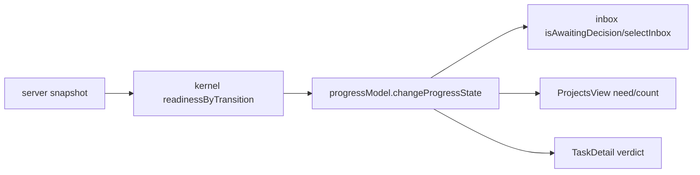

# Issue #68 Dashboard revision fixture remediation · 技术设计

## 用户结果与范围

Dashboard 中本意验证“人现在能拍板”的 Verify 卡应继续显示徽标、收件箱项目、ProjectsView 的需处理计数和 TaskDetail 三轨 verdict。正向测试输入必须包含与生产 snapshot 同形的可信逐事件 revision/readiness 投影；缺失或不可信投影仍 fail closed。

本 Change 从 #64 的冻结候选 `d017e75c001dca4f109d905c872b5c5624324aef` 开始，仅修四个 Dashboard 测试文件的正向 fixture：`App.test.tsx`、`inbox.test.tsx`、`ProjectsView.test.tsx`、`TaskDetail.test.tsx`。不修改 Dashboard/server/kernel/CLI/Automation 生产代码，不修改公共 DTO，不触碰 #42/#64 的 Review/receipt。

## 事实与调用链



`makeChange` 的默认 testkit 只按字段推导 readiness：Verify `verify-pass` 在 `verification_report` 缺失时未就绪；三轨字段不再替代 canonical revision assessor/provenance。生产 server 先通过 `snapshotWorkflowExecution` 求值 revision trust，再把每条 event 的 `{ ready, blockers }` 投影给 Dashboard。四个 RED 都是 fixture 未提供该投影，未发现真实 projection 旁路。

## 方案比较

| 方案 | 做法 | 结论 |
| --- | --- | --- |
| A. 四文件显式 trusted fixture（采用） | 在每个目标测试文件的正向 Verify fixture 注入固定的逐 event `{ ready: true, blockers: [] }` server-shaped projection；默认 `makeChange` 继续 fail closed | 最小、可审计，不污染负测或公共契约 |
| B. 修改 `testkit.makeChange` 默认 Verify 为 ready | 全局把 fixture 默认升级为可信 | 拒绝：会让缺失 readiness/负测静默通过，制造 ambient trusted state |
| C. 修改 Dashboard production model | 让三轨字段推断 gate，绕过服务端 readiness | 拒绝：复制服务端规则并削弱 fail closed |

## 可信正向 fixture 契约

- 正向 Verify fixture 显式提供 `workflowExecution.readinessByTransition.verify['verify-pass']` 与 `['verify-fail']` 两条边，形状与 server snapshot 相同，均为 `ready: true`、`blockers: []`。
- fixture 只表达服务端已经完成 canonical build revision/provenance assessor 的结果；不填裸 SHA、不新增 `ready` 字段、不调用或伪造 assessor。
- `makeChange` 默认无可信 readiness 的输入保留，继续覆盖 `agent`/不入箱/无 need 的 fail-closed 语义。
- revision missing/malformed/provenance mismatch/revision drift、rollback ready、zero mutation/privacy blocker 继续由现有 kernel/server/dashboard 负测覆盖，不作弱化。

## 验收矩阵

| 表面 | RED 根因 | GREEN 断言 |
| --- | --- | --- |
| App SSE/currentRoot | Verify 卡无 trusted readiness，徽标为空 | SSE 徽标为 1；只显示显式 root 的 `a-verify` |
| Inbox | `changeProgressState` 对 forward readiness fail closed | `VERIFY_OK` 样本按时间/名称入箱；规则缺失、运行中/排队、不可达仍拒绝 |
| ProjectsView | 同源 state 全为 agent，need=0 | Verify gate 样本进入 `section-need`、计数为 1；failed/open/不可达行为不变 |
| TaskDetail | 无 readiness 时 verdict 为 agent 文案 | trusted 三轨 fail 仍列出 `codex_review`，`verification_report` 缺失只作 miss |

## 实施与验证边界

1. 先重跑精确 6-file RED，保留 4 files/17 failures/293 passes 证据。
2. 仅修改上述四个测试文件正向 fixture；扫描同文件及邻近 helper，确保没有把 trusted projection 写入全局 testkit。
3. 逐组跑四文件与 `progressModel`/`ProgressView` 相邻回归，再跑相关 view-model/API contract、`typecheck:web`/`build:web` 必要门；不运行全仓 `test:web`。
4. Build readiness 只设置 Tenon 字段并提交候选 commit；不在本 Change 执行 `build-complete`、Verify、formal Review、push/PR/merge。

## Assumptions / Decision Log

- #64 final report 的共同原因与当前 17 RED 完全一致；隔离复现未发现 production projection RED。
- 用户已授权持续自主执行，根代理保留 review、验收、PR 与 CI 权限；本 worker 只负责本 worktree 的 Explore/Spec/Build 实施。
- 不增加依赖、不改变 `ChangeSnapshot` 或 readiness blocker 公共契约；兼容性只由既有 server-shaped projection 维持。

```coverage
touches: workflow, dashboard-test-fixtures
L1_api:      waived -> 不改 API/DTO；仅消费既有 server snapshot 形状
L2_data:     waived -> 不改 canonical state 或持久化
L3_rules:    filled -> #可信正向 fixture 契约
L4_state:    filled -> #事实与调用链
L5_errors:   filled -> #验收矩阵与负向边界
L6_security: filled -> #可信正向 fixture 契约（不泄露 token/path，不绕过 assessor）
L7_perf:     waived -> 仅测试夹具，运行成本不变
L8_deps:     waived -> 不新增依赖
L10_terms:   filled -> CONTEXT.md / #事实与调用链
```
