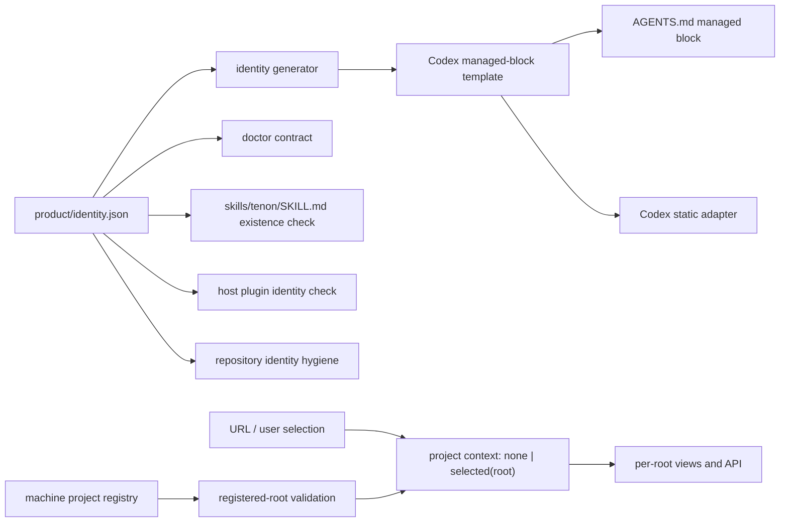

# 技术设计

## 背景

Tenon 的发布 Skill inventory 已包含根入口 `skills/tenon/SKILL.md`，Codex 调用形式应为
`tenon:tenon`。当前存在两处漂移：

- `packages/cli/src/commands/doctor-skills.ts` 仍把 `pipeline` 视为必需入口 id；
- Codex 静态规则的源模板仍写旧 CLI/入口，而仓库 `AGENTS.md` 又单独写成不存在的
  `tenon:pipeline`。

因此发布包内容正确，但 doctor、静态 adapter 与仓库规则没有消费同一身份源。旧项目目录中的
`.agents/skills` 还会进一步形成 shadow conflict；原生插件模式必须保持 selected runtime 为唯一根。
实机还复现了更深一层的问题：宿主配置同时启用两个工作流插件身份时，旧 hook 会先拒绝当前
Tenon Skill。安装态因此也必须纳入同一个“唯一身份”契约，而不能只检查 payload 目录。

Dashboard 还把“机器上登记了哪些项目”错误地当成“用户当前选择了哪个项目”：
`resolveDashboardRoot()` 在 URL/localStorage 没有有效偏好时回退 `roots[0]`，URL 同步随后把该
隐式结果写成 `?root=`；工作台又独立回退 `okRoots[0]`。因此即使用户没有选择，界面和 API 也会
静默进入注册顺序中的第一个项目。

## 决策

采用“身份真相源 → 确定性投影 → 新鲜度门禁”的单向生成架构：

1. 在 `product/identity.json` 增加 `entrySkill: "tenon"`。
2. `PRODUCT_IDENTITY.entrySkill` 直接驱动 doctor 的 Codex contract skill 集。
3. 身份生成器同时生成 Codex managed block 模板；Codex adapter 只读取该模板，不再内嵌第二份文案。
4. 仓库 `AGENTS.md` 的哨兵块必须与生成模板逐字一致。
5. 身份检查同时证明入口目录存在、模板引用等于
   `${identity.plugin}:${identity.entrySkill}`、仓库哨兵块未漂移、adapter 消费生成模板。
6. 不创建 `pipeline` Skill alias，不把旧项目 Skill 投影重新装回原生项目。
7. doctor 从宿主 inventory 验证当前只启用一个 Tenon 工作流插件身份；冲突时 fail closed，并要求
   通过宿主插件管理器卸载冲突项，绝不直接改写宿主 cache。
8. 仓库卫生检查扫描受版本控制路径与正文，拒绝维护清单中的外部参考项目名称。
9. Dashboard shell 持有唯一项目上下文 `none | selected(root)`；注册项目列表只做候选集合，
   URL 有效 root 与用户点击是唯一选择事件。删除 `roots[0]`、`okRoots[0]` 和 localStorage 的
   选择回退，所有 per-root consumer 只接收 `selected(root)`。



### 关键不变量

- `entrySkill` 是逻辑 id，Codex 完整引用由插件 id 与入口 id确定性拼接。
- 原生 selected root 和 static project projection 互斥；doctor 不把历史 cache 当候选。
- 发布候选中不存在第二入口、旧命令 alias 或项目级重复 Skill。
- 宿主 inventory 中不存在会注册同类 hook 的第二工作流插件。
- 受版本控制的路径和正文不出现外部参考项目名称；Git 对象历史不属于发行 payload。
- 项目注册事实不等于选择授权；无显式选择时，URL 无 `root`、per-root API 调用数为零。
- 失效或被移除的选择只能转为 `none`，不能转为另一个 root。

### 状态机

1. Source：维护者只改 `product/identity.json` 和生成器模板逻辑。
2. Generated：`npm run generate:identity` 更新 TypeScript 身份与 Codex managed block。
3. Checked：`npm run check:identity` 对所有投影做逐字/存在性校验。
4. Packaged：release 把唯一 `skills/tenon` 与生成模板打进不可变 payload。
5. Installed：doctor 从 selected root 发现 `tenon`，项目根没有重复投影。
6. Host-verified：doctor 确认宿主只启用 Tenon 工作流插件；仓库卫生检查确认发行内容没有受禁名称。
7. Dashboard-unselected：URL 无有效 root，项目上下文保持 `none`，只展示跨项目总览/选择入口。
8. Dashboard-selected：用户选择或有效深链产生 `selected(root)`，URL 与 per-root API 使用同一 root。
9. Dashboard-invalidated：注册快照使 root 失效时清除选择、change 与 URL root，回到项目总览。

### 错误处理

- 入口 Skill 缺失、模板过期、AGENTS 哨兵块漂移或 adapter 未消费模板：身份检查失败，禁止发布。
- 项目投影同名不同摘要：doctor 继续 fail closed，不覆盖用户文件。
- 当前会话尚未热加载新插件：提示新开会话，不用旧 namespace 伪造 Skill 证据。
- 宿主 inventory 检出冲突工作流插件：doctor 报红并给出宿主官方卸载命令，不直接删除 cache。
- 仓库受控路径或正文命中受禁名称：身份检查失败并输出精确文件，禁止发布。
- Dashboard 深链 root 未登记或项目被移除：清除选择并显示项目入口，不回退首项目，不请求 per-root API。

## 备选方案

1. **只改两个字符串**：改动最小，但仍保留三份手工维护投影，下一次改名会再次漂移；拒绝。
2. **保留 `pipeline` alias**：可让 doctor 立即变绿，但违反“不兼容旧入口”和唯一 Skill 根；拒绝。
3. **doctor 扫描任意首个 Skill**：会把存在性当正确性，无法证明正常对话调用目标；拒绝。
4. **身份源驱动生成与检查**：增加少量生成代码，但把入口、规则、adapter 和发布门连接为一条可验证链；采用。
5. **Dashboard 继续记住首个/最近项目，只在 URL 隐藏 root**：选择仍会从 API 或视图回流，且刷新
   后上下文不可解释；拒绝。
6. **Dashboard 显式和状态**：多一个 `none` 分支，但让 URL、视图和 API 共享同一授权事实；采用。

## 风险

- managed block 改为生成模板后必须保留哨兵外用户内容；adapter 替换算法必须在双哨兵完整时才执行。
- 版本推进涉及多个 package manifest，必须由版本一致性测试和 release tag 校验兜住。
- 本机旧投影已移动到废纸篓；该动作可恢复，但不能在产品代码里自动删除未知用户目录。
- Dashboard 原来依赖“第一个项目”保证进度/工作台总有 root；删除隐式回退后，两个视图都必须拥有
  真实无选择空态，避免以空串调用 API。

```coverage
touches:
L1_api:      filled -> #决策 中 per-root API 仅消费 selected(root)
L2_data:     filled -> #关键不变量 中 none | selected(root) 项目上下文
L3_rules:    filled -> #关键不变量
L4_state:    filled -> #状态机
L5_errors:   filled -> #错误处理
L6_security: filled -> 失效 root fail closed，禁止静默进入其他项目
L7_perf:     waived -> 仅构建期文本生成与检查
L8_deps:     filled -> product/identity.json、generator、doctor、adapter、release payload
L10_terms:   filled -> Tenon、entrySkill、Selected Skill Root、managed block、host inventory
```
