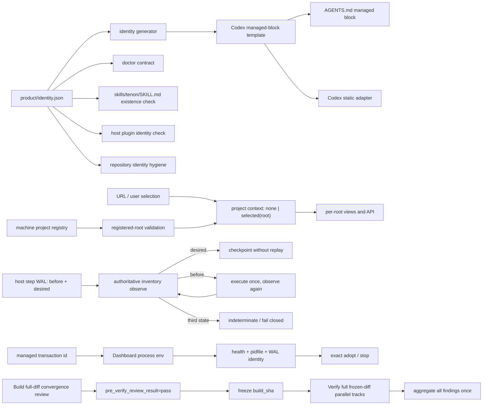

# 技术设计

## 背景

Tenon 的发布 Skill inventory 已包含根入口 `skills/tenon/SKILL.md`，Codex 调用形式应为
`tenon:tenon`。当前存在两处漂移：

- `packages/cli/src/commands/doctor-skills.ts` 仍把 `pipeline` 视为必需入口 id；
- Codex 静态规则的源模板仍写旧 CLI/入口，而仓库 `AGENTS.md` 又单独写成不存在的
  `tenon:pipeline`。

因此发布包内容正确，但 doctor、静态 adapter 与仓库规则没有消费同一身份源。旧项目目录中的
`.agents/skills` 还会进一步形成 shadow conflict；原生插件模式必须保持 selected runtime 为唯一根。
实机还复现了更深一层的问题：宿主配置同时启用两个工作流插件身份时，旧 hook 会先拒绝当前
Tenon Skill。安装态因此也必须纳入同一个“唯一身份”契约，而不能只检查 payload 目录。

Dashboard 还把“机器上登记了哪些项目”错误地当成“用户当前选择了哪个项目”：
`resolveDashboardRoot()` 在 URL/localStorage 没有有效偏好时回退 `roots[0]`，URL 同步随后把该
隐式结果写成 `?root=`；工作台又独立回退 `okRoots[0]`。因此即使用户没有选择，界面和 API 也会
静默进入注册顺序中的第一个项目。

第十轮独立审查进一步证明，现有 WAL 仍把 host command 的 `started → completed` 当作重试边界：
外部命令已经成功、但 completed 写入失败时，恢复会再次调用同一命令。Dashboard ownership 也只
由前后 probe 的 release/stateScope/PID 推断；并发的同 release 普通服务可能在两次 probe 之间
出现并被错误收养。持续授权实现虽然已共享分类器，但正式 capability、ADR 与计划没有冻结其
Change-bound delegated review 边界，导致实现与治理文档再次漂移。

## 决策

采用“身份真相源 → 确定性投影 → 新鲜度门禁”的单向生成架构：

1. 在 `product/identity.json` 增加 `entrySkill: "tenon"`。
2. `PRODUCT_IDENTITY.entrySkill` 直接驱动 doctor 的 Codex contract skill 集。
3. 身份生成器同时生成 Codex managed block 模板；Codex adapter 只读取该模板，不再内嵌第二份文案。
4. 仓库 `AGENTS.md` 的哨兵块必须与生成模板逐字一致。
5. 身份检查同时证明入口目录存在、模板引用等于
   `${identity.plugin}:${identity.entrySkill}`、仓库哨兵块未漂移、adapter 消费生成模板。
6. 不创建 `pipeline` Skill alias，不把旧项目 Skill 投影重新装回原生项目。
7. doctor 从宿主 inventory 验证当前只启用一个 Tenon 工作流插件身份；冲突时 fail closed，并要求
   通过宿主插件管理器卸载冲突项，绝不直接改写宿主 cache。
8. 仓库卫生检查扫描受版本控制路径与正文，拒绝维护清单中的外部参考项目名称。
9. Dashboard shell 持有唯一项目上下文 `none | selected(root)`；注册项目列表只做候选集合，
   URL 有效 root 与用户点击是唯一选择事件。删除 `roots[0]`、`okRoots[0]` 和 localStorage 的
   选择回退，所有 per-root consumer 只接收 `selected(root)`。
10. host mutation 使用 desired-state reconciliation。每个步骤在执行前把规范化
    `beforeInventory`、可序列化 `desiredPostcondition` 和 `replayPolicy` 写入 WAL；恢复先观察
    权威 inventory，再按 `desired → checkpoint`、`before → execute`、`third state → fail closed`
    三分支处理。命令执行后必须再次观察并证明 desired，stdout 只作为诊断，不是提交事实。
11. Dashboard 启动选项增加当前 `transactionId`，并通过 `TENON_MANAGED_TRANSACTION_ID` 传入
    Server。健康响应、pidfile、`ManagedDashboardIdentity` 与 WAL 保持同一可选字段；
    `inspect/adopt/stop` 只有在 transaction id 精确相等时才声明 transaction ownership。
    普通 `tenon dashboard` 不生成该环境变量，永远不能被 release transaction 收养。
12. 持续授权由共享 prompt classifier 产生 canonical `pipeline-interaction-authority-v1`，
    绑定 Change 与 host session；拒绝/修改优先、撤销立即生效。delegated review 只在同一
    phase/event 的 request、真实 Skill、文档读取与 guard 已完成后写 receipt。
13. Build→Verify 增加全量收敛协议：Build 先对完整 diff、全部 capability、失败路径和发行门禁
    做 pre-Verify review，canonical `pre_verify_review_result=pass` 才允许冻结。Verify 的独立
    Reviewer 必须审完整冻结 diff；适用并行轨全部完成后才一次性聚合 findings。任何回退都把
    pre-Verify 结果重置为 pending，重试同时回归旧 finding 与全量复核。



### 关键不变量

- `entrySkill` 是逻辑 id，Codex 完整引用由插件 id 与入口 id确定性拼接。
- 原生 selected root 和 static project projection 互斥；doctor 不把历史 cache 当候选。
- 发布候选中不存在第二入口、旧命令 alias 或项目级重复 Skill。
- 宿主 inventory 中不存在会注册同类 hook 的第二工作流插件。
- 受版本控制的路径和正文不出现外部参考项目名称；Git 对象历史不属于发行 payload。
- 项目注册事实不等于选择授权；无显式选择时，URL 无 `root`、per-root API 调用数为零。
- 失效或被移除的选择只能转为 `none`，不能转为另一个 root。
- host mutation 的完成事实来自权威 inventory 满足 desired postcondition，不来自命令返回或
  `started` 状态；无法区分 before/desired 时绝不重放。
- release transaction 只能停止 transaction id 与当前 WAL 精确一致的 Dashboard；无 id 或其他
  transaction id 的服务均不属于它。
- 持续授权不跨 Change、不跨 host session，不跳过 exact review event、文档证据或验证。
- Build 的聚焦测试通过不等于已收敛；只有完整 pre-Verify review pass 才能冻结候选。
- Verify 不得在其他适用轨尚未结束时提前判定，也不得把 Reviewer scope 缩成上一轮 findings。

### 状态机

1. Source：维护者只改 `product/identity.json` 和生成器模板逻辑。
2. Generated：`npm run generate:identity` 更新 TypeScript 身份与 Codex managed block。
3. Checked：`npm run check:identity` 对所有投影做逐字/存在性校验。
4. Packaged：release 把唯一 `skills/tenon` 与生成模板打进不可变 payload。
5. Installed：doctor 从 selected root 发现 `tenon`，项目根没有重复投影。
6. Host-verified：doctor 确认宿主只启用 Tenon 工作流插件；仓库卫生检查确认发行内容没有受禁名称。
7. Dashboard-unselected：URL 无有效 root，项目上下文保持 `none`，只展示跨项目总览/选择入口。
8. Dashboard-selected：用户选择或有效深链产生 `selected(root)`，URL 与 per-root API 使用同一 root。
9. Dashboard-invalidated：注册快照使 root 失效时清除选择、change 与 URL root，回到项目总览。
10. Host-step-prepared：持久化 before inventory、desired postcondition 与 replay policy。
11. Host-step-reconciled：观察 desired 则补提交；观察 before 才执行；第三状态进入 indeterminate。
12. Dashboard-starting：WAL 先记录 transaction id，再以该 id 启动/探测进程。
13. Dashboard-owned：只有健康响应与 pidfile 都精确携带当前 transaction id 才可 adopt/stop。
14. Authority-active：显式持续意图绑定当前 Change/session；撤销转回普通 review 模式。
15. Build-converged：完整 diff/契约/发行门禁审查通过，`pre_verify_review_result=pass`。
16. Verify-aggregating：所有适用轨审同一冻结基线，全部完成后一次性聚合 findings。
17. Rework-reset：`requirements-changed` 或 `verify-fail` 将 pre-Verify 结果重置为 pending。

### 错误处理

- 入口 Skill 缺失、模板过期、AGENTS 哨兵块漂移或 adapter 未消费模板：身份检查失败，禁止发布。
- 项目投影同名不同摘要：doctor 继续 fail closed，不覆盖用户文件。
- 当前会话尚未热加载新插件：提示新开会话，不用旧 namespace 伪造 Skill 证据。
- 宿主 inventory 检出冲突工作流插件：doctor 报红并给出宿主官方卸载命令，不直接删除 cache。
- 仓库受控路径或正文命中受禁名称：身份检查失败并输出精确文件，禁止发布。
- Dashboard 深链 root 未登记或项目被移除：清除选择并显示项目入口，不回退首项目，不请求 per-root API。
- pending host step 缺少 before/desired（包括旧 WAL）：返回 indeterminate 与恢复诊断，不调用
  宿主 mutation，也不继续激活 runtime。
- host inventory 观察失败或出现第三状态：保留 WAL，拒绝执行/重放/补偿猜测。
- Dashboard health 缺少 transaction id、id 不同或 pidfile/health 不一致：保持 preexisting 或
  返回 indeterminate，不收养、不停止。
- delegated review 找不到同 Change/session 的有效 authority，或 exact event 证据不完整：恢复
  人工确认门，不自动降级为批准。
- pre-Verify 结果缺失/pending/fail：拒绝 `build-complete`，不冻结移动靶。
- 任一 Verify 轨未完成或 scope 不是完整 frozen diff：报告不得宣称全量 PASS，也不得请求出口 review。

## 备选方案

1. **只改两个字符串**：改动最小，但仍保留三份手工维护投影，下一次改名会再次漂移；拒绝。
2. **保留 `pipeline` alias**：可让 doctor 立即变绿，但违反“不兼容旧入口”和唯一 Skill 根；拒绝。
3. **doctor 扫描任意首个 Skill**：会把存在性当正确性，无法证明正常对话调用目标；拒绝。
4. **身份源驱动生成与检查**：增加少量生成代码，但把入口、规则、adapter 和发布门连接为一条可验证链；采用。
5. **Dashboard 继续记住首个/最近项目，只在 URL 隐藏 root**：选择仍会从 API 或视图回流，且刷新
   后上下文不可解释；拒绝。
6. **Dashboard 显式和状态**：多一个 `none` 分支，但让 URL、视图和 API 共享同一授权事实；采用。
7. **把宿主命令标记为 retry-safe**：无法覆盖成功后崩溃窗口；拒绝。
8. **用 stdout/result 作为 host step 提交凭据**：结果落盘本身仍有同一崩溃窗口；拒绝。
9. **before/desired 权威对账**：需要规范化 inventory 与 postcondition codec，但能在不假装
   exactly-once 的前提下防止重复非幂等效果；采用。
10. **通过 release/stateScope/PID 推断 Dashboard ownership**：并发同 release 进程不可区分；拒绝。
11. **transaction id 贯穿 Dashboard 身份**：增加协议字段与滚动兼容读取，但提供精确所有权；采用。
12. **只在 Verify 修上一轮 findings**：单轮快但会逐层暴露相邻问题；拒绝。
13. **Build 全量收敛 + Verify 全量独立复核**：增加一个机器字段和审查成本，但显著减少窄审回环，
    同时保留独立冻结验收；采用。

## 风险

- managed block 改为生成模板后必须保留哨兵外用户内容；adapter 替换算法必须在双哨兵完整时才执行。
- 版本推进涉及多个 package manifest，必须由版本一致性测试和 release tag 校验兜住。
- 本机旧投影已移动到废纸篓；该动作可恢复，但不能在产品代码里自动删除未知用户目录。
- Dashboard 原来依赖“第一个项目”保证进度/工作台总有 root；删除隐式回退后，两个视图都必须拥有
  真实无选择空态，避免以空串调用 API。
- 宿主 inventory 的规范化必须稳定、去除非语义字段，并限制 WAL 大小；否则 harmless 顺序/时间字段
  会制造第三状态。聚焦测试必须覆盖命令成功后崩溃、before/desired/third-state 三分支。
- Dashboard transaction id 是身份而非凭据；不得进入用户可控 URL，也不能替代 Host/token/loopback
  安全边界。旧健康响应保持可读但不能被事务 adopt。
- 文件尺寸门要求把 reconcile policy/codec 与 Dashboard identity 装配拆到独立模块，不能继续膨胀
  `release-coordinator.ts`、`dashboard.ts` 或 `managed-release-journal.ts`。
- canonical 新字段必须末尾追加并只兼容精确上一版本缺失形状；任意缺字段仍失败关闭。
- 全量审查不等于无界重复运行：Build 一次收敛、Verify 一次独立复核；发现 High 时先等全部轨结束，
  再一次性回退完整 finding 集。

```coverage
touches:
L1_api:      filled -> #决策 中 per-root API 与 Dashboard health transactionId 契约
L2_data:     filled -> #关键不变量 中项目上下文、host step WAL、Dashboard identity
L3_rules:    filled -> #关键不变量
L4_state:    filled -> #状态机 中 Build-converged / Verify-aggregating / Rework-reset
L5_errors:   filled -> #错误处理
L6_security: filled -> 失效 root、第三 inventory 状态与跨事务 Dashboard 均 fail closed
L7_perf:     filled -> 每个恢复步骤只做有界 inventory 观察，WAL/health 字段有尺寸上限
L8_deps:     filled -> identity、generator、doctor、adapter、WAL、server health、default workflow、release payload
L10_terms:   filled -> Tenon、entrySkill、desired state、transaction id、host inventory
```
