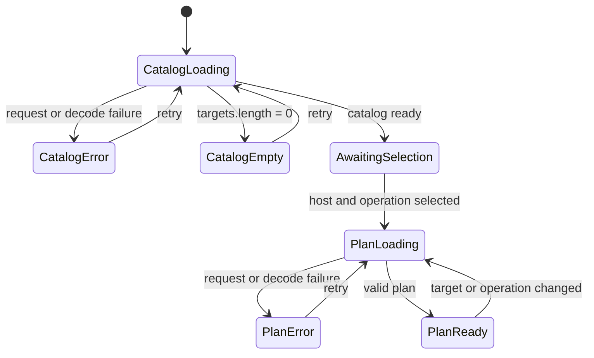

# Host Target Plan Center 技术设计

## 背景

Tenon 基线 `2d103e330f847e003ff5909097d892f5722cca04` 的 setup/update 已要求显式单宿主，并通过 `TENON_HOSTS`、native/adapter 分流和 `--dry-run` 保护真实写路径；缺口是这些事实仍以 CLI flags 和人类文本存在，Dashboard 无法安全地选择目标、展示能力或获得结构化计划。

外部研究固定到：

- Comet [`2945693e4061c369be0d400ed2999a66fa87c680`](https://github.com/rpamis/comet/commit/2945693e4061c369be0d400ed2999a66fa87c680) / [PR #227](https://github.com/rpamis/comet/pull/227)：显式 `init/update --platform`，注册目标与 project custom target 分离，global custom 拒绝；package 是未打 tag 的 beta.10。
- Trellis 正式 [`v0.6.9 / 12e279a8`](https://github.com/mindfold-ai/Trellis/commit/12e279a8af00456b1d0d4e3d0f7f59e7b702202e)：按角色和任务组织上下文。
- Trellis 未发布 [`5f543960`](https://github.com/mindfold-ai/Trellis/commit/5f543960) / [PR #468](https://github.com/mindfold-ai/Trellis/pull/468)：path-glob、full/ticket/silent、SHA 刷新与 9500 字符预算。该实现受 AGPL-3.0 约束且未发布，本轮只 clean-room 借鉴“有界、按目标加载、版本化”的原则，不复制代码、测试、文案或文件结构。

## 用户结果

用户能在真实 Tenon Dashboard 中：

1. 浏览 Tenon 已注册宿主的目标卡及 native/adapter、scope 和能力。
2. 选择一个宿主与 `setup` 或 `update`。
3. 看到明确的只读状态、可复制命令和有序步骤。
4. 在 loading、无目标/未选择、错误与成功状态之间获得稳定反馈。

## 约束与非目标

- P1 只接受 `TENON_HOSTS`；不接受任意 `.foo`、自定义 ID、任意目录或 `target` 查询参数。
- 不运行 `cmdSetup`、`cmdUpdate`、adapter 脚本、marketplace 命令或任何文件写入。
- 不检测实际安装状态，不把“可生成计划”谎报成“已安装”。
- 不把 adapter registry 的完整 hook tier 复制成第二套注册表；P1 只展示由当前 CLI 稳定证明的能力。
- 不引入 Trellis 的注入状态机、glob 或预算实现。

## 决策

采用“CLI 计划真相源 + server 严格只读 adapter + Dashboard 功能域”。

### 为什么不放入 kernel

宿主命令、marketplace 和 adapter 是 CLI/供应商协议，不是 workflow/state 领域不变量。把它们搬入 kernel 会破坏零供应商依赖边界。现有 server 已通过 `PipelineCliRunner` 以 argv 数组调用 CLI bundle，因此新增只读 CLI 命令是最窄稳定边界。

### 数据流

```mermaid
flowchart LR
  UI["HostTargetPlanView"] --> Client["hostTargetPlanClient + decoder"]
  Client --> API["GET /api/host-targets or /api/host-target-plan"]
  API --> Validate["strict query + DTO validation"]
  Validate --> Runner["PipelineCliRunner argv array"]
  Runner --> CLI["tenon host-target-plan --json"]
  CLI --> Registry["TENON_HOSTS + native setup/update plan"]
  Registry --> DTO["host-target-plan/v1"]
```



任何节点遇到未知输入或未知响应都失败关闭；没有节点进入 setup/update 执行函数。

## 计划契约

### Catalog

`tenon host-target-plan --json` 与 `GET /api/host-targets` 返回：

```ts
interface HostTargetCatalog {
  schema_version: 'host-target-plan/v1'
  targets: HostTarget[]
}

interface HostTarget {
  id: PipelineHost
  kind: 'native' | 'adapter'
  cli_flag: `--${PipelineHost}`
  target_scope: 'user' | 'project'
  supported_operations: readonly ['setup', 'update']
  capabilities: readonly HostTargetCapability[]
}
```

能力 token 只来自以下稳定集合：

- `native-marketplace`
- `project-adapter`
- `managed-runtime`
- `bundled-skills`
- `automatic-update`

### 单目标计划

`tenon host-target-plan --host <id> --operation <setup|update> --json` 与
`GET /api/host-target-plan?host=<id>&operation=<op>` 返回：

```ts
interface HostTargetPlan {
  schema_version: 'host-target-plan/v1'
  side_effects: 'none'
  host: HostTarget
  operation: 'setup' | 'update'
  command: HostPlanCommand
  steps: HostTargetPlanStep[]
  notices: string[]
}
```

- `command` 始终是用户可在终端手动执行的 `tenon setup|update --<host>`；adapter 使用 `<project>` 占位提示 project scope。
- native 的步骤复用现有 `nativeInstallPlan` / `nativeUpdatePlan` 命令数组；setup 再附加 managed runtime、bundled skills 与 readiness，update 只追加真实 managed release 所包含的 managed runtime，不宣称 setup-only skills/readiness。
- adapter 的步骤按真实命令边界区分操作：setup 为 `package-assets → managed-runtime → adapter-deploy → bundled-skills → runtime-readiness`，update 在 `adapter-deploy` 后结束，不包含 setup-only 的 skills/readiness；两者都不解析或执行 adapter 脚本。
- `side_effects: 'none'` 是生成器不变量；不是对复制后手动执行命令的承诺。

## API 边界与错误

### `GET /api/host-targets`

- 不接受任何查询参数；有参数返回 `400 HOST_TARGET_QUERY_INVALID`。
- 使用固定 argv `['host-target-plan', '--json']`。
- CLI 不可用返回 `503 HOST_TARGET_PLAN_UNAVAILABLE`。
- CLI 非零、trim 后 stdout 不是恰好一个完整 JSON 文档，或 DTO 畸形时返回 `502 HOST_TARGET_PLAN_INVALID`；本端点不得复用会从多行输出中挑选末行 JSON 的宽松 parser。

### `GET /api/host-target-plan`

- 参数必须且只能各出现一次：`host`、`operation`。
- `host` 必须来自 catalog 白名单；`operation` 只能是 `setup|update`。
- 未知、重复、多余、空值均返回 `400 HOST_TARGET_QUERY_INVALID`，且不调用 runner。
- 使用固定 argv `['host-target-plan', '--host', host, '--operation', operation, '--json']`。
- 所有 GET 继续受现有统一 loopback Host header 守卫保护；不接收 root、不要求写 token。

## Dashboard 视图

### 功能域与装配

- `src/hostPlan/HostTargetPlanView.tsx` 拥有 catalog/plan 请求生命周期、目标卡、操作选择、复制反馈和视图布局。
- `src/api/hostTargetPlanClient.ts` 与 decoder/types 拥有 HTTP 和协议解析。
- `App.tsx`、`Nav.tsx`、`dashboardLocation.ts` 只新增 `hostPlan` view 装配；该视图是机器级能力，在零 project 时仍可访问。
- 新增可见文本全部进入 `translations.ts` 的中英文同构键。

### 状态机



- 目标卡使用原生 `<button>`，操作使用具名 button group；焦点、Enter/Space 与可见 focus ring 由语义控件承担。
- 复制按钮只调用 Clipboard API，失败显示错误，不提供执行入口。
- 桌面为目标网格 + 计划区；移动端单列，命令允许横向断行而不产生页面溢出。

## 关键业务规则

1. Catalog 顺序与 `TENON_HOSTS` 一致，不能按 UI 自行重排或添加目标。
2. native 仅为 Codex/Claude；其他注册宿主为 adapter。
3. 每个计划恰好一个 host 和一个 operation。
4. 计划生成不访问文件系统、网络、环境、宿主 inventory 或项目 root。
5. API 只把通过严格 decoder 的 CLI DTO返回给前端。
6. UI 不根据 host ID 重建计划；只翻译稳定 token 并展示服务端事实。
7. Setup 与 update 不共享 setup-only 尾步：adapter setup 为五步、update 为前三步；native setup 追加 managed runtime/skills/readiness，native update 只追加 managed runtime。三端 decoder、fixture 和真实命令测试必须锁定差异。
8. Host Plan server 只接受 trim 后恰好一个完整 JSON 文档；前置/后置杂讯或多个 JSON 文档一律失败关闭。

## 术语

- **Host Target**：Tenon `TENON_HOSTS` 中可被 setup/update 显式选择的宿主。
- **Native Host**：拥有 Tenon marketplace/plugin 生命周期的 Codex 或 Claude。
- **Adapter Host**：由当前 Tenon release 向项目部署 adapter 的其他已注册宿主。
- **Plan**：零副作用生成的命令与步骤描述；不是执行记录。
- **Catalog**：按 `TENON_HOSTS` 顺序列出的受支持目标集合。

## 备选方案

1. 共享 kernel contract：单一真相强，但把供应商/CLI 协议下沉领域层，拒绝。
2. Server 读取 YAML 并生成计划：减少子进程，但产生第二套 setup/update 规则，拒绝。
3. 直接调用 `setup/update --dry-run` 并解析文本：复用现有命令但文本不稳定、错误难严格映射，拒绝。
4. Dashboard 静态 host 列表：开发最快但必然与 CLI 漂移，拒绝。

## 风险与缓解

- **CLI/server/frontend DTO 漂移**：三层都做严格版本与字段 decoder，契约测试覆盖畸形响应。
- **计划与真实写路径漂移**：native/adapter 的 setup/update 分别对齐真实外层控制流，并用真实命令集成测试锁定 setup-only 尾步差异，不复制脚本内部。
- **CLI 杂讯被误当成有效 DTO**：Host Plan route 使用局部单文档 parser，禁止通用末行 JSON 容错掩盖协议污染。
- **误认为已执行**：固定 `side_effects: none`、只读文案、无执行按钮、只提供复制。
- **参数注入**：server 在 runner 前白名单校验，固定 argv 数组，拒绝所有额外查询参数。
- **许可污染**：Trellis 仅作为公开设计概念来源；实现从 Tenon 现有代码与本设计独立推导。

## 验证矩阵

- CLI：catalog、每个注册 host、setup/update、adapter setup 五步/update 三步、native update 无 setup-only 尾步、真实 `cmdSetup`/`cmdUpdate` 输出编排、未知 host/operation、JSON 稳定性、零 runner/环境访问。
- Server：Host guard、无参数 catalog、合法 plan、缺失/重复/额外/未知查询、CLI unavailable/nonzero、前置/后置杂讯、多文档和 DTO malformed。
- Dashboard client：catalog/plan decoder、非 2xx、畸形 JSON、网络错误。
- Component：catalog loading/empty/error/retry、选择/切换、plan loading/error/retry/ready、复制成功/失败、中英文、键盘。
- 浏览器：确认 Tenon 页面身份，桌面/移动、键盘 focus、loading/empty/error、命令复制与无执行入口。

```coverage
touches:
L1_api:      filled -> #API-边界与错误
L2_data:     waived -> 只生成瞬时 DTO，不持久化、不迁移数据
L3_rules:    filled -> #关键业务规则
L4_state:    filled -> #状态机
L5_errors:   filled -> #API-边界与错误
L6_security: filled -> #API-边界与错误
L7_perf:     waived -> TENON_HOSTS 为固定有界目录，计划为常数规模且无外部 I/O
L8_deps:     waived -> 不新增运行时依赖，复用 PipelineCliRunner 与现有 Dashboard 栈
L10_terms:   filled -> #术语
```
