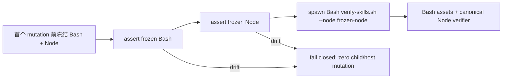

# 技术设计

## 背景

Issue #44 的冻结候选 `c38694185a35a376b096c1d3c131e389dc981094` 在 Review attempt `3255898e-3ed1-48cd-afec-12fcb57c187b`（2/2）中失败。审计提交 `9106c285c0e9c15ff811a1ccc38aca0f148c8958` 保留了结论：生产路径把一个 trusted Node pathname 交给 `tools/verify-skills.sh`，但拥有最终 Bash spawn 的 caller 没有同时重放 frozen Node 的物理身份。

本 Change 只修复 #63 指定的这一缺陷。#44 报告中的 Skill root inode 绑定、Windows containment、安全 id 判据和 sync JSON category 四项 finding 不在本 Change 范围内；旧 Change、Review 2/2 和失败报告保持原样。

## 目标与非目标

- 目标：package、update、release-store、setup 与 doctor 的每个 provenance Bash spawn 都在同一同步 pre-spawn 边界依次重验 frozen Bash 与 frozen Node。
- 目标：任一物理身份漂移在 runner/child 被调用前失败关闭，并先于 host mutation、runtime activation、Dashboard start 和 ready evidence。
- 目标：保持 v1.0.1/v1.0.2 release/rollback 行为、registry schema v3、诊断 category 与 public CLI contract 不变。
- 非目标：不把物理验证搬入 Bash 重新实现，不修改 provenance registry/hash 算法，不引入依赖，不发布或合并。

## 现状证据与调用面

| 路径 | 当前事实 | #63 缺口 |
| --- | --- | --- |
| `commands/packaged-assets.ts` | 从 `nodeBinding.executable` 取 pathname，再通过 `env.runCommand('bash', ...)` 委托 verifier | bound env 只会重验被 spawn 的 Bash，没有重验作为参数传入的 Node |
| `commands/update-candidate-verification.ts` | 与 packaged-assets 相同，覆盖 no-op、candidate revalidation 与 ready evidence 前检查 | Node drift 可越过本次 verifier caller |
| `runtime/release-store.ts` | runner wrapper 对 Bash spawn 只调用 `verifyBash`，对直接 Node spawn 才调用 `verifyNode` | provenance Bash 内部将 spawn Node，但 wrapper 未重验 Node |
| `commands/setupSkills.ts` | production exact-root gate 直接 `spawnSync(process.execPath, ...)` | 回退到未绑定的 `process.execPath`，且没有统一 Bash+Node provenance gate |
| `commands/setup.ts` | native host 流程创建 `lifecycleEnv`，但完成 host 后调用 skills gate 时重新传原始 `env` | 首个 mutation 前冻结的 lifecycle bindings 没有贯穿到后续 gate |
| `main.ts` Doctor probe | 每次从 PATH 解析 Bash/Node pathname，再 `execFile(bash, ... --node node)` | pathname 未冻结为 `TrustedExecutable`，spawn 前无物理 replay |
| `runtime/release-payload.ts::inspectCandidatePayload` | 已在 provenance Bash 前调用 `verifyBash` + `verifyNode`，并在直接 Node spawn 前调用 `verifyNode` | 是选定语义的正向参照；不得让其他 wrapper 绕过它 |

`openspec/specs/plugin-distribution/spec.md` 已规定：仅保存绝对 pathname 不构成信任；每次 spawn 前必须重验 realpath、file identity、change identity 与父目录身份，并禁止回退 `process.execPath`、裸 PATH 或未绑定 pathname。

## 决策

### 复合 provenance spawn binding

在 CLI command adapter 层复用既有 `TrustedExecutable`，建立一个显式的 Bash+Node 复合 verifier binding。该 binding 持有两条冻结 executable pathname 和两份物理 proof，暴露同步 `assertForSpawn()`（实际命名可沿用相邻代码风格）：

1. 同步重验 Bash binding；
2. 同步重验 Node binding；
3. caller 的下一条有副作用语句必须就是本次 Bash spawn；中间不得插入 await、文件写入、状态记录或其他 child；
4. 任一 assert 失败时，不调用底层 runner，并保留既有高层错误/退出码契约。



`packaged-assets`、`update-candidate-verification` 与 `setupSkills` 使用同一 command-layer binding，不复制判断。具备 production physical resolver 时，缺任一 binding 必须在 spawn 前失败；只提供 pathname 的 legacy test/adapter seam 不得被提升成物理信任声明。

### 生命周期与 runtime wrapper

- native setup/update 继续在首个 host mutation 前通过 `freezeTrustedLifecycleCommands()` 冻结 Bash/Git/Node；全流程 skills gate 使用同一个 `lifecycleEnv`，不在 mutation 后重新解析 PATH。
- `RuntimeReleaseStore` 的 runner wrapper 在识别 provenance Bash invocation 时同时运行 `verifyBash` 与 `verifyNode`；普通 Bash 仍只验证 Bash，直接 Node invocation 仍逐次验证 Node。这样 stage、stored-release inspect、candidate replay 与 rollback validation 共用一个立即边界。
- `inspectCandidatePayload()` 现有复合 proof 语义保留，并作为顺序测试基准；不得双重 spawn 或改变 verifier argv。

### Doctor adapter 与文件边界

`main.ts` 是 484 行的 CLI composition root，超过 command/controller 400 行硬上限。把 Doctor 的生产 probe 装配（包括 trusted executable freezing 与 `runVerifySkills`）提取到独立、可注入测试的 command adapter；`main.ts` 只创建并注入 probe。该拆分不移动 domain rule、不改变 `DoctorProbes` DTO，也不让 doctor 自己解析 registry。

`release-store.ts` 保持 runtime infrastructure owner；command binding 不反向依赖 runtime store，kernel/automation/public registry 均不改。

## 失败与顺序不变量

1. provenance spawn 的可观察顺序必须是 `bash-proof → node-proof → spawn`。
2. Node proof 抛错时，runner/spawn 计数为 0；package/update/setup 返回既有失败结果，doctor 返回 red probe，release store 抛 `candidate-invalid` 或现有上层映射。
3. drift 失败不得写 active/previous selection、launcher、host plugin、marketplace、Dashboard ownership、ready receipt 或成功 audit。
4. pathname 必须来自同一冻结 binding；禁止 `process.execPath`、`'bash'` 或之后重新解析 PATH 作为 production fallback。
5. `--node` argv 与刚重验的 Node binding executable 必须字节一致。

## 验收矩阵

| seam | 正向证明 | 负向证明 |
| --- | --- | --- |
| composite command binding | Bash/Node proof 紧邻且只在 proof 后运行 | Node drift 为零 runner call |
| packaged assets | verifier argv 使用冻结 Node，成功保持现有输出 | drift 在 candidate reuse/host mutation/activation 前终止 |
| update candidate | 所有 revalidation/ready 路径复用 binding | drift 时零 activation、Dashboard、ready evidence |
| setup skills | exact-root gate 通过 Bash verifier 且使用 lifecycle binding | 不再使用 `process.execPath`；drift 前不产出 plan/安装 child |
| release store | candidate 与 stored release 每个 provenance Bash 都有双 proof | Node drift 保持 selection/launchers，并且底层 runner 0 调用 |
| doctor | command-level frozen Bash/Node 双 proof后才 exec | Node drift 返回失败且 exec 0 调用 |
| compatibility | v1 manifest、v1.0.1 WAL/launcher、v1.0.2 stable target 与 fully verified rollback 继续通过 | 不为 legacy payload 合成新 trust 数据 |
| distribution | TypeScript/build、tracked bundle freshness、verify-skills、bundle/N-1、clean install 通过 | source/dist 或 install gate 漂移非零 |

Build 先运行受影响 Vitest/TypeScript/bundle/architecture/clean-install 定向矩阵并修到稳定；随后只运行一次完整 CI 等价最终门。E2E 与普通测试不计正式 Review。正式 Review 总上限 2，若 2/2 仍失败则保留证据并 blocked，不开启第三次。

## 备选方案

### A. 只在 lifecycle 起点验证一次 Node

拒绝。它不关闭冻结与实际 verifier spawn 之间的 TOCTOU 窗口，直接违反“每次 spawn 前”主规格。

### B. 在 `verify-skills.sh` 用 Bash 重建 Node inode/owner 校验

拒绝。Bash 无法复用 `TrustedExecutable` 的 canonical file/change/parent identity，会形成第二套、跨平台不一致的 trust 算法。

### C. 所有路径直接 spawn hidden Node command

拒绝。它跳过 Bash 脚本负责的完整 packaged asset/hook/manifest 检查，并改变既有委托契约。`setupSkills` 应收敛到统一 Bash gate，而不是让其他路径收敛到较窄的 direct Node gate。

### D. 在每个 caller 手写两次 assert

拒绝作为主方案。虽然可修单点，但容易再次遗漏路径或把 assert 与 spawn 分开；共享复合 binding + runtime wrapper 的边界更小且可测试。

## 风险

- 复验 helper 若只比较 command name、不绑定实际 `--node` pathname，会留下参数替换缺口；测试必须断言 argv。
- setup 的 legacy injected env 没有 physical resolver；兼容 seam 可以保留旧行为，但 production detection 必须 fail closed，且不得把 pathname-only resolver 标成可信。
- Doctor adapter 提取可能无意改变其他探针的 scope/cache 行为；现有 doctor tests 与新 adapter 单测共同锁定，仅移动装配职责。
- tracked CLI dist 是发布契约；只改 src 不重建会让 clean install 继续运行旧漏洞。
- release-store 的 runner wrapper若对所有 Bash 都重验 Node会扩大失败面；只对 provenance verifier Bash 做复合 proof，其他 Bash 保持现状。

## 兼容与数据

本变更不新增或修改 public CLI flag、`DoctorProbes` 契约、registry schema、runtime manifest、selection、launcher、audit 结构或错误 category。v1.0.1 与 v1.0.2 的读取和 rollback 语义保持不变；复合 proof 只存在于 adapter 的 child-process 边界，不写回已有数据，也不为旧 payload 合成新的 trust evidence。

## 安全边界

`TrustedExecutable` 继续是唯一的物理可执行信任原语；复合 binding 只组合 Bash 与 Node 两份既有 proof，不创建第二套 owner/inode/path-chain 算法。production 路径不得把 pathname、`process.execPath` 或 PATH lookup 结果提升为信任。任一漂移必须在 runner 前抛出，错误输出不得泄露额外敏感环境信息。

## 性能

每个 provenance spawn 仅增加一次有界的本地 Node 物理 replay；该操作同步完成，不访问网络、不引入 cache、retry、后台线程或额外 process。安全边界要求逐 spawn replay，因此不跨 spawn 缓存验证结果。

## 依赖与分层

command adapter 复用现有 `TrustedExecutable`/lifecycle binding，runtime release store 继续通过既有 verify callbacks 重放 proof，Doctor 只提取 CLI infrastructure wiring。不得新增第三方依赖，不让 command adapter 依赖 runtime store，不把 provenance spawn 规则下沉到 kernel、automation 或 registry domain。

## Assumptions / Decision Log

- 已确认：当前代码精确等于冻结候选，`9106c285` 仅追加 #44 失败治理证据。
- 已确认：`inspectCandidatePayload()` 已实现期望顺序，可作为而非替代其他路径的证明。
- 已确认：#63 明确授权修改 CLI runtime/commands/tests/dist/spec/docs，不需要 kernel、automation、server 或 UI 变化。
- 决策：物理 proof 属于 CLI/native execution adapter，不进入 provenance registry/domain schema。
- 决策：setup 全流程复用 mutation 前冻结的 `lifecycleEnv`；standalone `setup skills` 在自身首个 child 前冻结。
- 决策：Doctor probe 从 `main.ts` 提取，以满足文件长度门并提供零真实 spawn 的 deterministic drift 测试。
- 开放问题：无会改变范围、架构或验收的公共契约歧义；Spec 只需把上述不变量转成 SHALL/Scenario 与可执行计划。

## 术语

- **复合 provenance binding**：同一次 verifier 委托所需的 frozen Bash 与 frozen Node 物理证明集合。
- **immediate pre-spawn**：两次同步 proof 之后，下一条副作用就是目标 spawn，之间没有 await、写入或其他 child。
- **physical drift**：realpath、file identity、change identity、权限/owner 或冻结父目录链与初始证明不一致。
- **production physical resolver**：返回 `TrustedExecutable` 而不是单纯 pathname 的 resolver。

```coverage
touches: distribution, skill-provenance, native-execution
L1_api:      waived -> #兼容与数据
L2_data:     waived -> #兼容与数据
L3_rules:    filled -> #失败与顺序不变量
L4_state:    filled -> #生命周期与-runtime-wrapper
L5_errors:   filled -> #失败与顺序不变量
L6_security: filled -> #安全边界
L7_perf:     filled -> #性能
L8_deps:     filled -> #依赖与分层
L10_terms:   filled -> #术语
```
